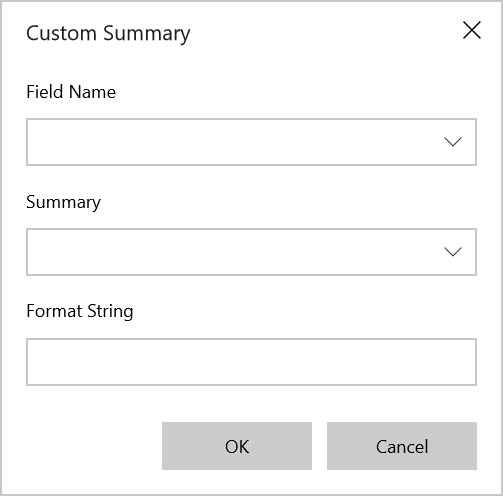
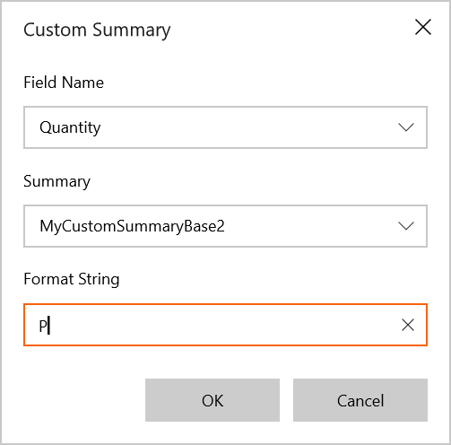
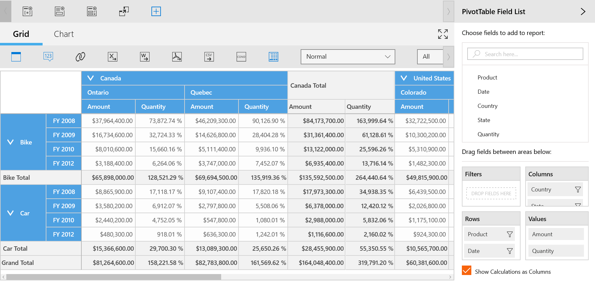

# Custom Summary

SfPivotClient provides support to change the summary type of existing calculation items to 'Custom' at run time using the custom summary dialog.

**Defining a Custom Summary**

* To change the summary type as custom summary, click the *Custom Summary* button  in the client toolbar. In result, the custom summary dialog will be opened as shown below.

* The existing pivot calculation name can be selected from the **Field Name** drop down list.

* One or more custom summary types can be kept in the **Summary** drop down list and any one of the CustomSummaryBase needs to be selected from this collection.

* The format for the required field can be defined using **Format String** field. For example, 'C' for Currency, 'P' for Percentage, 'N' for Numeric.

* Then click the **OK** button to populate the values in SfPivotClient.

