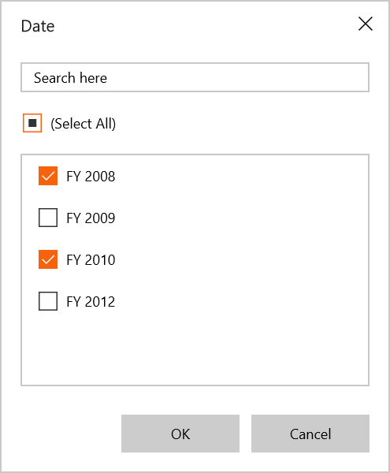
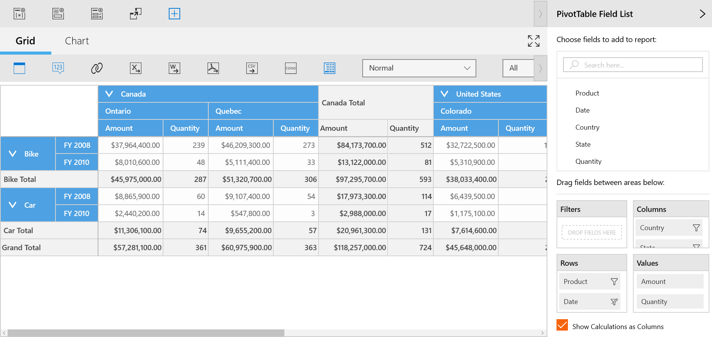
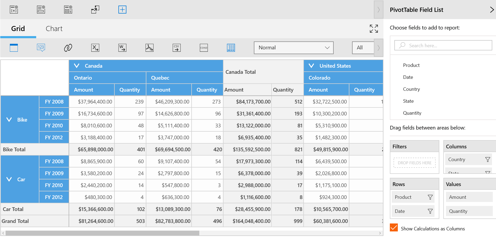
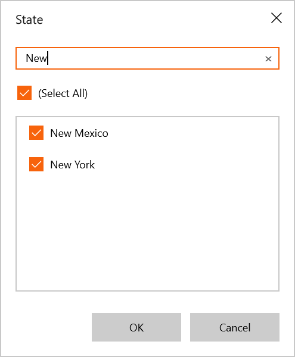

# Data Exploration

## Filtering

Filtering can be applied to SfPivotClient control at run time using **Filter Editor** dialog. This dialog can be opened by clicking the *Filter icon* present over the right corner of fields in the Rows or Columns section of Axis Element Builder.

Filter editor dialog is used to filter the values at run time. It displays only a subset of data that meets a specific criteria and hides the data that you do not want to display.

The *(Select All)* option in the dialog lets the user to select or un-select all fields for filtering. If we want to filter some values, we must uncheck some field values in the filter editor dialog and then click the **OK** button.

The following screenshots illustrate that the members of FY2009 and FY2012 are excluded from the SfPivotClient control.

## Grouping

The data can be grouped when more than one pivot item is added to column or row section in Axis Element Builder. Based on the order of addition, the data is grouped and then control is refreshed.

In the following example, **Date** values get grouped, with respect to the values of **Product**. Likewise multiple dimension members can be grouped by dragging the elements from Cube Dimension Browser to Axis Element Builder.

## Searching

If you want to search the pivot item values, we need to enter required text in the search box. Based on the search text, the relevant field values will be displayed in the field list.

The following screenshot shows how to search pivot item values in filter editor dialog.

