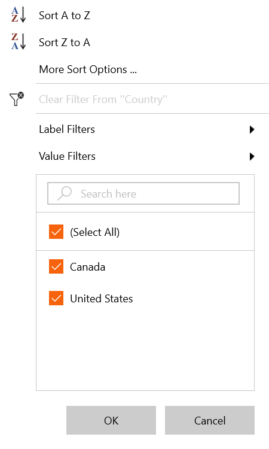
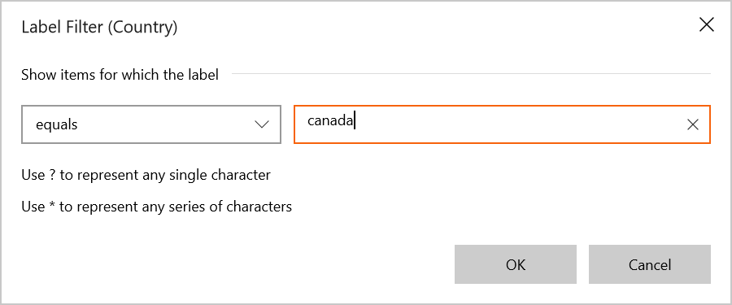
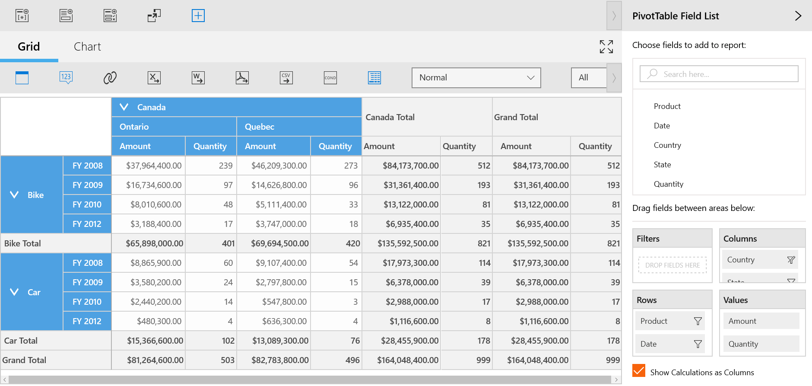
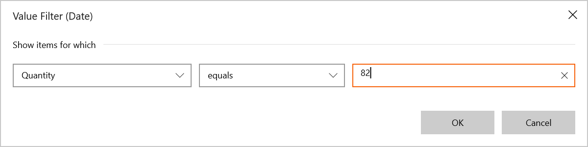
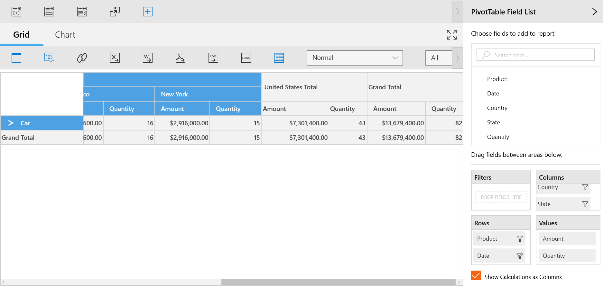

# Excel-Like Filtering and Sorting

SfPivotClient control provides support for excel-like filtering and sorting applied to a PivotItem. We can enable or disable the excel-like sorting and filtering support in SfPivotClient by setting the property of  `AllowMultiFunctionalSortFilter`.

Please refer the below code snippet to enable excel like filtering and sorting.





<syncfusion:SfPivotClient x:Name="pivotClient" AllowMultiFunctionalSortFilter="True" />





this.pivotClient.AllowMultiFunctionalSortFilter = true;





Me.pivotClient.AllowMultiFunctionalSortFilter = True





## Multi-Functional Features

**Sort A to Z**

It can be used to sort the corresponding PivotItem in the *Ascending order*.

**Sort Z to A**

It can be used to sort the corresponding PivotItem in the *Descending order*.

**More Sort Options**

It is used to sort the corresponding PivotItem based upon the Grandtotal of the PivotCalculation field.

**Clear filters**

It is used to clear all the filter changes applied to the corresponding PivotItem and could bring back the SfPivotClient to the normal state.

**Label Filters**

It is used to filter the SfPivotClient based on the labels of PivotItem field and it can be achieved by using various options which are listed below.

* Equals
* Does Not Equal
* Begins With
* Does Not Begin With
* Ends with
* Does Not End With
* Contains
* Does Not Contain
* Greater Than
* Greater Than or Equal To
* Less than
* Less than or Equal To
* Between
* Not Between

_Label filter dialog for filtering "Canada" in Country_

_SfPivotClient applied with label filter_

**Value Filters**

It is used to filter the SfPivotClient based on the values of PivotItem field and it can be achieved by using various options which are listed below.

* Equals
* Does Not Equal
* Greater Than
* Greater Than or Equal To
* Less than
* Less than or Equal To
* Between
* Not Between
* Top 10

_Value filter dialog for filtering "France" using its Quantity value "398"_

_SfPivotClient applied with value filter_