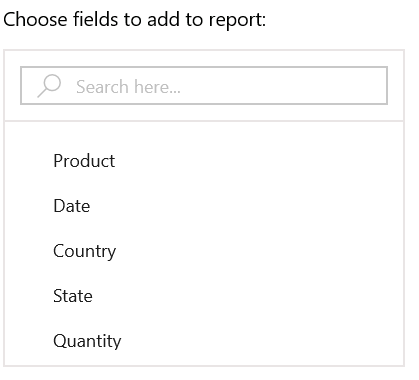

# PivotClient: Components

## Pivot Table Field List

By using the Pivot Table Field List, you can add, re-arrange or remove fields to show data in SfPivotClient exactly the way you want.

With the current implementation of Grouping Bar, the deleted items cannot be added again in SfPivotClient. In order to achieve this requirement, Pivot
Table Field List is maintained with components listed below.

* Pivot Browser
* Axis Element Builder
* Show Calculations as Columns

### Pivot Browser

Pivot Browser represents the collection of pivot items available in the data source. You need to add the pivot items to Rows or Columns section, by dragging and dropping pivot items from browser to required Axis Element Builder.

### Axis Element Builder

Axis Element Builder is used to re-arrange and re-position the fields in SfPivotClient. Based on the fields in the section, SfPivotGrid and SfPivotChart will display the resultant data.

#### Filters

Filters section is used to narrow the focus of the multidimensional data displayed in the SfPivotChart/SfPivotGrid. For the filter section to display the fields, that field must not be present on both columns and rows section.

#### Columns

Columns section is used to display fields as columns at the top of a report.

It defines one or more fields that are displayed into the PivotColumns of the SfPivotGrid. If more than one field is in the column section,then the SfPivotChart/SfPivotGrid will stack each dimension. The order in which the fields are stacked is based on the order that they appears on the PivotColumns.

#### Rows

Rows section is used to display fields as rows at the top of a report.

It defines one or more fields that are displayed into the PivotRows of the SfPivotGrid. If more than one field is in the row section, then the SfPivotChart/SfPivotGrid will stack each dimension. The order in which the fields are stacked is based on the order that they appears on the PivotRows.

#### Values

Values section is used to display the summary fields of the SfPivotGrid. It defines the one or more PivotComputationInfo items that are displayed into the PivotCalculations of SfPivotGrid.

#### Split Button

Split Button highlights the elements in the Axis Element Builder. It holds pivot item or pivot computation item or filter expression item which can be dragged and dropped from Pivot Browser into Axis Element Builder.

While doing drag and drop operation, a split button is created along with displaying the caption of corresponding pivot item or pivot computation item or filter expression item.

#### Operations in Axis Element Builder

**Adding Items to Axis**

The pivot items or pivot computation items can be dragged from the Pivot Browser and dropped into the Axis Element Builder at desired position using the drag-and-drop operation. Also we can be move the items from any axis to other axis by dragging an appropriate item and dropping them at desired position in Axis Element Builder.

**Removing Items from Axis**

In order to remove the pivot item or pivot computation item from the Axis Element Builder, right-click the items in the rows or columns or filters or values and select the **Remove** option from the fly-out menu.

The below screenshot illustrates how to remove an item from Axis Element Builder.

**Rearranging Items in Axis**

Rearranging can be done by using the context menu available in the Axis Element Builder. Right click the desired item from rows or columns or values or filters and then select the desired option like *Move Down*, *Move Up*, *Move First* and *Move Last*  from the menu items to rearrange the selected item.

The below screenshot illustrates how to rearrange an item in Axis Element Builder.

### Pivot Computation Information Dialog

The Pivot Computation Information dialog is used to change or edit value formats, summary types, calculation types and the field header. It can be opened by double clicking the fields in Values section.

### Filter Editor Dialog

Filter Editor dialog displays collection of selected pivot items. It can be opened by clicking the *Filter Button* present over right corner of the fields in the Rows or Columns section.

Filter Editor dialog is used to filter the values at run time, so that it displays only a subset of data that meets a criteria that you specify and hides data that you do not want to display.

The *(Select All)* option in the dialog lets the user to select or un-select all fields for filtering.

### Show Calculations As Columns

SfPivotClient provides support to show the calculation values either in Columns or Rows section. In-order to view the calculation values in row, un-check the “Show Calculations as column” check box.

## Toolbar

By default the following options are available in the toolbar.

* Expression Field - The button used to add an expression field at run-time.
* Custom Summary - The button used to change the SummaryType into Custom for existing PivotCalculations.
* Calculated Field - The button used to add a calculated field at run-time.
* Toggle Pivot - The toggle button used to swap the pivot items from rows to columns and vice versa.
* Show/Hide Expanders - The toggle button that toggles the visibility of expanders used for drilling operations.

## SfPivotGrid and SfPivotChart

The [SfPivotGrid](http://help.syncfusion.com/uwp/sfpivotgrid/overview/) and [SfPivotChart](http://help.syncfusion.com/uwp/sfpivotchart/overview) controls will be rendered with respect to the operations done at Axis Element Builder.