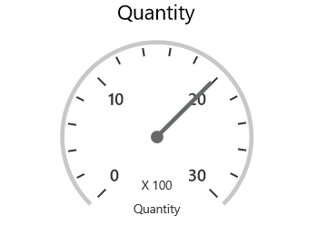

# Appearance

## Layout Customization

SfPivotGauge provides support to display multiple gauges in a structured layout and it can be achieved by using the properties of `RowsCount` and `ColumnsCount`. These properties specify the number of rows and columns required for displaying the control.





<syncfusion:SfPivotGauge x:Name="PivotGauge1" RowsCount="2" ColumnsCount="2"
                         ItemSource="{Binding ProductSalesData}" PivotRows="{Binding PivotRows}"
                         PivotColumns="{Binding PivotColumns}" PivotCalculations="{Binding PivotCalculations}">
</syncfusion:SfPivotGauge>





PivotGauge1.RowsCount = 2;
PivotGauge1.ColumnsCount = 2;





PivotGauge1.RowsCount = 2
PivotGauge1.ColumnsCount = 2





## Gauge Radius

SfPivotGauge provides support to adjust its radius by assigning a proper value to its `Radius` property. The following code snippet illustrates about how to modify the radius of SfPivotGauge.





<syncfusion:SfPivotGauge x:Name="PivotGauge1" Radius="75"
                         ItemSource="{Binding ProductSalesData}" PivotRows="{Binding PivotRows}"
                         PivotColumns="{Binding PivotColumns}" PivotCalculations="{Binding PivotCalculations}">
</syncfusion:SfPivotGauge>





PivotGauge1.Radius = 75;





PivotGauge1.Radius = 75





## Gauge Header

Gauge header is the combination of details about calculation and KPI. The header components of SfPivotGauge can be hidden by using the property of `ShowGaugeHeader` as specified in the following code snippet.





<syncfusion:SfPivotGauge x:Name="PivotGauge1" ShowGaugeHeaders="False"
                         ItemSource="{Binding ProductSalesData}" PivotRows="{Binding PivotRows}"
                         PivotColumns="{Binding PivotColumns}" PivotCalculations="{Binding PivotCalculations}">
</syncfusion:SfPivotGauge>





PivotGauge1.ShowGaugeHeaders = false;





PivotGauge1.ShowGaugeHeaders = False





## Gauge Label

The visibility of gauge labels that is displayed inside the gauge can be toggled with the help of `ShowGaugeFactors` property. The following code snippet shows how to hide the labels of SfPivotGauge.





<syncfusion:SfPivotGauge x:Name="PivotGauge1" ShowGaugeLabels="False"
                         ItemSource="{Binding ProductSalesData}" PivotRows="{Binding PivotRows}"
                         PivotColumns="{Binding PivotColumns}" PivotCalculations="{Binding PivotCalculations}">
</syncfusion:SfPivotGauge>





PivotGauge1.ShowGaugeLabels = false;





PivotGauge1.ShowGaugeLabels = False





## Gauge Factor

Gauge factor component can be hidden by using the property of `ShowGaugeFactors` as specified in the below code snippet.





<syncfusion:SfPivotGauge x:Name="PivotGauge1" ShowGaugeFactors="False"
                         ItemSource="{Binding ProductSalesData}" PivotRows="{Binding PivotRows}"
                         PivotColumns="{Binding PivotColumns}" PivotCalculations="{Binding PivotCalculations}">
</syncfusion:SfPivotGauge>





PivotGauge1.ShowGaugeFactors = false;





PivotGauge1.ShowGaugeFactors = False





