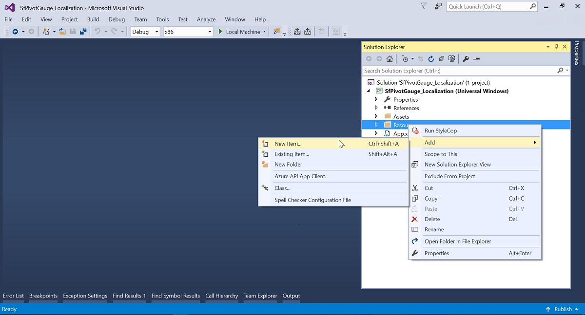
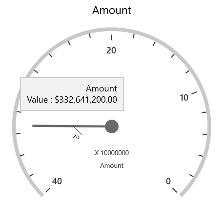

# Localization

Localization is the key feature to provide software solutions that are targeted at global users. SfPivotGauge allows users to localize the control to a specific locale. SfPivotGauge supports “resx” based localization.

You should perform the following steps to localize the control:

* Translation
* Resource file and file name conventions
* Culture specification

## Translation

The first step in localization is translating the strings that can be localized to the destination locale.

N> Localization key field should be same for all locales. Do not translate the key fields.

## Resource file and file name conventions

After translating the strings, perform the following steps in the application:

1.Right-click the project file to create a new folder in the project by selecting Add > New Folder and rename the folder as “Resources”.
2.Then, right-click the **Resources** folder to create a new resource file by selecting Add > New Item.

N> The resource file name should be in the format “&lt;Culture Code&gt;.resx”.

3.Copy and paste the translated locale to the resource file which is created in the previous step.

## Culture specification

You should specify the CurrentUICulture in the Application_Startup method of App.xaml.cs file or in the constructor of MainPage.xaml.cs file.

N> If you are specifying the current culture in the constructor of MainPage, then ensure that the culture is specified before calling the InitializeComponent() method.





public sealed partial class MainPage : Page
{
    public MainPage()
    {
        ApplicationLanguages.PrimaryLanguageOverride = "ar-AE";
        this.InitializeComponent();
    }
}





Public NotInheritable Partial Class MainPage
    Inherits Page
    Public Sub New()
        ApplicationLanguages.PrimaryLanguageOverride = "ar-AE"
        Me.InitializeComponent()
    End Sub
End Class





## RTL

SfPivotGauge provides RTL support to display the content from right to left direction by setting the property of `FlowDirection` property as **RightToLeft**.





<syncfusion:SfPivotGauge x:Name="PivotGauge1" FlowDirection="RightToLeft"
                         ItemSource="{Binding ProductSalesData}" PivotRows="{Binding PivotRows}"
                         PivotColumns="{Binding PivotColumns}" PivotCalculations="{Binding PivotCalculations}">
</syncfusion:SfPivotGauge>





PivotGauge1.FlowDirection = FlowDirection.RightToLeft;





PivotGauge1.FlowDirection = FlowDirection.RightToLeft





A demo sample is available at the following location:

{system drive}:\Users\\&lt;User Name&gt;\AppData\Local\Syncfusion\EssentialStudio\\&lt;Version Number&gt;\Samples\UWP\SampleBrowser\PivotGauge\PivotGauge\View\Localization.xaml