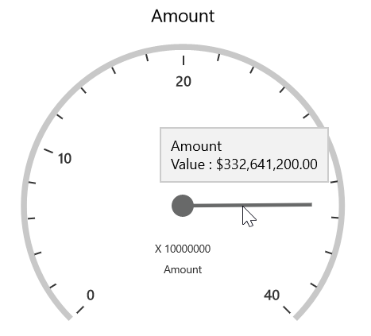

# Tooltip

SfPivotGauge provides the information about values when the mouse pointer is moved over the gauge. The below code snippet illustrates how to show tooltip by using `ShowGaugeTooltip` property.





<syncfusion:SfPivotGauge x:Name="PivotGauge1" ShowGaugeTooltip="True"
                         ItemSource="{Binding ProductSalesData}" PivotRows="{Binding PivotRows}"
                         PivotColumns="{Binding PivotColumns}" PivotCalculations="{Binding PivotCalculations}">
</syncfusion:SfPivotGauge>





PivotGauge1.ShowGaugeTooltip = true;





PivotGauge1.ShowGaugeTooltip = True





