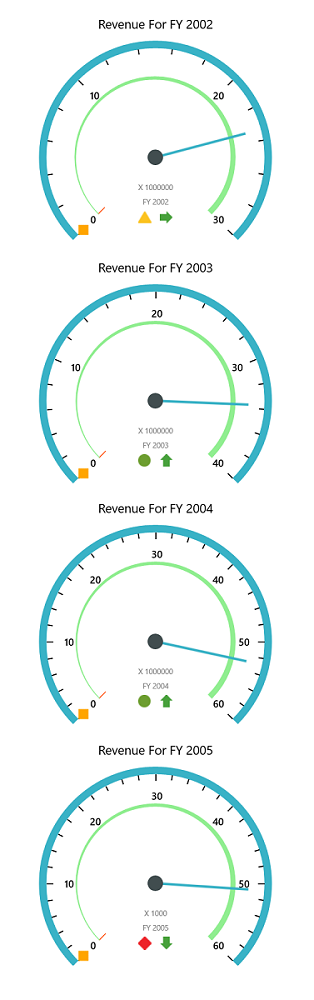

# Getting Started

## Creating a simple application with SfPivotGauge Control

This section explains the steps required to create a simple SfPivotGauge control bound to OLAP data source and also covers the information about creating a WCF service which helps to bind OLAP data to SfPivotGauge control through OlapDataManager.

### Control Initialization

Create a blank **Universal Windows Platform** application by using Visual Studio IDE and name the project as **"SfPivotGaugeDemo".**

SfPivotGauge control can be initialized and added to an application through 3 ways:

1. Adding control through designer.
2. Adding control through XAML.
3. Adding control through code-behind.

#### Adding Control through Designer

Select **"Properties"** under SfPivotGaugeDemo project shown in Solution Explorer and change the Target Version of the application as **"Windows 10 (10.0; Build 10240)"**.

Now open the MainPage.xaml file under SfPivotGaugeDemo project to view the designer. Then select the SfPivotGauge control under “Syncfusion Controls for UWP XAML” group from the toolbox and add it to the designer through drag and drop operation. The corresponding SDK reference will be added to the project automatically.

Finally name the added SfPivotGauge control as “PivotGauge1” in MainPage.xaml to refer it in code-behind as follows:



<PivotGauge:SfPivotGauge x:Name="PivotGauge1"/>



#### Adding Control through XAML

In order to add SfPivotGauge control manually in XAML, the following assembly references must be added in the project.
	
1. Syncfusion.SfPivotGauge.UWP
2. Syncfusion.SfGauge.UWP
3. Syncfusion.Olap.UWP

You can find these libraries under following location.

{Installed Drive}:\Program Files (x86)\Syncfusion\Essential Studio\[Version]\Universal Windows\10.0\SDK\References\CommonConfiguration\neutral\

Or else, the SfPivotGauge control can be added to the project by choosing SDK reference as follows:

Right click on **"References"** under SfPivotGaugeDemo project shown in Solution Explorer and then select Add Reference > Universal Windows > Extensions > Syncfusion Controls for UWP XAML.  
 
Now add the following namespace in MainPage.xaml file.



xmlns:syncfusion="using:Syncfusion.UI.Xaml.PivotGauge"



Then initialize the SfPivotGauge control inside the Grid by using the specified namespace and name the control as “PivotGauge1”.



<Page
    xmlns="http://schemas.microsoft.com/winfx/2006/xaml/presentation"
    xmlns:x="http://schemas.microsoft.com/winfx/2006/xaml"
    xmlns:local="using:SfPivotGaugeDemo"
    xmlns:d="http://schemas.microsoft.com/expression/blend/2008"
    xmlns:mc="http://schemas.openxmlformats.org/markup-compatibility/2006"
    x:Class="SfPivotGaugeDemo.MainPage"
    xmlns:syncfusion="using:Syncfusion.UI.Xaml.PivotGauge"
    mc:Ignorable="d">

    <Grid Background="{ThemeResource ApplicationPageBackgroundThemeBrush}">
        <syncfusion:SfPivotGauge x:Name="PivotGauge1"/>
    </Grid>
</Page>



#### Adding Control through Code-Behind

In order to add SfPivotGauge control manually in code-behind, the following assembly references must be added in the project.

1. Syncfusion.SfPivotGauge.UWP
2. Syncfusion.SfGauge.UWP
3. Syncfusion.Olap.UWP

You can find these libraries under following location.

{Installed Drive}:\Program Files (x86)\Syncfusion\Essential Studio\[Version]\Universal Windows\10.0\SDK\References\CommonConfiguration\neutral\

Or else, the SfPivotGauge control can be added to the project by choosing SDK reference as follows:

Right click on **"References"** under SfPivotGaugeDemo project shown in Solution Explorer and then select Add Reference > Universal Windows > Extensions > Syncfusion Controls for UWP XAML.

Now open the MainPage.xaml file, and include name for the Grid as “Root_Grid” to refer it in code-behind.



<Page
    xmlns="http://schemas.microsoft.com/winfx/2006/xaml/presentation"
    xmlns:x="http://schemas.microsoft.com/winfx/2006/xaml"
    xmlns:local="using:SfPivotGaugeDemo"
    xmlns:d="http://schemas.microsoft.com/expression/blend/2008"
    xmlns:mc="http://schemas.openxmlformats.org/markup-compatibility/2006"
    x:Class="SfPivotGaugeDemo.MainPage"
    mc:Ignorable="d">

    <Grid Background="{ThemeResource ApplicationPageBackgroundThemeBrush}" x:Name="Root_Grid">
    </Grid>
</Page>



Next add the namespace - "Syncfusion.UI.Xaml.PivotGauge" in MainPage.xaml.cs file. Then initialize the SfPivotGauge control and assign a name for it as "PivotGauge1". Then add the control in parent Grid as follows.



using Windows.UI.Xaml.Controls;
using Syncfusion.UI.Xaml.PivotGauge;

namespace SfPivotGaugeDemo {
    /// 

    /// An empty page that can be used on its own or navigated to within a Frame.
    /// 

    public sealed partial class MainPage: Page {
        public MainPage() {
            this.InitializeComponent();
            SfPivotGauge pivotGauge = new SfPivotGauge();
            pivotGauge.Name = "PivotGauge1";
            Root_Grid.Children.Add(pivotGauge);
        }
    }
}



### Adding Service Reference to Project

N> The following steps explain about how to refer the online service in Universal Windows Platform application in-order to bind the Cube information in SfPivotGauge. The service URL used here refers our demo Cube - “Adventure Works”, mainly for illustration purpose. To create your own WCF service, please refer the topic of [Creating WCF Service Application.](http://help.syncfusion.com/uwp/sfpivotgauge/getting-started#creating-wcf-service-application).

After initializing SfPivotGauge control, right click on **"References"** under SfPivotGaugeDemo project shown in Solution Explorer and select **"Add Service Reference"** option.  

In “Add Service Reference” window, enter the following address and click “Go” button to add the online service.

[http://bi.syncfusion.com/OlapUWPService/OlapManager.svc/mex](http://bi.syncfusion.com/OlapUWPService/OlapManager.svc/mex).

Also change the default service namespace from "ServiceReference1" to "OlapManagerService" so that it will be easier to identify the OLAP service later. Finally click "OK" button to add the service reference.

Then include the following code in MainPage.xaml.cs file to hook the loaded event of SfPivotGauge control.



public MainPage() {
    this.InitializeComponent();

    //Hook PivotGauge's loaded event to assign OlapDataManager
    PivotGauge1.Loaded += PivotGauge_Loaded;
}

private void PivotGauge_Loaded(object sender, Windows.UI.Xaml.RoutedEventArgs e) {

}



In the **PivotGauge_Loaded method**, initialize the OlapDataManager and hook its OlapDataChanged event. Then create an OlapReport and assign it to OlapDataManager through **"SetCurrentReport"** method. Finally assign the OlapDataManager to SfPivotGauge’s OlapDataManager.



       private void PivotGauge_Loaded(object sender, Windows.UI.Xaml.RoutedEventArgs e) {
           OlapDataManager olapDataManager = new OlapDataManager();
           // Hook OlapDataManager’s OlapDataChanged event.
           olapDataManager.OlapDataChanged += OlapDataManager_OlapDataChanged;
           // Assign created report to current report of OlapDataManager.
           olapDataManager.SetCurrentReport(CreateOlapReport());
           PivotGauge1.OlapDataManager = olapDataManager;
       }

       private void OlapDataManager_OlapDataChanged(object sender, OlapDataChangedEventArgs args) {}

       private OlapReport CreateOlapReport() {
           OlapReport olapReport = new OlapReport() {
               Name = "VirtualKPI.Report"
           };
           olapReport.CurrentCubeName = "Adventure Works";

           DimensionElement internalDimension = new DimensionElement();
           internalDimension.Name = "Product";
           internalDimension.AddLevel("Product Categories", "Category");
           internalDimension.Hierarchy.LevelElements[0].Add(new MemberElement {
               Name = "Bikes"
           });

           KpiElements kpiElement = new KpiElements();
           kpiElement.Elements.Add(new KpiElement {
               Name = "Revenue", ShowKPIStatus = true, ShowKPIGoal = false, ShowKPITrend = true, ShowKPIValue = true
           });

           MeasureElements measureElementColumn = new MeasureElements();
           measureElementColumn.Elements.Add(new MeasureElement {
               Name = "Sales Amount"
           });
           measureElementColumn.Elements.Add(new MeasureElement {
               Name = "Order Quantity"
           });

           DimensionElement dimensionElementRow = new DimensionElement();
           dimensionElementRow.Name = "Date";
           dimensionElementRow.AddLevel("Fiscal", "Fiscal Year");

           olapReport.CategoricalElements.Add(measureElementColumn);
           olapReport.CategoricalElements.Add(kpiElement);
           olapReport.SeriesElements.Add(dimensionElementRow);

           return olapReport;
       }
       


N> **"OlapDataChanged"** event should be hooked before setting the current report to OlapDataManager.

Next declare a global reference to OlapManagerService’s IOlapDataProvider. In the **OlapDataManager_OlapDataChanged** method, call the **"SetConnection"** method to initialize the connection. Then call the **GetJSONDataAsync** operation by passing parameters of serialized OlapReport and the MDX query generated from the current OlapReport.  The resultant serialized CellSet is assigned to JSONData of SfPivotGauge’s OlapDataManager.



public sealed partial class MainPage: Page {
    OlapManagerService.IOlapDataProvider clientChannel;

    public MainPage() {……………}

    private void OlapDataManager_OlapDataChanged(object sender, OlapDataChangedEventArgs args) {
        if (args.MDXQuery != null && sender is OlapDataManager) {
            SetConnection();
            (sender as OlapDataManager).JSONData = clientChannel.GetJSONDataAsync(args.MDXQuery, args.SerializedReport).Result;
        }
    }

    private void SetConnection() {
        //To create service contract
        BasicHttpBinding basicHttpBinding = new BasicHttpBinding();
        basicHttpBinding.MaxReceivedMessageSize = 2147483647;
        basicHttpBinding.MaxBufferSize = 2147483647;
        EndpointAddress address = new EndpointAddress("http://bi.syncfusion.com/OlapUWPService/OlapManager.svc/");
        ChannelFactory < OlapManagerService.IOlapDataProvider > clientFactory = new ChannelFactory < OlapManagerService.IOlapDataProvider > (basicHttpBinding, address);
        clientChannel = clientFactory.CreateChannel();
    }
}



Finally, the SfPivotGauge control is rendered as shown below. 

 

## Creating WCF Service Application

Create a new **WCF** Service application by using Visual Studio IDE and name the WCF project as **"OlapManagerService".**

Add the following dependency assemblies into your WCF service application.  

* Syncfusion.Olap.Base.dll
* Syncfusion.OlapUWP.BaseWrapper.dll

You can find these libraries under following location.

{Installed Drive}:\Program Files (x86)\Syncfusion\Essential Studio\[Version]\Assemblies\4.6\

N> ADOMD.NET assembly (Microsoft.AnalysisServices.AdomdClient.dll) is required to create SfPivotGauge control.
The above assembly can be obtainable after installing the following setup files.
SQLSERVER2008_ASADOMD10.msi and SQLSERVER2008_ASOLEDB10.msi
These setup files can be downloaded at  [Microsoft download center](https://www.microsoft.com/en-us/download).
If you have installed any version of SQL Server Analysis Service (SSAS) or Microsoft ADOMD.NET utility, then the location of Microsoft.AnalysisServices.AdomdClient library is [system drive:\Program Files (x86)\Microsoft.NET\ADOMD.NET].

Now open the “Service1.svc.cs” file under “OlapManagerService” project and replace the existing code with the exact following code.



using Syncfusion.Olap.UWP.Common;
using Syncfusion.Olap.UWP.Data;
using Syncfusion.Olap.UWP.Manager;
using System.ServiceModel;
using System.ServiceModel.Activation;

namespace OlapManagerService {
    [AspNetCompatibilityRequirements(RequirementsMode = AspNetCompatibilityRequirementsMode.Allowed)]
    [ServiceBehavior(IncludeExceptionDetailInFaults = true)]
    public class Service1: IOlapDataProvider {#
        region Private variables

        private readonly OlapDataProvider _dataProvider;

        #endregion

        # region Constructor
        /// 

        /// Initializes a new instance of the <see cref="Service1"/> class.
        /// 

        public Service1() {
            string connectionString = "Data Source=http://bi.syncfusion.com/olap/msmdpump.dll; Initial Catalog=Adventure Works DW 2008 SE;";
            _dataProvider = new OlapDataProvider(connectionString);
        }

        #endregion

        # region IOlapDataProvider Members

        public string GetJSONData(string mDXQuery, string serializedReport) {
            CellSet cellSet = _dataProvider.ExecuteMdxQuery(mDXQuery, serializedReport);
            _dataProvider.DataProvider.CloseConnection();
            return Utils.Serialize(cellSet);
        }

        #endregion
    }
}



N> Here we have specified our demo Cube path for demonstration purpose. You can modify the connection string as per your requirement.

Include the basic HTTP binding and service endpoint address in the web.config file by replacing the following code snippet of **"ServiceModel"** section.



<system.serviceModel>
    <bindings>
        <basicHttpBinding>
            <!-- Create a custom binding for our service to enable sending large amount of data -->
            <binding name="BasicHttpBinding" maxBufferPoolSize="2147483647" maxReceivedMessageSize="2147483647" maxBufferSize="2147483647">
                <readerQuotas maxArrayLength="2147483647" maxBytesPerRead="2147483647" maxDepth="2147483647" maxNameTableCharCount="2147483647" maxStringContentLength="2147483647" />
            </binding>
        </basicHttpBinding>
    </bindings>
    <behaviors>
        <serviceBehaviors>
            <behavior name="OlapManagerService.Service1Behavior">
                <serviceMetadata httpGetEnabled="true" />
                <serviceDebug includeExceptionDetailInFaults="true" />
                <dataContractSerializer maxItemsInObjectGraph="2147483647" />
            </behavior>
        </serviceBehaviors>
    </behaviors>
    <serviceHostingEnvironment multipleSiteBindingsEnabled="false" />
    <services>
        <service behaviorConfiguration="OlapManagerService.Service1Behavior" name="OlapManagerService.Service1">
            <endpoint address="" binding="basicHttpBinding" bindingConfiguration="BasicHttpBinding" contract="Syncfusion.Olap.UWP.Manager.IOlapDataProvider" />
            <endpoint address="mex" binding="mexHttpBinding" contract="IMetadataExchange" />
        </service>
    </services>
</system.serviceModel>



Then build and host this WCF service in IIS. Refer the hosted URL as service reference in your Universal Windows Platform application (client application). This is how we have hosted our service in IIS and referred the obtained URL i.e., [http://bi.syncfusion.com/OlapUWPService/OlapManager.svc/mex] (http://bi.syncfusion.com/OlapUWPService/OlapManager.svc/mex) as service reference in the sample illustrated in [Adding Service Reference to Project section.](http://help.syncfusion.com/uwp/SfPivotGauge/Getting-Started#Adding Service Reference to Project)

