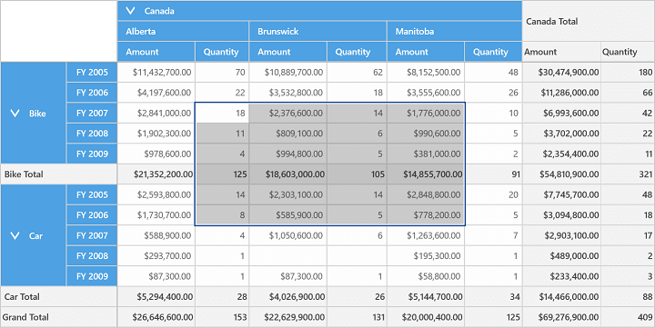
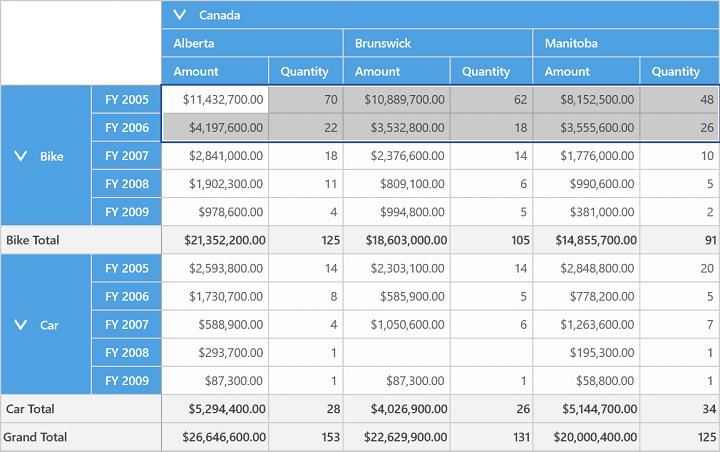
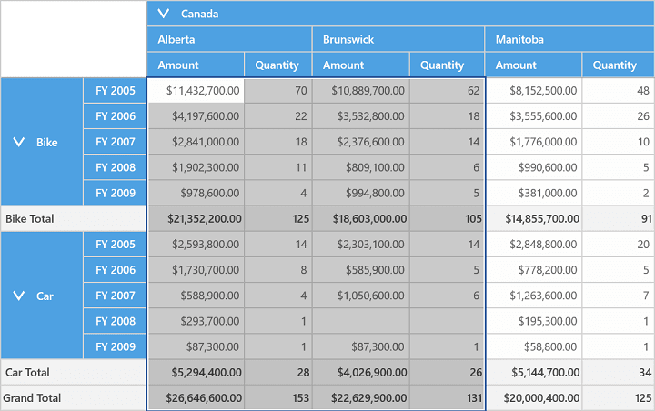
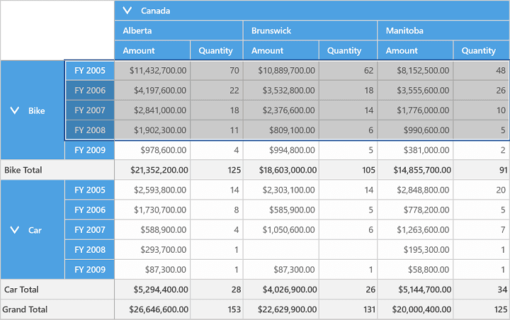
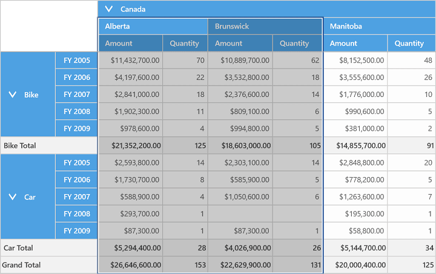

# Cell Selection

SfPivotGrid supports excel like cell selection where you can select grid value cells like in Microsoft Excel. This can be achieved by setting the `AllowSelection` property of SfPivotGrid to true.

On cell selection, **SelectionChanged** event will be triggered and **PivotGridSelectionChangedEventArgs** will return an IEnumerable collection of column index, row index and value index of the corresponding selected cell. The event argument will also return the cell range and the selection mode like mouse-down, mouse-move, mouse-up etc.

Please refer the below code snippet to enable cell selection.





<!--Adding SfPivotGrid and enabling cell selection-->
<syncfusion:SfPivotGrid x:Name="PivotGrid1" **AllowSelection="True"**/>





this.PivotGrid1.AllowSelection = true;





Me.PivotGrid1.AllowSelection = True





This is illustrated in the following screenshot:

## Multi-Row Selection

You can select a whole row in PivotGrid by clicking on the specific row header and you could select multiple rows by clicking on one row header and dragging it through other row headers as per our requirement.

## Multi-Column Selection

You can select a whole column in PivotGrid by clicking on the specific column header and you could select multiple columns by clicking on one column header and dragging it through other column headers as per our requirement.

## Selection With Headers

The `AllowSelectionWithHeaders` property can be used to achieve the cell selection behavior along with headers. Please refer the below code snippet to enable cell selection with headers.

N> It is applicable only for Relational DataSource.





<syncfusion:SfPivotGrid x:Name="PivotGrid1" **AllowSelectionWithHeaders="True"**/>





this.PivotGrid1.AllowSelectionWithHeaders = true;





Me.PivotGrid1.AllowSelectionWithHeaders = True





This following screenshot illustrates the cell selection along with row headers.

This following screenshot illustrates the cell selection along with column headers.

A demo sample is available at the following location.

{system drive}:\Users\&lt;User Name&gt;\AppData\Local\Syncfusion\EssentialStudio\&lt;Version Number&gt;\Samples\UWP\SampleBrowser\PivotGrid\PivotGrid\View\CellSelection.xaml