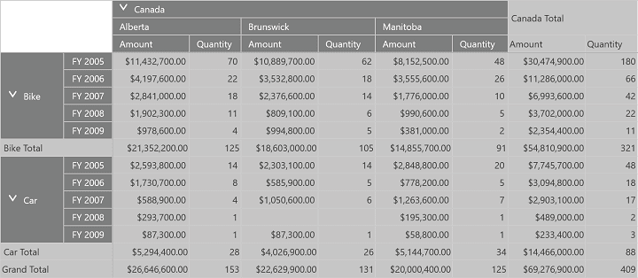

# Theming

Theming is the process of applying particular settings to visual elements of a control. Following built-in themes are supported in the SfPivotGrid control.

* Blend
* Lime
* Metro
* Office2010Blue
* Office2010Black
* Office2010Silver
* Office2013LightGray
* Office2013DarkGray
* Office2013White
* Office2016Colorful
* Office2016DarkGray
* Office2016White
* Office365
* Saffron
* VisualStudio2013
* VisualStudio2015

By using the `GridVisualStyle` property in the SfPivotGrid, you can set the visual style of the control. By default, the `Metro` theme is applied. The following code snippet shows how to change the visual style for the SfPivotGrid.





<syncfusion:SfPivotGrid x:Name="PivotGrid1" GridVisualStyle="Office2010Black"
                        ItemSource="{Binding ProductSalesData}" PivotRows="{Binding PivotRows}"
                        PivotColumns="{Binding PivotColumns}" PivotCalculations="{Binding PivotCalculations}"/>





this.PivotGrid1.GridVisualStyle = PivotGridVisualStyle.Office2010Black;





Me.PivotGrid1.GridVisualStyle = PivotGridVisualStyle.Office2010Black





