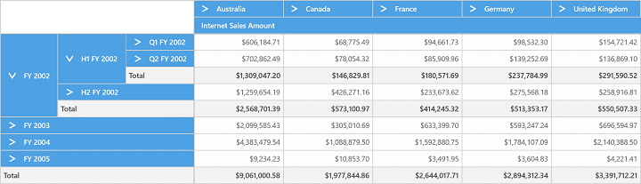
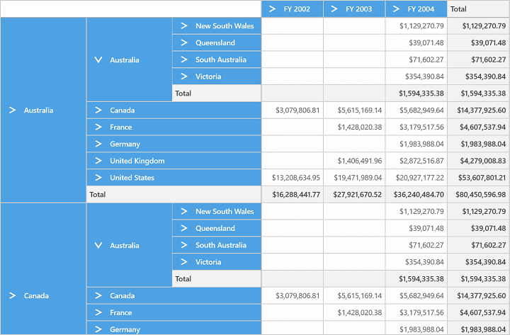
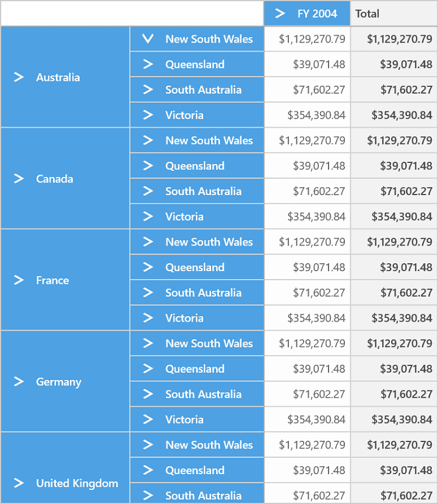
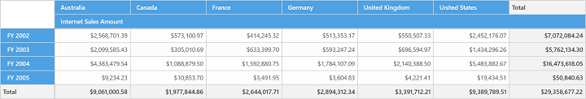

# Drill Operation

## Drill Down / Drill Up

This is a basic feature of SfPivotGrid through which the amount of information can be limited for a better view. It allows you to drill down to access the detailed level of data or drill up to see the summarized data by using the expander present in the grid cells.

Drill up, also called as roll up, navigates from more detailed data to less detailed data, by climbing up a concept hierarchy for a dimension.

Drill down, also called as roll down, is the reverse of drill up which navigates from less detailed data to more detailed data, by climbing down a concept hierarchy for a dimension.

While binding hierarchical dimensions (for example, the time dimension could include 3 levels namely Year, Quarter, and Month), the SfPivotChart allows you to visualize the data for different levels by using the collapsible labels which is illustrated in the following screenshot.

## Drill Types

The following drill types are supported in SfPivotChart.

* Drill Member
* Drill Position
* Drill Replace

**Drill Member**

'Drill Member' is the default drilling type performed in SfPivotGrid. When multiple dimensions are added in the grid, expanding a single member expands the corresponding member element across all of its positions. The following code snippet and screenshot illustrates how the elements are drilled in drill member type.





pivotGrid1.OlapDataManager.CurrentReport.DrillType = DrillType.DrillMember;





pivotGrid1.OlapDataManager.CurrentReport.DrillType = DrillType.DrillMember





**Drill Position**

'Drill Position' type enables the user to drill only the current position of a selected member in the OLAP Report. This excludes the drilled data of the selected member in other positions by using MDX query. The following code snippet and screenshot illustrates how the elements are drilled in drill position type.





pivotGrid1.OlapDataManager.CurrentReport.DrillType = DrillType.DrillPosition;





pivotGrid1.OlapDataManager.CurrentReport.DrillType = DrillType.DrillPosition





**Drill Replace**

SfPivotGrid supports 'Drill Replace' type, in which the control would tend to display only the immediate child members and ancestors on drill-down. The following code snippet and screenshot illustrates how the elements are drilled in drill member type.





pivotGrid1.OlapDataManager.CurrentReport.DrillType = DrillType.DrillReplace;





pivotGrid1.OlapDataManager.CurrentReport.DrillType = DrillType.DrillReplace





N> The drilled-down member will be replaced with the drilled data and it cannot be drilled-up.

N> Since the property `DrillType` interacts with the `OlapDataManager`, you need to call `DataBind()` method of SfPivotGrid after assigning the value to this property.

## Show / Hide Expanders

The expander refers to the arrow sign prior to a member present in the grid cells. The visibility of expanders in the SfPivotGrid can be toggled with the help of `ShowExpanders` property available in the OLAP Report.

Please refer the below code snippet to disable expanders in SfPivotGrid.





pivotGrid1.OlapDataManager.CurrentReport.ShowExpanders = false;





pivotGrid1.OlapDataManager.CurrentReport.ShowExpanders = False





N> Since the property `ShowExpanders` interacts with the `OlapDataManager`, you need to call `DataBind()` method of SfPivotGrid after assigning the value to this property.
