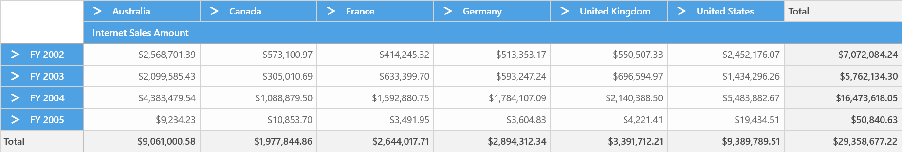

# Getting Started

This section covers the information required to create a simple SfPivotGrid control bound to OLAP data source and also about creating a WCF service which helps to bind OLAP data to SfPivotGrid control through OlapDataManager.

### Control Initialization

SfPivotGrid control can be initialized and added to an application through the following ways:

1. Through designer
2. Through XAML
3. Through code-behind

## Adding Control through Designer

Open Visual Studio IDE and navigating to *File > New > Project > Universal > Blank APP(Universal Windows)* under Windows option inside the Visual C# Templates to create a new UWP application.

N> Once the UWP application is created, select `Properties` under the project shown in Solution Explorer and change the Target Version of the application as **Windows 10 (10.0; Build 10240)**.

Now select Toolbox options from View menu and it will appear inside the VisualStudio IDE. From the toolbox select SfPivotGrid control under “Syncfusion Controls for UWP XAML” group, then drag and drop it into the designer section of MainPage.xaml file.

Finally name the added SfPivotGrid control as “PivotGrid1” in MainPage.xaml to refer it in code-behind as follows:





<PivotGrid:SfPivotGrid x:Name="PivotGrid1"/>





## Adding Control through XAML

Open Visual Studio IDE and navigating to *File > New > Project > Universal > Blank APP(Universal Windows)* under Windows option inside the Visual C# Templates to create a new UWP application.

Then, name the project as "SfPivotGridDemo" while creating the application to access the project later.

In order to add SfPivotGrid control manually in XAML, the following assembly references must be added in the project.

* Syncfusion.SfPivotGrid.UWP
* Syncfusion.SfCellGrid.UWP
* Syncfusion.SfGridCommon.UWP
* Syncfusion.SfShared.UWP
* Syncfusion.SfInput.UWP
* Syncfusion.SfColorPickers.UWP
* Syncfusion.SfBusyIndicator.UWP
* Syncfusion.Olap.UWP
* Syncfusion.PivotAnalysis.UWP
* Syncfusion.Data.UWP

You can find these libraries under following location.

&lt;Installed Drive&gt;:\Program Files (x86)\Syncfusion\Essential Studio\\&lt;Version&gt;\Assemblies for Universal Windows\10.0

Or else, the SfPivotGrid control can be added to the project by choosing SDK reference as follows:

Right click on **References** and select *Add Reference > Universal Windows > Extensions > Syncfusion Controls for UWP XAML*.

Now add the following namespace in MainPage.xaml file.





xmlns:syncfusion="using:Syncfusion.UI.Xaml.PivotGrid"





Then initialize the SfPivotGrid control inside the Grid by using the specified namespace and name the control as “PivotGrid1”.





<Page
    xmlns="http://schemas.microsoft.com/winfx/2006/xaml/presentation"
    xmlns:x="http://schemas.microsoft.com/winfx/2006/xaml"
    xmlns:local="using:SfPivotGridDemo"
    xmlns:d="http://schemas.microsoft.com/expression/blend/2008"
    xmlns:mc="http://schemas.openxmlformats.org/markup-compatibility/2006"
    x:Class="SfPivotGridDemo.MainPage"
    xmlns:syncfusion="using:Syncfusion.UI.Xaml.PivotGrid"
    mc:Ignorable="d">

    <Grid Background="{ThemeResource ApplicationPageBackgroundThemeBrush}">
        <syncfusion:SfPivotGrid x:Name="PivotGrid1"/>
    </Grid>
</Page>





## Adding Control through code-behind

Open Visual Studio IDE and navigating to *File > New > Project > Universal > Blank APP(Universal Windows)* under Windows option inside the Visual C# Templates to create a new UWP application.

Then, name the project as "SfPivotGridDemo" while creating the application to access the project later.

In order to add SfPivotGrid control manually in code-behind, the following assembly references must be added in the project.

* Syncfusion.SfPivotGrid.UWP
* Syncfusion.SfCellGrid.UWP
* Syncfusion.SfGridCommon.UWP
* Syncfusion.SfShared.UWP
* Syncfusion.SfInput.UWP
* Syncfusion.SfBusyIndicator.UWP
* Syncfusion.Olap.UWP
* Syncfusion.PivotAnalysis.UWP
* Syncfusion.SfColorPickers.UWP
* Syncfusion.Data.UWP

You can find these libraries under following location.

&lt;Installed Drive&gt;:\Program Files (x86)\Syncfusion\Essential Studio\\&lt;Version&gt;\Assemblies for Universal Windows\10.0

Or else, the SfPivotGrid control can be added to the project by choosing SDK reference as follows:

Right click on **References** and select *Add Reference > Universal Windows > Extensions > Syncfusion Controls for UWP XAML*.

Now open the MainPage.xaml file, and include name for the Grid as “Root_Grid” to refer it in code-behind.





<Page
    xmlns="http://schemas.microsoft.com/winfx/2006/xaml/presentation"
    xmlns:x="http://schemas.microsoft.com/winfx/2006/xaml"
    xmlns:local="using:SfPivotGridDemo"
    xmlns:d="http://schemas.microsoft.com/expression/blend/2008"
    xmlns:mc="http://schemas.openxmlformats.org/markup-compatibility/2006"
    x:Class="SfPivotGridDemo.MainPage"
    mc:Ignorable="d">

    <Grid Background="{ThemeResource ApplicationPageBackgroundThemeBrush}" x:Name="Root_Grid">
    </Grid>
</Page>





Next add the namespace - "Syncfusion.UI.Xaml.PivotGrid" in MainPage.xaml.cs file. Then initialize the SfPivotGrid control and assign a name for it as "PivotGrid1". Then add the control in parent Grid as follows.





using Windows.UI.Xaml.Controls;
using Syncfusion.UI.Xaml.PivotGrid;

namespace SfPivotGridDemo
{
    /// 

    /// An empty page that can be used on its own or navigated to within a Frame.
    /// 

    public sealed partial class MainPage : Page
    {
        public MainPage()
        {
            this.InitializeComponent();
            SfPivotGrid pivotGrid = new SfPivotGrid();
            pivotGrid.Name = "PivotGrid1";
            Root_Grid.Children.Add(pivotGrid);
        }
    }
}





Imports Windows.UI.Xaml.Controls
Imports Syncfusion.UI.Xaml.PivotGrid

Namespace SfPivotGridDemo

    Public NotInheritable Partial Class MainPage
        Inherits Page

        Public Sub New()
            Me.InitializeComponent()
            Dim pivotGrid As SfPivotGrid = New SfPivotGrid()
            pivotGrid.Name = "PivotGrid1"
            Root_Grid.Children.Add(pivotGrid)
        End Sub
    End Class
End Namespace





## Adding Service Reference to Project

N> The following steps explain about how to refer the online service in Universal Windows Platform application in-order to bind the cube information in SfPivotGrid. The service URL used here refers our demo Cube - “Adventure Works”, mainly for illustration purpose. To create your own WCF service, please refer the topic of [Creating WCF Service Application.](http://help.syncfusion.com/uwp/sfpivotgrid/getting-started#creating-wcf-service-application).

After initializing SfPivotGrid control, right click on **References** and select **Add Service Reference** option.

In “Add Service Reference” window, enter the following address and click “Go” button to add the online service.

[http://bi.syncfusion.com/OlapUWPTestService/OlapManager.svc](http://bi.syncfusion.com/OlapUWPTestService/OlapManager.svc)

Also change the default service namespace from "ServiceReference1" to “OlapManagerService” so that it will be easier to identify the OLAP service later. Finally click “OK” button to add the service reference.

Include the following namespace in code-behind for using OlapDataManager and OlapReport in the application.

* Syncfusion.Olap.UWP.Manager
* Syncfusion.Olap.UWP.Reports

Then include the following code to initialize the OlapDataManager and to create OlapReport through loaded event of SfPivotGrid control.





using Syncfusion.Olap.UWP.Manager;
using Syncfusion.Olap.UWP.Reports;

namespace SfPivotGridDemo
{
    public sealed partial class MainPage : Page
    {
        private OlapManagerService.IOlapDataProvider clientChannel;

        public MainPage()
        {
            this.InitializeComponent();
            //Hook PivotGrid's loaded event to assign OlapDataManager
            PivotGrid1.Loaded += PivotGrid_Loaded;
        }

        private void PivotGrid_Loaded(object sender, Windows.UI.Xaml.RoutedEventArgs e)
        {
            OlapDataManager olapDataManager = new OlapDataManager();
            olapDataManager.OlapDataChanged += OlapDataManager_OlapDataChanged;
            olapDataManager.GetCubeSchema += OlapDataManager_GetCubeSchema;
            olapDataManager.GetCubeInfoCollection += OlapDataManager_GetCubeInfoCollection;
            olapDataManager.GetLevelMembersUsingMdx += OlapDataManager_GetLevelMembersUsingMdx;
            olapDataManager.SetCurrentReport(CreateOlapReport());
            PivotGrid1.OlapDataManager = olapDataManager;
        }

        private OlapReport CreateOlapReport()
        {
            OlapReport olapReport = new OlapReport();
            olapReport.Name = "Sales Report";
            olapReport.CurrentCubeName = "Adventure Works";

            DimensionElement dimensionElementColumn = new DimensionElement();
            dimensionElementColumn.Name = "Customer";
            dimensionElementColumn.HierarchyName = "Customer Geography";
            dimensionElementColumn.AddLevel("Customer Geography", "Country");

            MeasureElements measureElementColumn = new MeasureElements();
            measureElementColumn.Elements.Add(new MeasureElement {
                Name = "Internet Sales Amount"
            });

            DimensionElement dimensionElementRow = new DimensionElement();
            dimensionElementRow.Name = "Date";
            dimensionElementRow.AddLevel("Fiscal", "Fiscal Year");

            olapReport.CategoricalElements.Add(dimensionElementColumn);
            olapReport.CategoricalElements.Add(measureElementColumn);
            olapReport.SeriesElements.Add(dimensionElementRow);

            return olapReport;
        }
    }
}





Imports Syncfusion.Olap.UWP.Manager
Imports Syncfusion.Olap.UWP.Reports

Namespace SfPivotGridDemo

    Public NotInheritable Partial Class MainPage
        Inherits Page

        Private clientChannel As OlapManagerService.IOlapDataProvider

        Public Sub New()
            Me.InitializeComponent()
            PivotGrid1.Loaded += AddressOf PivotGrid_Loaded
        End Sub

        Private Sub PivotGrid_Loaded(ByVal sender As Object, ByVal e As Windows.UI.Xaml.RoutedEventArgs)
            Dim olapDataManager As OlapDataManager = New OlapDataManager()
            olapDataManager.OlapDataChanged += OlapDataManager_OlapDataChanged
            olapDataManager.GetCubeSchema += OlapDataManager_GetCubeSchema
            olapDataManager.GetCubeInfoCollection += OlapDataManager_GetCubeInfoCollection
            olapDataManager.GetLevelMembersUsingMdx += OlapDataManager_GetLevelMembersUsingMdx
            olapDataManager.SetCurrentReport(CreateOlapReport())
            PivotGrid1.OlapDataManager = olapDataManager
        End Sub

        Private Function CreateOlapReport() As OlapReport
            Dim olapReport As OlapReport = New OlapReport()
            olapReport.Name = "Sales Report"
            olapReport.CurrentCubeName = "Adventure Works"
            Dim dimensionElementColumn As DimensionElement = New DimensionElement()
            dimensionElementColumn.Name = "Customer"
            dimensionElementColumn.HierarchyName = "Customer Geography"
            dimensionElementColumn.AddLevel("Customer Geography", "Country")
            Dim measureElementColumn As MeasureElements = New MeasureElements()
            measureElementColumn.Elements.Add(New MeasureElement With {.Name = "Internet Sales Amount"})
            Dim dimensionElementRow As DimensionElement = New DimensionElement()
            dimensionElementRow.Name = "Date"
            dimensionElementRow.AddLevel("Fiscal", "Fiscal Year")
            olapReport.CategoricalElements.Add(dimensionElementColumn)
            olapReport.CategoricalElements.Add(measureElementColumn)
            olapReport.SeriesElements.Add(dimensionElementRow)
            Return olapReport
        End Function
    End Class
End Namespace





N> `OlapDataChanged` event should be hooked before setting the current report to OlapDataManager.

Next declare a global reference to OlapManagerService’s IOlapDataProvider. In the **OlapDataManager_OlapDataChanged method**, call the `SetConnection` method to initialize the connection. Then call the **GetJSONDataAsync** operation by passing parameters of serialized OlapReport and the MDX query generated from the current OlapReport. The resultant serialized CellSet is assigned to JSONData of SfPivotGrid’s OlapDataManager.





namespace SfPivotGridDemo
{
    public sealed partial class MainPage: Page
    {
        OlapManagerService.IOlapDataProvider clientChannel;

        public MainPage()
        {
            //SfPivotGrid control Initialization
        }

        private void OlapDataManager_OlapDataChanged(object sender, OlapDataChangedEventArgs e)
        {
            if (e.MDXQuery != null && sender is OlapDataManager)
            {
                SetConnection();
                (sender as OlapDataManager).JSONData = clientChannel.GetJSONDataAsync(e.MDXQuery, e.SerializedReport, e.AllowMdxToOlapReportParse).Result;
            }
        }

        private string OlapDataManager_GetCubeSchema(object sender, GetCubeSchemaEventArgs e)
        {
            if (e.CubeName != null && sender is OlapDataManager)
            {
                SetConnection();
                return clientChannel.GetJSONCubeSchemaAsync(e.CubeName).Result;
            }
            return null;
        }

        private string OlapDataManager_GetCubeInfoCollection(object sender, GetCubeInfoCollectionEventArgs e)
        {
            if (sender is OlapDataManager)
            {
                SetConnection();
                return clientChannel.GetJSONCubesAsync().Result;
            }
            return null;
        }

        private string OlapDataManager_GetLevelMembersUsingMdx(object sender, GetLevelMembersUsingMdxEventArgs e)
        {
            if (sender is OlapDataManager)
            {
                SetConnection();
                return clientChannel.GetJSONLevelMembersUsingMdxAsync(e.MemberUniqueName, e.AxisPosition, e.IsGrandTotalOn, e.CubeName, e.PagingParams).Result;
            }
            return null;
        }

        private void SetConnection()
        {
            //To create service contract
            BasicHttpBinding basicHttpBinding = new BasicHttpBinding();
            basicHttpBinding.MaxReceivedMessageSize = 2147483647;
            basicHttpBinding.MaxBufferSize = 2147483647;
            EndpointAddress address = new EndpointAddress("http://bi.syncfusion.com/OlapUWPTestService/OlapManager.svc/");
            ChannelFactory<OlapManagerService.IOlapDataProvider> clientFactory = new ChannelFactory <OlapManagerService.IOlapDataProvider> (basicHttpBinding, address);
            clientChannel = clientFactory.CreateChannel();
        }
    }
}





Namespace SfPivotGridDemo

    Public NotInheritable Partial Class MainPage
        Inherits Page

        Private clientChannel As OlapManagerService.IOlapDataProvider

        Public Sub New()
        End Sub

        Private Sub OlapDataManager_OlapDataChanged(ByVal sender As Object, ByVal e As OlapDataChangedEventArgs)
            If e.MDXQuery IsNot Nothing AndAlso TypeOf sender Is OlapDataManager Then
                SetConnection()
                (TryCast(sender, OlapDataManager)).JSONData = clientChannel.GetJSONDataAsync(e.MDXQuery, e.SerializedReport, e.AllowMdxToOlapReportParse).Result
            End If
        End Sub

        Private Function OlapDataManager_GetCubeSchema(ByVal sender As Object, ByVal e As GetCubeSchemaEventArgs) As String
            If e.CubeName IsNot Nothing AndAlso TypeOf sender Is OlapDataManager Then
                SetConnection()
                Return clientChannel.GetJSONCubeSchemaAsync(e.CubeName).Result
            End If

            Return Nothing
        End Function

        Private Function OlapDataManager_GetCubeInfoCollection(ByVal sender As Object, ByVal e As GetCubeInfoCollectionEventArgs) As String
            If TypeOf sender Is OlapDataManager Then
                SetConnection()
                Return clientChannel.GetJSONCubesAsync().Result
            End If

            Return Nothing
        End Function

        Private Function OlapDataManager_GetLevelMembersUsingMdx(ByVal sender As Object, ByVal e As GetLevelMembersUsingMdxEventArgs) As String
            If TypeOf sender Is OlapDataManager Then
                SetConnection()
                Return clientChannel.GetJSONLevelMembersUsingMdxAsync(e.MemberUniqueName, e.AxisPosition, e.IsGrandTotalOn, e.CubeName, e.PagingParams).Result
            End If

            Return Nothing
        End Function

        Private Sub SetConnection()
            Dim basicHttpBinding As BasicHttpBinding = New BasicHttpBinding()
            basicHttpBinding.MaxReceivedMessageSize = 2147483647
            basicHttpBinding.MaxBufferSize = 2147483647
            Dim address As EndpointAddress = New EndpointAddress("http://bi.syncfusion.com/OlapUWPTestService/OlapManager.svc/")
            Dim clientFactory As ChannelFactory(Of OlapManagerService.IOlapDataProvider) = New ChannelFactory(Of OlapManagerService.IOlapDataProvider)(basicHttpBinding, address)
            clientChannel = clientFactory.CreateChannel()
        End Sub
    End Class
End Namespace





Finally, the SfPivotGrid control is rendered as shown below.

## Creating WCF Service Application

Create a new **WCF** Service application by using Visual Studio IDE and name the WCF project as **OlapManagerService**.

Add the following dependency assemblies into your WCF service application.

* Syncfusion.Olap.Base.dll
* Syncfusion.OlapUWP.BaseWrapper.dll

You can find these libraries under following location.

&lt;Installed Drive&gt;:\Program Files (x86)\Syncfusion\Essential Studio\\&lt;Version&gt;\Assemblies\4.6\

N> ADOMD.NET assembly (Microsoft.AnalysisServices.AdomdClient.dll) is required to create SfPivotGrid control.
The above assembly can be obtainable after installing the following setup files.
SQLSERVER2008_ASADOMD10.msi and SQLSERVER2008_ASOLEDB10.msi
These setup files can be downloaded at [Microsoft download center](https://www.microsoft.com/en-in/download/details.aspx?id=16978).
If you have installed any version of SQL Server Analysis Service (SSAS) or Microsoft ADOMD.NET utility, then the location of Microsoft.AnalysisServices.AdomdClient library is [system drive:\Program Files (x86)\Microsoft.NET\ADOMD.NET].

Now the "Service1.svc" would look like:





<%@ ServiceHost Language="C#" Debug="true" Service="OlapManagerService.Service1" CodeBehind="Service1.svc.cs" %>





Then open the “Service1.svc.cs” file under “OlapManagerService” project and replace the existing code with the exact following code.





using Syncfusion.Olap.UWP.Common;
using Syncfusion.Olap.UWP.Data;
using Syncfusion.Olap.UWP.Manager;
using System.ServiceModel;
using System.ServiceModel.Activation;

namespace OlapManagerService
{
    [AspNetCompatibilityRequirements(RequirementsMode = AspNetCompatibilityRequirementsMode.Allowed)]
    [ServiceBehavior(IncludeExceptionDetailInFaults = true)]
    public class Service1: IOlapDataProvider
    {
        #region Private variables

        private readonly OlapDataProvider _dataProvider;

        #endregion

        # region Constructor
        /// 

        /// Initializes a new instance of the <see cref="Service1"/> class.
        /// 

        public Service1()
        {
            string connectionString = "Data Source=http://bi.syncfusion.com/olap/msmdpump.dll; Initial Catalog=Adventure Works DW 2008 SE;";
            _dataProvider = new OlapDataProvider(connectionString);
        }

        #endregion

        # region IOlapDataProvider Members

        public string GetJSONData(string mDXQuery, string currentReport, bool allowMdxToOlapReportParse)
        {
            CellSet cellSet = _dataProvider.ExecuteMdxQuery(mDXQuery, currentReport, allowMdxToOlapReportParse);
            _dataProvider.DataProvider.CloseConnection();
            return cellSet != null ? Utils.Serialize(cellSet) : string.Empty;
        }

        public string GetJSONCubeSchema(string cubeName)
        {
            CubeSchema cubeSchema = _dataProvider.GetCubeSchema(cubeName);
            _dataProvider.DataProvider.CloseConnection();
            return cubeSchema != null ? Utils.Serialize(cubeSchema) : string.Empty;
        }

        public string GetJSONCubes()
        {
            CubeInfoCollection cubeInfoCollection = _dataProvider.GetCubes();
            _dataProvider.DataProvider.CloseConnection();
            return cubeInfoCollection != null ? Utils.Serialize(cubeInfoCollection) : string.Empty;
        }

        public string GetJSONChildMembers(string cubeName, string levelName)
        {
            MemberCollection memberCollection = _dataProvider.GetChildMembers(cubeName, levelName);
            _dataProvider.DataProvider.CloseConnection();
            return memberCollection != null ? Utils.Serialize(memberCollection) : string.Empty;
        }

        public string GetJSONChildrenByMDX(string command)
        {
            MemberCollection memberCollection = _dataProvider.GetChildrenByMDX(command);
            _dataProvider.DataProvider.CloseConnection();
            return memberCollection != null ? Utils.Serialize(memberCollection) : string.Empty;
        }

        public string GetJSONDataWithTotalCount(string currentReport)
        {
            SerializableDictionary<string, object> count = _dataProvider.GetCellSetWithTotalCount(currentReport);
            _dataProvider.DataProvider.CloseConnection();
            return count != null ? Utils.Serialize(count) : string.Empty;
        }

        public string GetJSONExecuteDrillThroughQuery(string mdxQuery)
        {
            var executedQuery = _dataProvider.ExecuteDrillThroughQuery(mdxQuery);
            _dataProvider.DataProvider.CloseConnection();
            return executedQuery != null ? Utils.Serialize(executedQuery) : null;
        }

        public string GetJSONExecuteMemberCount(string mdxQuery)
        {
            var memberCount = _dataProvider.ExecuteMemberCount(mdxQuery);
            _dataProvider.DataProvider.CloseConnection();
            return memberCount >= 0 ? Utils.Serialize(memberCount) : string.Empty;
        }

        public string GetJSONLevelMembersUsingMdx(string memberUniqueName, int axisPosition, bool isGrandTotalOn, string cubeName, string pagingParams)
        {
            var levelMembers = _dataProvider.GetLevelMembersUsingMdx(memberUniqueName, axisPosition, isGrandTotalOn, cubeName, pagingParams);
            _dataProvider.DataProvider.CloseConnection();
            return levelMembers != null ? Utils.Serialize(levelMembers) : string.Empty;
        }

        public string GetJSONMeasureGroupsDimensions(string cubeName, string measureGroupName)
        {
            var dimensions = _dataProvider.GetMeasureGroupsDimensions(cubeName, measureGroupName);
            _dataProvider.DataProvider.CloseConnection();
            return dimensions != null ? Utils.Serialize(dimensions) : string.Empty;
        }

        public string GetJSONParentMember(string uniqueName, string currentCubeName)
        {
            var parentMember = _dataProvider.GetParentMember(uniqueName, currentCubeName);
            _dataProvider.DataProvider.CloseConnection();
            return parentMember != null ? Utils.Serialize(parentMember) : string.Empty;
        }

        #endregion
    }
}





Imports Syncfusion.Olap.UWP.Common
Imports Syncfusion.Olap.UWP.Data
Imports Syncfusion.Olap.UWP.Manager
Imports System.ServiceModel
Imports System.ServiceModel.Activation

Namespace OlapManagerService

    <AspNetCompatibilityRequirements(RequirementsMode:=AspNetCompatibilityRequirementsMode.Allowed)>
    <ServiceBehavior(IncludeExceptionDetailInFaults:=True)>
    Public Class Service1
        Inherits IOlapDataProvider

        Private ReadOnly _dataProvider As OlapDataProvider

        Public Sub New()
            Dim connectionString As String = "Data Source=http://bi.syncfusion.com/olap/msmdpump.dll; Initial Catalog=Adventure Works DW 2008 SE;"
            _dataProvider = New OlapDataProvider(connectionString)
        End Sub

        Public Function GetJSONData(ByVal mDXQuery As String, ByVal currentReport As String, ByVal allowMdxToOlapReportParse As Boolean) As String
            Dim cellSet As CellSet = _dataProvider.ExecuteMdxQuery(mDXQuery, currentReport, allowMdxToOlapReportParse)
            _dataProvider.DataProvider.CloseConnection()
            Return If(cellSet IsNot Nothing, Utils.Serialize(cellSet), String.Empty)
        End Function

        Public Function GetJSONCubeSchema(ByVal cubeName As String) As String
            Dim cubeSchema As CubeSchema = _dataProvider.GetCubeSchema(cubeName)
            _dataProvider.DataProvider.CloseConnection()
            Return If(cubeSchema IsNot Nothing, Utils.Serialize(cubeSchema), String.Empty)
        End Function

        Public Function GetJSONCubes() As String
            Dim cubeInfoCollection As CubeInfoCollection = _dataProvider.GetCubes()
            _dataProvider.DataProvider.CloseConnection()
            Return If(cubeInfoCollection IsNot Nothing, Utils.Serialize(cubeInfoCollection), String.Empty)
        End Function

        Public Function GetJSONChildMembers(ByVal cubeName As String, ByVal levelName As String) As String
            Dim memberCollection As MemberCollection = _dataProvider.GetChildMembers(cubeName, levelName)
            _dataProvider.DataProvider.CloseConnection()
            Return If(memberCollection IsNot Nothing, Utils.Serialize(memberCollection), String.Empty)
        End Function

        Public Function GetJSONChildrenByMDX(ByVal command As String) As String
            Dim memberCollection As MemberCollection = _dataProvider.GetChildrenByMDX(command)
            _dataProvider.DataProvider.CloseConnection()
            Return If(memberCollection IsNot Nothing, Utils.Serialize(memberCollection), String.Empty)
        End Function

        Public Function GetJSONDataWithTotalCount(ByVal currentReport As String) As String
            Dim count As SerializableDictionary(Of String, Object) = _dataProvider.GetCellSetWithTotalCount(currentReport)
            _dataProvider.DataProvider.CloseConnection()
            Return If(count IsNot Nothing, Utils.Serialize(count), String.Empty)
        End Function

        Public Function GetJSONExecuteDrillThroughQuery(ByVal mdxQuery As String) As String
            Dim executedQuery = _dataProvider.ExecuteDrillThroughQuery(mdxQuery)
            _dataProvider.DataProvider.CloseConnection()
            Return If(executedQuery IsNot Nothing, Utils.Serialize(executedQuery), Nothing)
        End Function

        Public Function GetJSONExecuteMemberCount(ByVal mdxQuery As String) As String
            Dim memberCount = _dataProvider.ExecuteMemberCount(mdxQuery)
            _dataProvider.DataProvider.CloseConnection()
            Return If(memberCount >= 0, Utils.Serialize(memberCount), String.Empty)
        End Function

        Public Function GetJSONLevelMembersUsingMdx(ByVal memberUniqueName As String, ByVal axisPosition As Integer, ByVal isGrandTotalOn As Boolean, ByVal cubeName As String, ByVal pagingParams As String) As String
            Dim levelMembers = _dataProvider.GetLevelMembersUsingMdx(memberUniqueName, axisPosition, isGrandTotalOn, cubeName, pagingParams)
            _dataProvider.DataProvider.CloseConnection()
            Return If(levelMembers IsNot Nothing, Utils.Serialize(levelMembers), String.Empty)
        End Function

        Public Function GetJSONMeasureGroupsDimensions(ByVal cubeName As String, ByVal measureGroupName As String) As String
            Dim dimensions = _dataProvider.GetMeasureGroupsDimensions(cubeName, measureGroupName)
            _dataProvider.DataProvider.CloseConnection()
            Return If(dimensions IsNot Nothing, Utils.Serialize(dimensions), String.Empty)
        End Function

        Public Function GetJSONParentMember(ByVal uniqueName As String, ByVal currentCubeName As String) As String
            Dim parentMember = _dataProvider.GetParentMember(uniqueName, currentCubeName)
            _dataProvider.DataProvider.CloseConnection()
            Return If(parentMember IsNot Nothing, Utils.Serialize(parentMember), String.Empty)
        End Function
    End Class
End Namespace





N> Here we have specified our demo cube path for demonstration purpose. You can modify the connection string as per your requirement.

Include the basic HTTP binding and service endpoint address in the web.config file by replacing the following code snippet of `ServiceModel` section.





<system.serviceModel>
    <bindings>
      <basicHttpBinding>
        <!-- Create a custom binding for our service to enable sending large amount of data -->
        <binding name="MyBasicHttpBinding" maxBufferPoolSize="2147483647" maxReceivedMessageSize="2147483647" maxBufferSize="2147483647">
          <readerQuotas maxArrayLength="2147483647" maxBytesPerRead="2147483647" maxDepth="2147483647" maxNameTableCharCount="2147483647" maxStringContentLength="2147483647" />
        </binding>
      </basicHttpBinding>
    </bindings>
    <behaviors>
      <serviceBehaviors>
        <behavior name="">
          <serviceMetadata httpGetEnabled="true" httpsGetEnabled="true" />
          <serviceDebug includeExceptionDetailInFaults="false" />
          <dataContractSerializer maxItemsInObjectGraph="2147483647" />
        </behavior>
        <!-- Enable the serializer to serialize greater number of records -->
        <behavior name="OlapService.OlapManager">
          <serviceMetadata httpGetEnabled="true" />
          <serviceDebug includeExceptionDetailInFaults="true" />
          <dataContractSerializer maxItemsInObjectGraph="2147483647" />
        </behavior>
      </serviceBehaviors>
    </behaviors>

    <protocolMapping>
        <add binding="basicHttpsBinding" scheme="https"/>
    </protocolMapping>

    <serviceHostingEnvironment multipleSiteBindingsEnabled="false"/>
    <services>
      <!--Bind the WCF service to our custom binding-->
      <service behaviorConfiguration="OlapService.OlapManager" name="OlapService.OlapManager">
        <endpoint address="" binding="basicHttpBinding" bindingConfiguration="MyBasicHttpBinding" contract="Syncfusion.Olap.UWP.Manager.IOlapDataProvider" />
        <endpoint address="mex" binding="mexHttpBinding" contract="IMetadataExchange" />
      </service>
    </services>
</system.serviceModel>





Then build and host this WCF service in IIS. Refer the hosted URL as service reference in your Universal Windows Platform application (client application). This is how we have hosted our service in IIS and referred the obtained URL as service reference in the sample illustrated in [Adding Service Reference to Project section.](http://help.syncfusion.com/uwp/SfPivotGrid/getting-started#adding-service-reference-to-project)