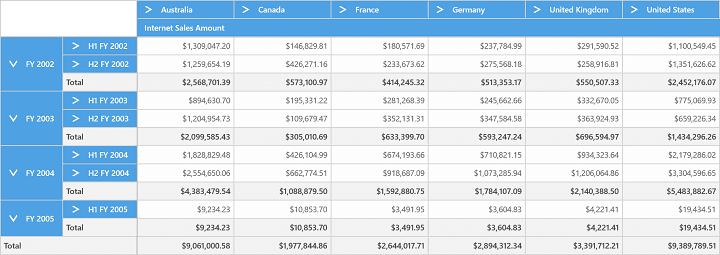
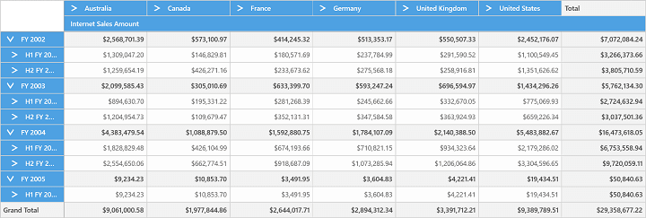
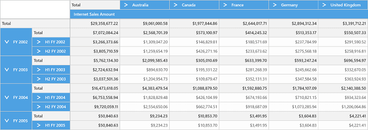
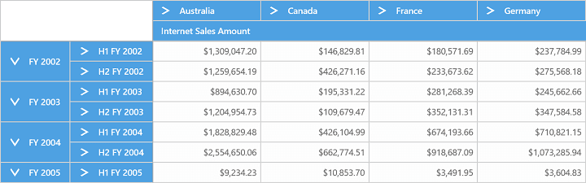

# Grid Layout

The position of summary cells in the SfPivotGrid can be customized with the help of `Layout` property. It can be positioned at the top or bottom of each parent member.

The following are the five different kinds of layouts supported by the SfPivotGrid:

* Normal Layout
* Excel Like Layout
* Normal Top Summary Layout
* No Summaries Layout

**Normal layout**

'Normal' layout is the default layout of SfPivotGrid in which the summary cells are positioned at the bottom of value cells. Refer the below code snippet to customize the grid layout:





<syncfusion:SfPivotGrid x:Name="PivotGrid1" Layout="Normal"
                        OlapDataManager="{Binding OlapDataManager}">
</syncfusion:SfPivotGrid>





this.PivotGrid1.Layout = GridLayout.Normal;





Me.PivotGrid1.Layout = GridLayout.Normal





**Excel like layout**

In the 'Excel-Like' layout, the summary cells are positioned at the bottom alone and the child members appear below the parent member with some indent space.





<syncfusion:SfPivotGrid x:Name="PivotGrid1" Layout="ExceLikeLayout"
                        OlapDataManager="{Binding OlapDataManager}">
</syncfusion:SfPivotGrid>





this.PivotGrid1.Layout = GridLayout.ExcelLikeLayout;





Me.PivotGrid1.Layout = GridLayout.ExcelLikeLayout





**Normal top summary layout**

In 'Normal Top Summary' layout, the summary cells are positioned at the top of each parent member and the child members appear adjacent to it.





<syncfusion:SfPivotGrid x:Name="PivotGrid1" Layout="NormalTopSummary"
                        OlapDataManager="{Binding OlapDataManager}">
</syncfusion:SfPivotGrid>





this.PivotGrid1.Layout = GridLayout.NormalTopSummary;





Me.PivotGrid1.Layout = GridLayout.NormalTopSummary





**No summaries layout**

In 'No Summaries' layout, the summary cells can be hidden and the child members can be appeared adjacent to the parent member.





<syncfusion:SfPivotGrid x:Name="PivotGrid1" Layout="NoSummaries"
                        OlapDataManager="{Binding OlapDataManager}">
</syncfusion:SfPivotGrid>





this.PivotGrid1.Layout = GridLayout.NoSummaries;





Me.PivotGrid1.Layout = GridLayout.NoSummaries





A demo sample is available at the following location:

{system drive}:\Users\&lt;User Name&gt;\AppData\Local\Syncfusion\EssentialStudio\&lt;Version Number&gt;\Samples\UWP\SampleBrowser\PivotGrid\PivotGrid\View\GridLayout.xaml
