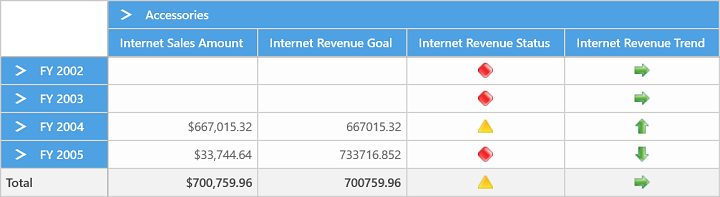

# KPI

KPI (Key Performance Indicator) is a collection of calculations that are associated with a measure group in a cube that are used to evaluate business success. Typically, these calculations are a combination of multi-dimensional expressions (MDX) or calculated members. KPIs also have additional metadata that provides information about how the applications should display the results of KPIs calculations.

The following are the different types of Indicators:

* KPI Goal
* KPI Status
* KPI Trend
* KPI Value

The KPI elements can be defined in the OLAP Report in the following way:





OlapReport olapReport = new OlapReport();
// Selecting the Cube
olapReport.CurrentCubeName = "Adventure Works";

DimensionElement dimensionElementColumn = new DimensionElement();
// Specifying the Name for Column Dimension Element
dimensionElementColumn.Name = "Product";
// Specifying the Level element
dimensionElementColumn.AddLevel("Product Categories", "Category");
MeasureElements measureElementColumn = new MeasureElements();
// Specifying the Name for the Measure Element
measureElementColumn.Elements.Add(new MeasureElement { Name = "Sales Amount Quota" });
KpiElements kpiElement = new KpiElements();
// Specifying the KPI Element name and configuring its Indicators
kpiElement.Elements.Add(new KpiElement
{
    Name = "Internet Revenue",
    ShowKPIGoal = true,
    ShowKPIStatus = true,
    ShowKPIValue = true,
    ShowKPITrend = true
});
DimensionElement dimensionElementRow = new DimensionElement();
// Specifying the Name for Row Dimension Element
dimensionElementRow.Name = "Date";
// Specifying the Level element
dimensionElementRow.AddLevel("Fiscal", "Fiscal Year");
// Adding Row Elements
olapReport.SeriesElements.Add(dimensionElementRow);
// Adding Column Elements
olapReport.CategoricalElements.Add(dimensionElementColumn);
olapReport.CategoricalElements.Add(kpiElement);
PivotGrid1.OlapDataManager.SetCurrentReport(olapReport);





Dim olapReport As New OlapReport()
' Selecting the Cube
olapReport.CurrentCubeName = "Adventure Works"
Dim dimensionElementColumn As New DimensionElement()
' Specifying the Name for Column Dimension Element
dimensionElementColumn.Name = "Product";
' Specifying the Level element
dimensionElementColumn.AddLevel("Product Categories", "Category");
Dim measureElements As New MeasureElements()
measureElements.Add(New MeasureElement With {.Name = " Sales Amount Quota"})
olapReport.SeriesElements.Add(measureElements)
Dim kpiElement As New KpiElements()
' Specifying the KPI Element name and configuring its Indicators
kpiElement.Elements.Add(New KpiElement() With { _
        Key .Name = "Internet Revenue", _
        Key .ShowKPIGoal = True, _
        Key .ShowKPIStatus = True, _
        Key .ShowKPIValue = True, _
        Key .ShowKPITrend = True _
})
Dim dimensionElementRow As New DimensionElement()
' Specifying the Name for Row Dimension Element
dimensionElementRow.Name = "Date"
' Specifying the Level element
dimensionElementRow.AddLevel("Fiscal", "Fiscal Year")
' Adding Row Elements
olapReport.SeriesElements.Add(dimensionElementRow)
' Adding Column Elements
olapReport.CategoricalElements.Add(dimensionElementColumn);
olapReport.CategoricalElements.Add(kpiElement)
PivotGrid1.OlapDataManager.SetCurrentReport(olapReport)





A demo sample is located in the below location.

{system drive}:\Users\&lt;User Name&gt;\AppData\Local\Syncfusion\EssentialStudio\&lt;Version Number&gt;\Samples\UWP\SampleBrowser\PivotGrid\PivotGrid\View\KPI.xaml
