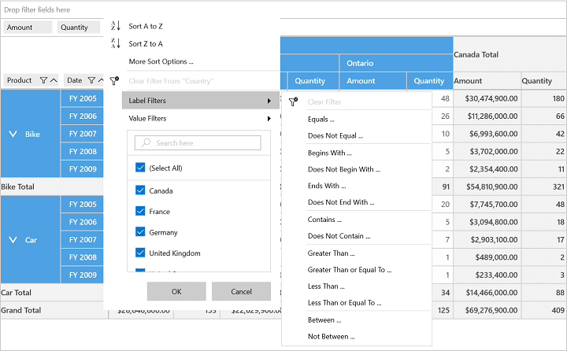
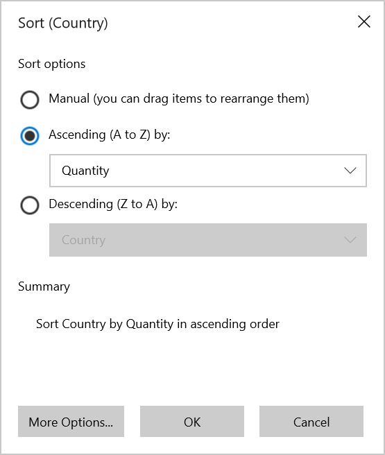
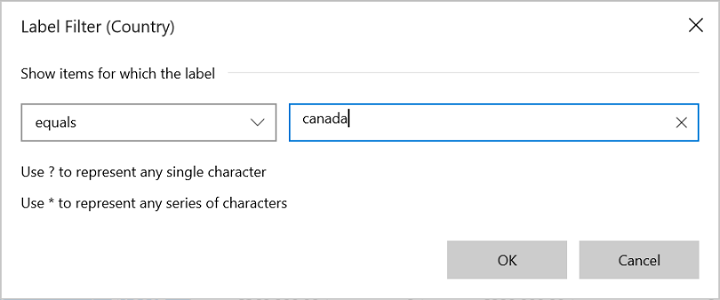
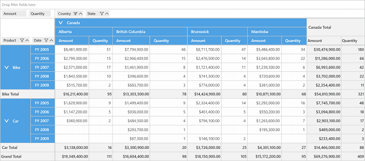
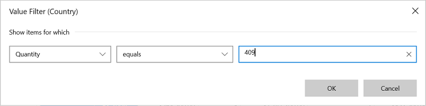

# Excel-Like Filtering and Sorting

SfPivotGrid control provides support for excel-like filtering and sorting applied to a PivotItem. We can enable or disable the excel-like sorting and filtering support by setting the property of `AllowMultiFunctionalSortFilter` in SfPivotGrid.

Please refer the below code snippet to enable excel-like filtering and sorting.





<syncfusion:SfPivotGrid x:Name="PivotGrid1" **AllowMultiFunctionalSortFilter="True"**/>





this.PivotGrid1.AllowMultiFunctionalSortFilter = true;





Me.PivotGrid1.AllowMultiFunctionalSortFilter = True





## Multi-Functional Features

**Sort A to Z**

It can be used to sort the corresponding PivotItem in the *Ascending order*.

**Sort Z to A**

It can be used to sort the corresponding PivotItem in the *Descending order*.

**More Sort Options**

It is used to sort the corresponding PivotItem based upon the grand total of PivotCalculation field.

**Clear filters**

It is used to clear all the filter changes applied to the corresponding PivotItem and could bring back the SfPivotGrid to normal state.

**Label Filters**

It is used to filter SfPivotGrid based on the labels of PivotItem field and it can be achieved by using various options which are listed below.

* Equals
* Does Not Equal
* Begins With
* Does Not Begin With
* Ends with
* Does Not End With
* Contains
* Does Not Contain
* Greater Than
* Greater Than or Equal To
* Less than
* Less than or Equal To
* Between
* Not Between

_Label Filter popup for filtering "Canada" in Country_

_SfPivotGrid applied with Label Filter_

**Value Filters**

It is used to filter SfPivotGrid based on the values of PivotItem field and it can be achieved by using various options which are listed below.

* Equals
* Does Not Equal
* Greater Than
* Greater Than or Equal To
* Less than
* Less than or Equal To
* Between
* Not Between
* Top 10

_Value Filter popup for filtering "Canada" using its Quantity value "409"_

_SfPivotGrid applied with Value Filter_

A demo sample is available at the following location.

{system drive}:\Users\&lt;User Name&gt;\AppData\Local\Syncfusion\EssentialStudio\&lt;Version Number&gt;\Samples\UWP\SampleBrowser\PivotGrid\PivotGrid\View\SummaryDisplay.xaml