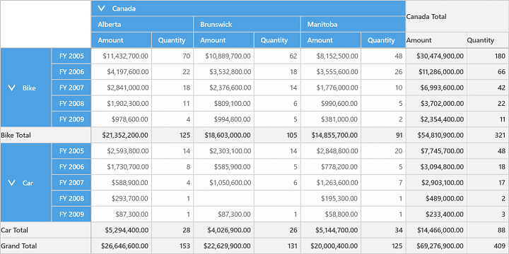
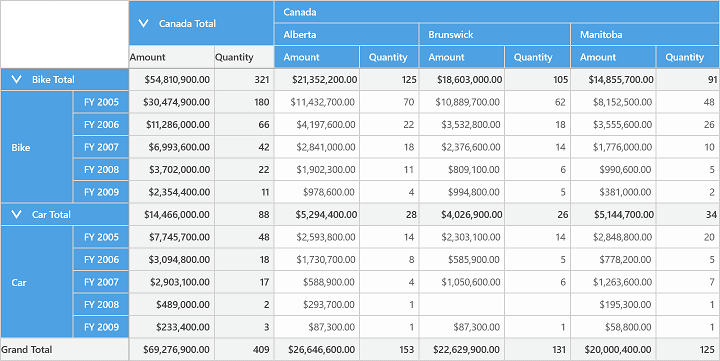

# Grid Layout

The position of summary cells in SfPivotGrid can be customized with the help of `GridLayout` property. It can be either positioned at the top or bottom of the value cells.

The following are the two different kinds of layouts supported by SfPivotGrid.

* Normal Layout
* Top Summary Layout

**Normal Layout**

'Normal' layout is the default layout of SfPivotGrid in which the summary cells are positioned at the bottom of the value cells. Please refer the below code snippet to customize the grid layout.





 <syncfusion:SfPivotGrid Name="PivotGrid1" GridLayout="Normal"
                         ItemSource="{Binding ProductSalesData}" PivotAxis="{Binding PivotAxis}"
                         PivotLegend="{Binding PivotLegend}" PivotCalculations="{Binding PivotCalculations}"/>





this.PivotGrid1.GridLayout = GridLayout.Normal;





Me.PivotGrid1.GridLayout = GridLayout.Normal





**Top Summary Layout**

In 'Top Summary' layout, the summary cells are positioned at the beginning of the value cells. The following code snippet illustrates how to set top summary layout in SfPivotGrid.





 <syncfusion:SfPivotGrid Name="PivotGrid1" GridLayout="TopSummary"
                         ItemSource="{Binding ProductSalesData}" PivotAxis="{Binding PivotAxis}"
                         PivotLegend="{Binding PivotLegend}" PivotCalculations="{Binding PivotCalculations}"/>





this.PivotGrid1.GridLayout = GridLayout.TopSummary;





Me.PivotGrid1.GridLayout = GridLayout.TopSummary





A demo sample is available at the following location.

{system drive}:\Users\&lt;User Name&gt;\AppData\Local\Syncfusion\EssentialStudio\&lt;Version Number&gt;\Samples\UWP\SampleBrowser\PivotGrid\PivotGrid\View\Relational.xaml