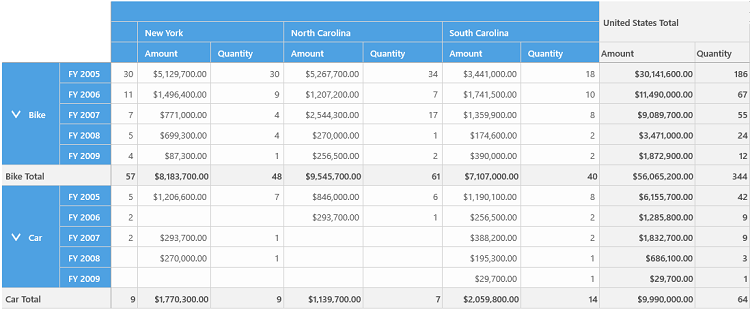

# Hiding Grand totals

You can hide the grand totals of pivot grid control by setting the `ShowGrandTotals` property to false. By default, the pivot grid displays the grand total values for both rows and columns.

Refer to the following code sample to hide both row and column grand total in the pivot grid.





<pivotGrid:SfPivotGrid x:Name="pivotGrid1" ShowGrandTotals="False" />





this.pivotGrid1.ShowGrandTotals = false;





Me.pivotGrid1.ShowGrandTotals = False





