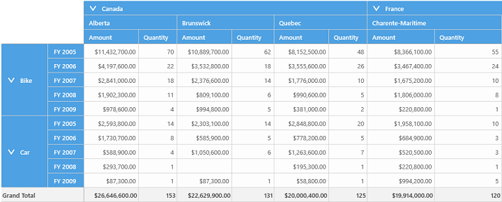
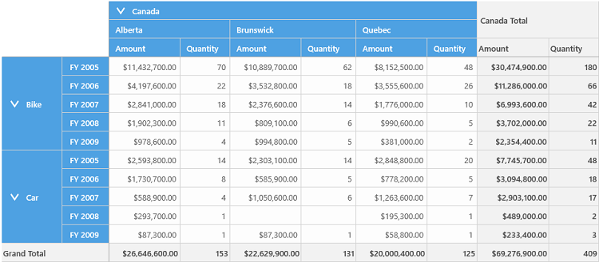
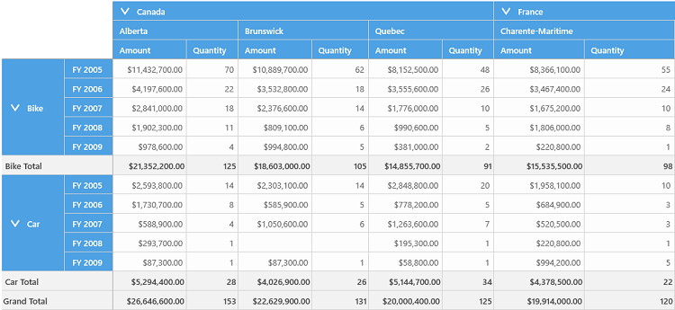
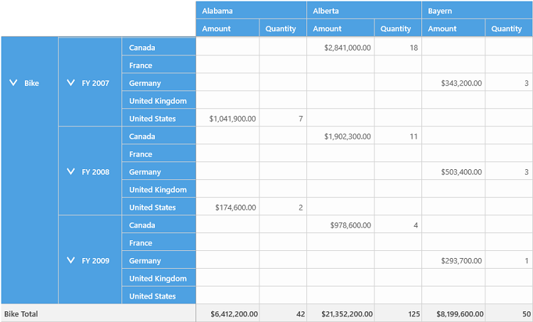

# Hiding Subtotals

The pivot grid control provides support to show or hide subtotal values in it. This support allows users to have an abstract view of the data as per their requirement. The following levels of hiding are supported in pivot grid control.

* Hiding all the subtotals
* Hiding only the row subtotals
* Hiding only the column subtotals
* Hiding the subtotals for the specific pivot item

## Hiding all the subtotals

The `ShowSubTotals` property can be used to hide the subtotal values of both pivot rows and pivot columns. Refer to the below code sample to hide all the subtotal values in the pivot grid.





<Grid x:Name="Root_grid">
    <pivotGrid:SfPivotGrid x:Name="pivotGrid1" ItemSource="{Binding ProductSalesData}" ShowSubTotals="False">
    </pivotGrid:SfPivotGrid>
</Grid>





this.pivotGrid1.ShowSubTotals = false;





Me.pivotGrid1.ShowSubTotals = False





## Hiding only the row subtotals 

The `ShowRowSubTotals` property can be used to hide only the sub-total values of pivot rows. Refer to the below code sample to hide only the subtotal values of pivot rows in the pivot grid.





<pivotGrid:SfPivotGrid x:Name="pivotGrid1" ItemSource="{Binding ProductSalesData}" ShowRowSubTotals="False">
</pivotGrid:SfPivotGrid>





this.pivotGrid1.ShowRowSubTotals = false;





Me.pivotGrid1.ShowRowSubTotals = False

{% endhighlight}



## Hiding only the Column sub-totals 

The `ShowColumnSubTotals` property can be used to hide the sub-totals for PivotColumns only and it can be mentioned either in *XAML* or *Code-behind*. Please refer the below code sample.





    <Grid x:Name="Root_grid">
        <pivotGrid:SfPivotGrid x:Name="pivotGrid1" ItemSource="{Binding ProductSalesData}" ShowColumnSubTotals="False">
            <pivotGrid:SfPivotGrid.PivotRows>
                <pivotitem:PivotItem FieldHeader="Product" FieldMappingName="Product" TotalHeader="Total"/>
                <pivotitem:PivotItem FieldHeader="Date" FieldMappingName="Date" TotalHeader="Total"/>
            </pivotGrid:SfPivotGrid.PivotRows>
            <pivotGrid:SfPivotGrid.PivotColumns>
                <pivotitem:PivotItem FieldHeader="Country" FieldMappingName="Country" TotalHeader="Total"/>
                <pivotitem:PivotItem FieldHeader="State" FieldMappingName="State" TotalHeader="Total"/>
            </pivotGrid:SfPivotGrid.PivotColumns>
            <pivotGrid:SfPivotGrid.PivotCalculations>
                <pivotitem:PivotComputationInfo FieldCaption="Amount" FieldName="Amount" Format="C" SummaryType="DoubleTotalSum"/>
                <pivotitem:PivotComputationInfo FieldCaption="Quantity" FieldName="Quantity" Format="#.##" SummaryType="Count"/>
            </pivotGrid:SfPivotGrid.PivotCalculations>
        </pivotGrid:SfPivotGrid>
    </Grid>





    public partial class MainPage : Windows.UI.Xaml.Controls.Page
    {
        private object productSalesData;

        public object ProductSalesData
        {
            get
            {
                this.productSalesData = this.productSalesData ?? ProductSales.GetSalesData();
                return this.productSalesData;
            }
            set { this.productSalesData = value; }
        }

        public MainPage()
        {
            this.InitializeComponent();
            this.Loaded += MainPage_Loaded;
        }

        private void MainPage_Loaded(object sender, RoutedEventArgs e)
        {
            SfPivotGrid pivotGrid = new SfPivotGrid();
            pivotGrid.ShowColumnSubTotals = false;
            pivotGrid.PivotRows.Add(new PivotItem { FieldHeader = "Product", FieldMappingName = "Product", TotalHeader = "Total" });
            pivotGrid.PivotRows.Add(new PivotItem { FieldHeader = "Date", FieldMappingName = "Date", TotalHeader = "Total" });
            pivotGrid.PivotColumns.Add(new PivotItem { FieldHeader = "Country", FieldMappingName = "Country", TotalHeader = "Total" });
            pivotGrid.PivotColumns.Add(new PivotItem { FieldHeader = "State", FieldMappingName = "State", TotalHeader = "Total" });
            pivotGrid.PivotCalculations.Add(new PivotComputationInfo { CalculationName = "Total", FieldName = "Amount", FieldHeader = "Amount", Format = "C", SummaryType = SummaryType.DoubleTotalSum });
            pivotGrid.PivotCalculations.Add(new PivotComputationInfo { CalculationName = "Total", FieldName = "Quantity", FieldHeader = "Quantity", Format = "#.##", SummaryType = SummaryType.Count });
            pivotGrid.ItemSource = ProductSalesData;
            this.DataContext = this;
            Root_grid.Children.Add(pivotGrid);
        }      
    }





    Public Partial Class MainPage
        Inherits Windows.UI.Xaml.Controls.Page
        Private m_productSalesData As Object

        Public Property ProductSalesData() As Object
            Get
                Me.m_productSalesData = If(Me.m_productSalesData, ProductSales.GetSalesData())
                Return Me.m_productSalesData
            End Get
            Set
                Me.m_productSalesData = value
            End Set
        End Property

        Public Sub New()
            Me.InitializeComponent()
            AddHandler Me.Loaded, AddressOf MainPage_Loaded
        End Sub

        Private Sub MainPage_Loaded(sender As Object, e As RoutedEventArgs)
            Dim pivotGrid As New SfPivotGrid()
            pivotGrid.ShowColumnSubTotals = False
            pivotGrid.PivotRows.Add(New PivotItem() With { _
                Key .FieldHeader = "Product", _
                Key .FieldMappingName = "Product", _
                Key .TotalHeader = "Total" _
            })
            pivotGrid.PivotRows.Add(New PivotItem() With { _
                Key .FieldHeader = "Date", _
                Key .FieldMappingName = "Date", _
                Key .TotalHeader = "Total" _
            })
            pivotGrid.PivotColumns.Add(New PivotItem() With { _
                Key .FieldHeader = "Country", _
                Key .FieldMappingName = "Country", _
                Key .TotalHeader = "Total" _
            })
            pivotGrid.PivotColumns.Add(New PivotItem() With { _
                Key .FieldHeader = "State", _
                Key .FieldMappingName = "State", _
                Key .TotalHeader = "Total" _
            })
            pivotGrid.PivotCalculations.Add(New PivotComputationInfo() With { _
                Key .CalculationName = "Total", _
                Key .FieldName = "Amount", _
                Key .FieldHeader = "Amount", _
                Key .Format = "C", _
                Key .SummaryType = SummaryType.DoubleTotalSum _
            })
            pivotGrid.PivotCalculations.Add(New PivotComputationInfo() With { _
                Key .CalculationName = "Total", _
                Key .FieldName = "Quantity", _
                Key .FieldHeader = "Quantity", _
                Key .Format = "#.##", _
                Key .SummaryType = SummaryType.Count _
            })
            pivotGrid.ItemSource = ProductSalesData
            Me.DataContext = Me
            Root_grid.Children.Add(pivotGrid)
        End Sub
    End Class

{% endhighlight}



## Hiding the sub-totals for the specific PivotItem

It can be achieved by setting the `ShowSubTotal` property to false for the specific PivotItem and it can be mentioned either in *XAML* or *Code-behind*. Note that when `ShowSubTotals` property of SfPivotGrid is set to false and setting this property will do nothing.

Please refer the below code sample.  





    <Grid x:Name="Root_grid">
        <pivotGrid:SfPivotGrid x:Name="pivotGrid1" ItemSource="{Binding ProductSalesData}">
            <pivotGrid:SfPivotGrid.PivotRows>
                <pivotitem:PivotItem FieldHeader="Product" FieldMappingName="Product" TotalHeader="Total"/>
                <pivotitem:PivotItem FieldHeader="Date" FieldMappingName="Date" TotalHeader="Total" ShowSubTotal="False"/>
                <pivotitem:PivotItem FieldHeader="Country" FieldMappingName="Country" TotalHeader="Total"/>
            </pivotGrid:SfPivotGrid.PivotRows>
            <pivotGrid:SfPivotGrid.PivotColumns>                
                <pivotitem:PivotItem FieldHeader="State" FieldMappingName="State" TotalHeader="Total"/>
            </pivotGrid:SfPivotGrid.PivotColumns>
            <pivotGrid:SfPivotGrid.PivotCalculations>
                <pivotitem:PivotComputationInfo FieldCaption="Amount" FieldName="Amount" Format="C" SummaryType="DoubleTotalSum"/>
                <pivotitem:PivotComputationInfo FieldCaption="Quantity" FieldName="Quantity" Format="#.##" SummaryType="Count"/>
            </pivotGrid:SfPivotGrid.PivotCalculations>
        </pivotGrid:SfPivotGrid>
    </Grid>
    




    public partial class MainPage : Windows.UI.Xaml.Controls.Page
    {
        private object productSalesData;

        public object ProductSalesData
        {
            get
            {
                this.productSalesData = this.productSalesData ?? ProductSales.GetSalesData();
                return this.productSalesData;
            }
            set { this.productSalesData = value; }
        }

        public MainPage()
        {
            this.InitializeComponent();
            this.Loaded += MainPage_Loaded;
        }

        private void MainPage_Loaded(object sender, RoutedEventArgs e)
        {
            SfPivotGrid pivotGrid = new SfPivotGrid();
            pivotGrid.PivotRows.Add(new PivotItem { FieldHeader = "Product", FieldMappingName = "Product", TotalHeader = "Total" });
            pivotGrid.PivotRows.Add(new PivotItem { FieldHeader = "Date", FieldMappingName = "Date", TotalHeader = "Total", ShowSubTotal = false });
            pivotGrid.PivotRows.Add(new PivotItem { FieldHeader = "Country", FieldMappingName = "Country", TotalHeader = "Total" });
            pivotGrid.PivotColumns.Add(new PivotItem { FieldHeader = "State", FieldMappingName = "State", TotalHeader = "Total" });
            pivotGrid.PivotCalculations.Add(new PivotComputationInfo { CalculationName = "Total", FieldName = "Amount", FieldHeader = "Amount", Format = "C", SummaryType = SummaryType.DoubleTotalSum });
            pivotGrid.PivotCalculations.Add(new PivotComputationInfo { CalculationName = "Total", FieldName = "Quantity", FieldHeader = "Quantity", Format = "#.##", SummaryType = SummaryType.Count });
            pivotGrid.ItemSource = ProductSalesData;
            this.DataContext = this;
            Root_grid.Children.Add(pivotGrid);
        }      
    }





    Public Partial Class MainPage
        Inherits Windows.UI.Xaml.Controls.Page
        Private m_productSalesData As Object

        Public Property ProductSalesData() As Object
            Get
                Me.m_productSalesData = If(Me.m_productSalesData, ProductSales.GetSalesData())
                Return Me.m_productSalesData
            End Get
            Set
                Me.m_productSalesData = value
            End Set
        End Property

        Public Sub New()
            Me.InitializeComponent()
            AddHandler Me.Loaded, AddressOf MainPage_Loaded
        End Sub

        Private Sub MainPage_Loaded(sender As Object, e As RoutedEventArgs)
            Dim pivotGrid As New SfPivotGrid()
            pivotGrid.PivotRows.Add(New PivotItem() With { _
                Key .FieldHeader = "Product", _
                Key .FieldMappingName = "Product", _
                Key .TotalHeader = "Total" _
            })
            pivotGrid.PivotRows.Add(New PivotItem() With { _
                Key .FieldHeader = "Date", _
                Key .FieldMappingName = "Date", _
                Key .TotalHeader = "Total", _
                Key .ShowSubTotal = False _
            })
            pivotGrid.PivotRows.Add(New PivotItem() With { _
                Key .FieldHeader = "Country", _
                Key .FieldMappingName = "Country", _
                Key .TotalHeader = "Total" _
            })
            pivotGrid.PivotColumns.Add(New PivotItem() With { _
                Key .FieldHeader = "State", _
                Key .FieldMappingName = "State", _
                Key .TotalHeader = "Total" _
            })
            pivotGrid.PivotCalculations.Add(New PivotComputationInfo() With { _
                Key .CalculationName = "Total", _
                Key .FieldName = "Amount", _
                Key .FieldHeader = "Amount", _
                Key .Format = "C", _
                Key .SummaryType = SummaryType.DoubleTotalSum _
            })
            pivotGrid.PivotCalculations.Add(New PivotComputationInfo() With { _
                Key .CalculationName = "Total", _
                Key .FieldName = "Quantity", _
                Key .FieldHeader = "Quantity", _
                Key .Format = "#.##", _
                Key .SummaryType = SummaryType.Count _
            })
            pivotGrid.ItemSource = ProductSalesData
            Me.DataContext = Me
            Root_grid.Children.Add(pivotGrid)
        End Sub
    End Class





A sample demo is available at the following location:
    
{system drive}:\Users\Public\Documents\Syncfusion\Universal Windows&lt;Version Number&gt;\SampleBrowser\PivotGrid\PivotGrid\View\TotalsHiding.xaml
