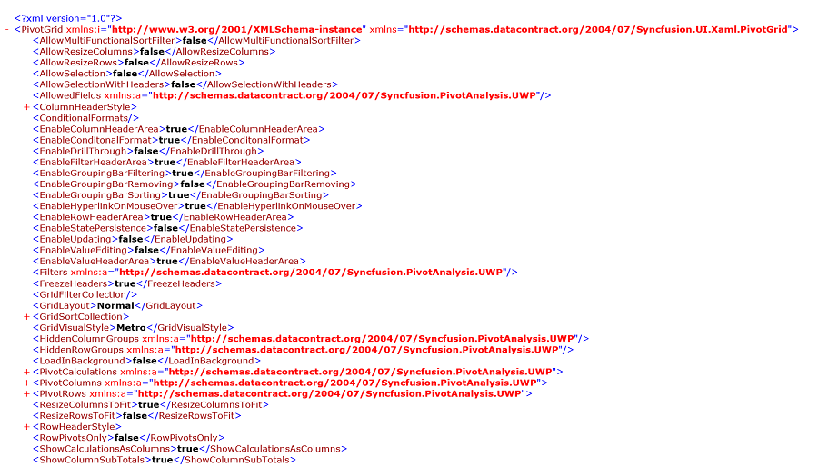

# Serialization and Deserialization

SfPivotGrid provides support to save and load the entire report and control setting using DataContractSerializer.The Serialization and de-serialization can be done using any one of the below formats.

## Serialization 

It allows the user to serialize SfPivotGrid by using Serialize method which exports the current PivotGrid control properties to an XML file.The Serialization can be done using any one of the below formats.

### Serialize using Stream 

It allows the user to save the SfPivotGrid control properties using Serialize method by passing the Stream.Please refer the below code snippet.





 var folder = ApplicationData.Current.LocalFolder;
 var storageFile = await folder.CreateFileAsync("PivotGrid.xml", CreationCollisionOption.ReplaceExisting);
 var stream = await storageFile.OpenStreamForWriteAsync();
 this.PivotGrid.Serialize(stream);





Dim folder As var = ApplicationData.Current.LocalFolder
Dim storageFile As var = folder.CreateFileAsync("PivotGrid.xml", CreationCollisionOption.ReplaceExisting)
Dim stream As var = storageFile.OpenStreamForWriteAsync
Me.PivotGrid.Serialize(stream)





### Serialize using FileSavePicker 

It Allows the user to save the properties and control settings of the SfPivotGrid control to the desired location in *.xml format using Serialize method.Please refer the below code snippet.





this.PivotGrid.Serialize();





Me.PivotGrid.Serialize()





### Serialize as String Format

It allows the user to save the properties and control settings of the SfPivotGrid control into a XML String format using the SerializeToXml method.Please refer the below code snippet.





this.PivotGrid.SerializeToXml();





Me.PivotGrid.SerializeToXml()





### Serialize using Storage File 

It allows the user to save the SfPivotGrid control properties using Serialize method by passing the storage file.Please refer the below code snippet.





var folder = ApplicationData.Current.LocalFolder;         
var storageFile = await folder.CreateFileAsync("PivotGrid.xml", CreationCollisionOption.ReplaceExisting);
this.PivotGrid.Serialize(storageFile);





Dim folder As var = ApplicationData.Current.LocalFolder
Dim storageFile As var = folder.CreateFileAsync("PivotGrid.xml", CreationCollisionOption.ReplaceExisting)
Me.PivotGrid.Serialize(storageFile)





## Deserialization

It allows the user to deserialize the SfPivotGrid setting by using Deserialize method which reconstructs the SfPivotGrid based on the setting in the stored XML file.The Deserialization can be done using any one of the below formats.

### Deserialize using Stream 

It allows the user to deserialize the SfPivotGrid control properties using Deserialize method by passing the Stream.Please refer the below code snippet.





var folder = ApplicationData.Current.LocalFolder;
var storageFile = await folder.GetFileAsync("PivotGrid.xml");
var stream = await storageFile.OpenStreamForReadAsync();
this.PivotGrid.Deserialize(stream);





Dim folder As var = ApplicationData.Current.LocalFolder
Dim storageFile As var = folder.GetFileAsync("PivotGrid.xml")
Dim stream As var = storageFile.OpenStreamForReadAsync
Me.PivotGrid.Deserialize(stream)





### Deserialize using FileSavePicker 

It Allows the user to deserialize the properties and control settings of the SfPivotGrid control from the specified *.xml file using the Deserialize method.Please refer the below code snippet.





this.PivotGrid.Deserialize();





Me.PivotGrid.Deserialize()





### Deserialize as String Format

It allows the user to deserialize the properties and control settings of the SfPivotGrid control using the Deserialize method by passing the XML string.




this.PivotGrid.Deserialize(this.PivotGrid.SerializeToXml());





Me.PivotGrid.Deserialize(Me.PivotGrid.SerializeToXml())





### Deserialize using Storage File 

It allows the user to deserialize the SfPivotGrid control properties using Deserialize method by passing the storage file.Please refer the below code snippet.





var folder = ApplicationData.Current.LocalFolder;
var storageFile = await folder.GetFileAsync("PivotGrid.xml");
this.PivotGrid.Deserialize(storageFile);





Dim folder As var = ApplicationData.Current.LocalFolder
Dim storageFile As var = folder.GetFileAsync("PivotGrid.xml")
Me.PivotGrid.Deserialize(storageFile)





A demo sample is available at the following location.

{system drive}:\Users\<User_Name>\AppData\Local\Syncfusion\EssentialStudio\<Version_Number>\Samples\UWP\SampleBrowser\PivotGrid\PivotGrid\View\Serialization.xaml