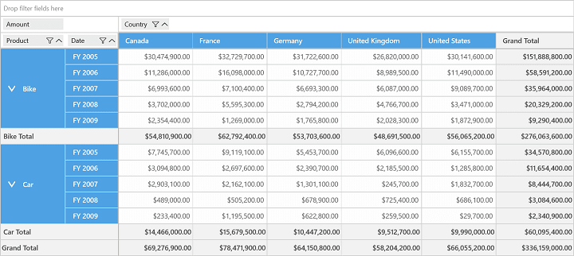
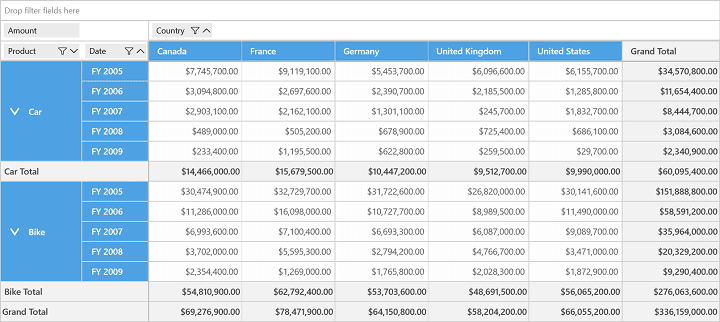
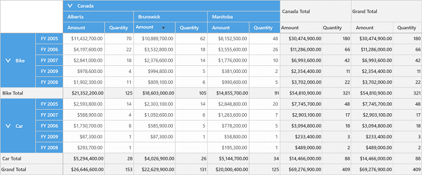

# Sorting

Sorting enables you to quickly visualize and understand your data better. Ultimately, it allows you to organize and find the data that you want to make more effective decisions. By default, SfPivotGrid holds built-in comparers for all data types so that it will populate the data in ascending/descending order based to its data type. You can also define your own custom comparer in order to view the data based on your requirement.

**Sorting Using Custom Comparer**

Sorting can be achieved by defining your own custom comparer and initializing its instance to the `Comparer` property of corresponding PivotItem.

For example, a custom comparer named as `ReverseOrderComparer` is defined to sort items in descending order. Please refer below its code snippet.





public class ReverseOrderComparer: IComparer
{
    public int Compare(object x, object y) {
        if (x == null && y == null)
            return 0;
        else if (y == null)
            return 1;
        else if (x == null)
            return -1;
        else
            return -x.ToString().CompareTo(y.ToString());
    }
}





Public Class ReverseOrderComparer
	Implements IComparer
	Public Function Compare(x As Object, y As Object) As Integer
		If x Is Nothing AndAlso y Is Nothing Then
			Return 0
		ElseIf y Is Nothing Then
			Return 1
		ElseIf x Is Nothing Then
			Return -1
		Else
			Return -x.ToString().CompareTo(y.ToString())
		End If
	End Function
End Class





In order to apply this comparer to PivotItem, an instance of `ReverseOrderComparer` is created and assigned to the `Comparer` property of the PivotItem as specified in the following code snippet.





PivotGrid1.PivotRows[0].Comparer = new ReverseOrderComparer();





PivotGrid1.PivotRows(0).Comparer = New ReverseOrderComparer()





_SfPivotGrid without ReverseOrderComparer_

_SfPivotGrid with ReverseOrderComparer_

## Sorting Using Values

SfPivotGrid supports sorting based on value fields. The sorting order such as ascending or descending can be specified with the help of `SortDirection` property and the way of sorting is differentiated by using `SortOption` property.

The following are the different kinds of sorting options available in SfPivotGrid.

* Sort all columns.
* Sort all columns other than total and grand total columns.
* Sort only total columns.
* Sort only grand total columns.
* Disable sort.

**Sorting All Columns**

`All` option allows sorting to be applied for all value columns of SfPivotGrid. Please refer the below code snippet.





<syncfusion:SfPivotGrid x:Name="PivotGrid1" SortOption="All"/>





PivotGrid1.SortOption = SortOption.All;





PivotGrid1.SortOption = SortOption.All





**Sorting All Columns Except Total and GrandTotal Columns**

`ColumnSorting` option is used to enable sorting for all value columns other than the sub total and grand total columns of SfPivotGrid. Please refer the below code snippet.





<syncfusion:SfPivotGrid x:Name="PivotGrid1" SortOption="ColumnSorting"/>





PivotGrid1.SortOption = SortOption.ColumnSorting;





PivotGrid1.SortOption = SortOption.ColumnSorting





**Sorting only Total Columns**

`TotalSorting` option is used to enable sorting only for sub-total columns of SfPivotGrid. Please refer the below code snippet.





<syncfusion:SfPivotGrid x:Name="PivotGrid1" SortOption="TotalSorting"/>





PivotGrid1.SortOption = SortOption.TotalSorting;





PivotGrid1.SortOption = SortOption.TotalSorting





**Sorting Only Grand Total Columns**

`GrandTotalSorting` option is used to enable sorting only for grand total columns of SfPivotGrid. Please refer the below code snippet.





<syncfusion:SfPivotGrid x:Name="PivotGrid1" SortOption="GrandTotalSorting"/>





PivotGrid1.SortOption = SortOption.GrandTotalSorting;





PivotGrid1.SortOption = SortOption.GrandTotalSorting





**Disable Sorting**

**None** option is the default option that disables sorting on all value columns of SfPivotGrid. Please refer the below code snippet.





<syncfusion:SfPivotGrid x:Name="PivotGrid1" SortOption="None"/>





PivotGrid1.SortOption = SortOption.None;





PivotGrid1.SortOption = SortOption.None



