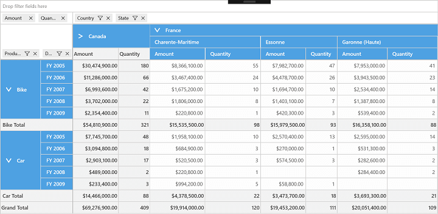
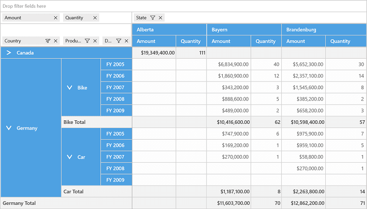

# State Persistence

SfPivotGrid provides support to maintain the collapsed and expanded state of corresponding pivot item when it gets changed. This can be achieved by enabling the property of `StatePersistenceEnabled` in the SfPivotGrid control. Please refer the below code snippet to enable the state persistence:





<syncfusion:SfPivotGrid x:Name="PivotGrid1" StatePersistenceEnabled="True"/>





PivotGrid1.StatePersistenceEnabled = true;





PivotGrid1.StatePersistenceEnabled = True





_SfPivotGrid with collapsed "Canada"_

_SfPivotGrid maintaining collapsed state of "Canada" after pivot change_