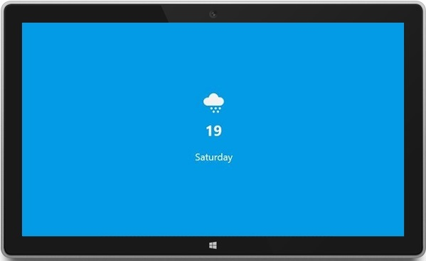
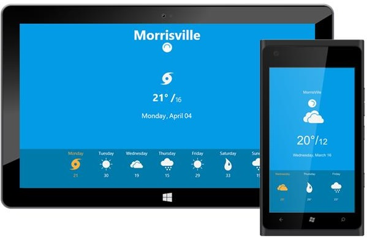
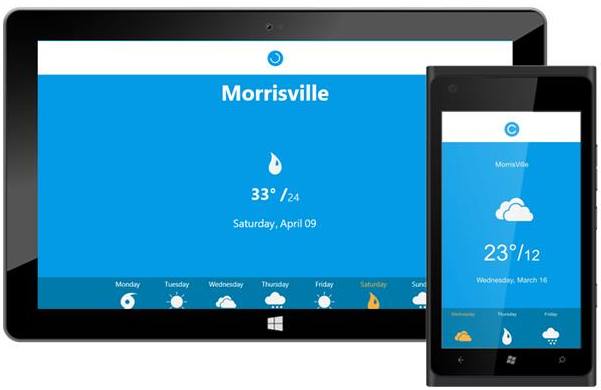

---
layout: post
title: Concepts and Features | PullToRefresh | UWP | Syncfusion
description: concepts and features
platform: UWP
control: PullToRefresh
documentation: ug
--- 

# Concepts and Features

## PullingThreshold

Gets or sets the threshold value from the edges for easy panning from the edges. The default value of TouchThreshold is 3 times the RefreshContentHeight.





    <syncfusion:SfPullToRefresh x:Name="pullToRefresh" PullingThreshold="225"/>

 



    pullToRefresh.PullingThreshold = 225d;



 

## PullableContent

PullableContent is the main view of the PullToRefresh control on which the desired items can be placed.



    <syncfusion:SfPullToRefresh x:Name="pullToRefresh" Width="900" Height="500" Refreshed="pullToRefresh_Refreshed" PullingThreshold="250" Transition="{Binding SlideTransition,Mode=TwoWay}">
        <syncfusion:SfPullToRefresh.PullableContent>
            <Grid Background="#039be5" Name="mainGrid">
                <Grid.RowDefinitions>
                    <RowDefinition Height="0.2*"/>
                    <RowDefinition Height="*"/>
                    <RowDefinition Height="0.4*"/>
                </Grid.RowDefinitions>
                <TextBlock VerticalAlignment="Center" HorizontalAlignment="Center" Text="{Binding SelectedValue.City}" 
                    FontSize="48" Foreground="White" FontWeight="Bold"/>
                <Grid Grid.Row="1"  Height="200" Width="200" VerticalAlignment="Center" HorizontalAlignment="Center">
                    <Grid.RowDefinitions>
                        <RowDefinition/>
                        <RowDefinition/>
                        <RowDefinition/>
                    </Grid.RowDefinitions>
                    <Image Source="{Binding SelectedValue.Icon}" Height="100" Width="100"/>
                    <StackPanel Grid.Row="1" Orientation="Horizontal" HorizontalAlignment="Center" VerticalAlignment="Center">
                        <TextBlock Text="{Binding SelectedValue.High}" FontWeight="Bold" FontSize="36" Foreground="#FFFFFF"/>
                        <TextBlock Text="° /" FontWeight="Bold" FontSize="36" Foreground="#FFFFFF"/>
                        <TextBlock Text="{Binding SelectedValue.Low}" FontWeight="SemiLight" VerticalAlignment="Bottom" FontSize="24" Foreground="#FFFFFF"/>
                    </StackPanel>
                    <TextBlock HorizontalAlignment="Center" VerticalAlignment="Center" Text="{Binding SelectedValue.DayOfWeek}" Grid.Row="2" FontSize="24" Foreground="#FFFFFF"/>
                </Grid>
            </Grid>
        </syncfusion:SfPullToRefresh.PullableContent>
    </syncfusion:SfPullToRefresh>



fig 5: PullableContent

## RefreshContentHeight

`RefreshContentHeight` sets the height of the refresh content.





    <syncfusion:SfPullToRefresh x:Name="pulltorefresh" RefreshContentHeight="200"/>





    pullToRefresh.RefreshContentHeight = 200d;





## Refresh ()

Refresh method is used to Refresh the `PullableContent` and also hides the `RefreshContent`.



    pullToRefresh.Refresh();



## Transition

The Transition property specifies the animations for the RefreshContent. Transition property has the following two options:

* `SlideOnTop`
* `Push`

The default transition is `SlideOnTop`. That draws the `RefreshContent` on top of the `PullableContent`.





    <syncfusion:SfPullToRefresh x:Name="pullToRefresh" Transition="SlideOnTop" />





    pullToRefresh.Transition = Transition.SlideOnTop;





The following code example shows how to set `Transition` as `Push` to SfPullToRefresh. This transition moves the refresh content and main content simultaneously.





    <syncfusion:SfPullToRefresh x:Name=" pullToRefresh" Transition="Push" />





    pullToRefresh.Transition = Transition.Push;





## Events

There are three built-in events in the PullToRefresh control namely:

1. `Pulling`
2. `Refreshing`
3. `Refreshed`

## Pulling

`Pulling` event is triggered when we start pulling down the PullableContent. It is triggered as long as the pointer or finger is pressed and the progress is less than 100 and not equal to 0 . The arguments for the event are:

* SfPullToRefresh
* Progress





    <syncfusion:SfPullToRefresh x:Name="pullToRefresh" Pulling="pullToRefresh_Pulling" />





    private void pullToRefresh_Pulling(object sender, PullingEventArgs args)
    {
        (sender as SfPullToRefresh).RefreshText = args.PulledDistance.ToString();
    }




## Refreshing

`Refreshing` event is triggered once the content is pulled through the PullingThreshold or Progress reaches 100. This event is triggered till the Refresh() method is called.





    <syncfusion:SfPullToRefresh x:Name="pullToRefresh" Refreshing="pullToRefresh_Refreshing" />





    private void pullToRefresh_Refreshing(object sender)
    {
        timer.Start();
        timer.Tick += Timer_Tick;
        (sender as SfPullToRefresh).Refresh();
    }





## Refreshed

`Refreshed` event is triggered once the refreshing and all the animations associated with the control are completed.





    <syncfusion:SfPullToRefresh x:Name=" pullToRefresh" Refreshed="pullToRefresh_Refreshed" />





    private async void pullToRefresh_Refreshed(object sender)
    {
        var dialog = new MessageDialog("Content has been refreshed");
        await dialog.ShowAsync();
    }




