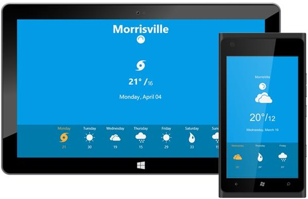

---
layout: post
title: Getting Started | PullToRefresh | UWP | Syncfusion
description: getting started
platform: UWP
control: PullToRefresh
documentation: ug
--- 

# Getting Started

## Create your first SfPullToRefresh in Universal Windows Platform

This section encompasses on how to create a PullToRefresh that lets you to refresh the current content of the application. 

`SfPullToRefresh` is available in the following assembly and namespace:

Assembly: `Syncfusion.SfPullToRefresh.UWP`

Namespace: `Syncfusion.UI.Xaml.PullToRefresh`

Refer to the following code to add the SfPullToRefresh control:





    <Page
    x:Class="PullToRefresh.MainPage"
    xmlns:syncfusion="using:Syncfusion.UI.Xaml.PullToRefresh">

    <Grid x:Name="LayoutRoot">
        <syncfusion:SfPullToRefresh />
    </Grid> 
    
    </Page>





    SfPullToRefresh pullToRefresh = new SfPullToRefresh();





## Customizing a simple SfPullToRefresh sample

To develop an application with UWP PullToRefresh is simple. The following steps explains how to create and configure its properties.

1. Create an instance for the `SfPullToRefresh` in the constructor and set the `SfPullToRefresh` control as in the XAML page of the Application. 



    <Grid x:Name="LayoutRoot" Background="Black">
        <syncfusion:SfPullToRefresh />
    </ Grid > 



2. Create the `PullableContent` for the `SfPullToRefresh`

You can set the `PullableContent` for the `SfPullToRefresh` by adding the desired UIElement.



    <syncfusion:SfPullToRefresh x:Name="pullToRefresh">
        <syncfusion: SfPullToRefresh.PullableContent>
            <Grid Background="#039be5" Name="mainGrid">
                <Grid.RowDefinitions>
                    <RowDefinition Height="0.2*"/>
                    <RowDefinition Height="*"/>
                    <RowDefinition Height="0.4*"/>
                </Grid.RowDefinitions>
                <TextBlock VerticalAlignment="Center" HorizontalAlignment="Center" Text="{Binding SelectedValue.City}" FontSize="48" Foreground="White" FontWeight="Bold"/>
                <Grid Grid.Row="1"  Height="200" Width="200" VerticalAlignment="Center" HorizontalAlignment="Center">
                    <Grid.RowDefinitions>
                        <RowDefinition/>
                        <RowDefinition/>
                        <RowDefinition/>
                    </Grid.RowDefinitions>
                    <Image Source="{Binding SelectedValue.Icon}" Height="100" Width="100"/>
                    <StackPanel Grid.Row="1" Orientation="Horizontal" HorizontalAlignment="Center" VerticalAlignment="Center">
                        <TextBlock Text="{Binding SelectedValue.High}" FontWeight="Bold" FontSize="36" Foreground="#FFFFFF"/>
                        <TextBlock Text="° /" FontWeight="Bold" FontSize="36" Foreground="#FFFFFF"/>
                        <TextBlock Text="{Binding SelectedValue.Low}" FontWeight="SemiLight" VerticalAlignment="Bottom" FontSize="24" Foreground="#FFFFFF"/>
                    </StackPanel>
                    <TextBlock HorizontalAlignment="Center" VerticalAlignment="Center" Text="{Binding SelectedValue.DayOfWeek}" Grid.Row="2" FontSize="24" Foreground="#FFFFFF"/>
                </Grid>
                <ScrollViewer x:Name="scroll"  PointerPressed="ScrollViewer_PointerPressed" Grid.Row="2" VerticalScrollBarVisibility="Hidden" Background="#007aaa">
                    <ItemsControl  VerticalAlignment="Top" HorizontalAlignment="Center" ItemsSource="{Binding Conditions}">
                        <ItemsControl.ItemTemplate>
                            <DataTemplate>
                                <StackPanel Margin="10 5 10 5"  VerticalAlignment="Top" HorizontalAlignment="Center">
                                    <TextBlock x:Name="dayTextBlock"  HorizontalAlignment="Center" VerticalAlignment="Center" Text="{Binding DayOfWeek}" Foreground="{Binding IsSelected, Converter={StaticResource BoolToBrush}, UpdateSourceTrigger=PropertyChanged}"/>
                                    <Image x:Name="selectedImage"  Source="{Binding CurrentIcon}" Height="60" Width="90"/>
                                    <TextBlock HorizontalAlignment="Center" VerticalAlignment="Center" Text="{Binding High}" Foreground="{Binding Path=Foreground, ElementName=dayTextBlock}"/>
                                </StackPanel>
                            </DataTemplate>
                        </ItemsControl.ItemTemplate>
                        <ItemsControl.ItemsPanel>
                            <ItemsPanelTemplate>
                                <StackPanel Orientation="Horizontal"/>
                            </ItemsPanelTemplate>
                        </ItemsControl.ItemsPanel>
                    </ItemsControl>
                </ScrollViewer>
            </Grid>
        </syncfusion:SfPullToRefresh.PullableContent>
    </syncfusion:SfPullToRefresh>



The `ItemsSource` can be populated to the ScrollViewer and the main Grid from the below code:



    public class Forecast : INotifyPropertyChanged
    {
        public Forecast()
        {
            IsSelected = false;
        }
        private bool isSelected;
        public bool IsSelected
        {
            get { return isSelected; }
            set {
                    if(value)
                    {
                        CurrentIcon = SelectionIcon;
                    }
                    else
                    {
                        CurrentIcon = Icon;
                    }
            isSelected = value; OnPropertyChanged("IsSelected"); }
        }

        private string city = string.Empty;
        public string City
        {
            get { return city; }
            set { city = value; OnPropertyChanged("City"); }
        }
        
        private string conditions = string.Empty;
        public string Conditions
        {
            get { return conditions; }
            set { conditions = value; OnPropertyChanged("Conditions"); }
        }

        private string dayOfWeek = DateTime.Now.DayOfWeek.ToString();
        public string DayOfWeek
        {
            get { return dayOfWeek; }
            set { dayOfWeek = value; OnPropertyChanged("DayOfWeek"); }
        }

        private string high = string.Empty;
        public string High
        {
        get { return high; }
        set { high = value; OnPropertyChanged("High"); }
        }
        
        private string low = string.Empty;
        public string Low
        {
            get { return low; }
            set { low = value; OnPropertyChanged("Low"); }
        }

        private ImageSource icon;
        public ImageSource Icon
        {
            get { return icon; }
            set { CurrentIcon = value; icon = value; OnPropertyChanged("Icon"); }
        }
        
        private int index = 0;
        public int Index
        {
            get { return index; }
            set { index = value; OnPropertyChanged("Index"); }
        }
        
        private ImageSource currentIcon;
        public ImageSource CurrentIcon
        {
            get { return currentIcon; }
            set { currentIcon = value; OnPropertyChanged("CurrentIcon"); }
        }

        private ImageSource selectionIcon;
        public ImageSource SelectionIcon
        {
            get { return selectionIcon; }
            set { selectionIcon = value; OnPropertyChanged("SelectedIcon"); }
        }

        private string date;
        public string Date
        {
            get { return date; }
            set { date = value;  OnPropertyChanged("Date"); }
        }

        public event PropertyChangedEventHandler PropertyChanged;
        public void OnPropertyChanged(string names)
        {
            if (PropertyChanged != null)
            PropertyChanged(this, new PropertyChangedEventArgs(names));
        }
    }

    public class ForecastViewModel : INotifyPropertyChanged
    {
        private ObservableCollection<Forecast> conditions;       
        public ObservableCollection<Forecast> Conditions
        {
            get { return conditions; }
            set { conditions = value; OnPropertyChanged("Conditions"); }
        }
        
        private Forecast selectedValue;
        public Forecast SelectedValue
        {
            get { return selectedValue; }
            set { selectedValue = value; OnPropertyChanged("SelectedValue"); }
        }

        public event PropertyChangedEventHandler PropertyChanged;
        public void OnPropertyChanged(string names)
        {
            if (PropertyChanged != null)
            PropertyChanged(this, new PropertyChangedEventArgs(names));
        }

        public ForecastViewModel()
        {
            Conditions = new ObservableCollection<Forecast>();
            Conditions.Add(new Forecast() { City = "Morrisville", Index=0, Date = DateTime.Today.Date.ToString("dd"), Month= DateTimeFormatInfo.CurrentInfo.GetMonthName(DateTime.Today.Month).ToString(), DayOfWeek = DateTime.Today.DayOfWeek.ToString(), Conditions = "Windy", High = "21", Low = "16", Icon = new BitmapImage(new Uri("ms-appx:///PullToRefresh/Assets/Windy.png")), SelectedIcon = new BitmapImage(new Uri("ms-appx:///PullToRefresh/Assets/Windy-selected.png")) });
            Conditions.Add(new Forecast() { City = "Morrisville", Index = 1, Date = DateTime.Today.AddDays(1).Date.ToString("dd"), DayOfWeek = DateTime.Today.AddDays(1).DayOfWeek.ToString(), Month = DateTimeFormatInfo.CurrentInfo.GetMonthName(DateTime.Today.AddDays(1).Month).ToString(), Conditions = "Warm", High = "30", Low = "21", Icon = new BitmapImage(new Uri("ms-appx:///PullToRefresh/Assets/Warm.png")), SelectedIcon = new BitmapImage(new Uri("ms-appx:///PullToRefresh/Assets/Warm-selected.png")) });
            Conditions.Add(new Forecast() { City = "Morrisville", Index = 2, Date = DateTime.Today.AddDays(2).Date.ToString("dd"), DayOfWeek = DateTime.Today.AddDays(2).DayOfWeek.ToString(), Month = DateTimeFormatInfo.CurrentInfo.GetMonthName(DateTime.Today.AddDays(2).Month).ToString(), Conditions = "Cloudy", High = "19", Low = "15", Icon = new BitmapImage(new Uri("ms-appx:///PullToRefresh/Assets/Cloudy.png")), SelectedIcon = new BitmapImage(new Uri("ms-appx:///PullToRefresh/Assets/Cloudy-selected.png")) });
            Conditions.Add(new Forecast() { City = "Morrisville", Index = 3, Date = DateTime.Today.AddDays(3).Date.ToString("dd"), DayOfWeek = DateTime.Today.AddDays(3).DayOfWeek.ToString(), Month = DateTimeFormatInfo.CurrentInfo.GetMonthName(DateTime.Today.AddDays(3).Month).ToString(), Conditions = "Rainy", High = "15", Low = "10", Icon = new BitmapImage(new Uri("ms-appx:///PullToRefresh/Assets/Rainy.png")), SelectedIcon = new BitmapImage(new Uri("ms-appx:///PullToRefresh/Assets/Rainy-selected.png")) });
            Conditions.Add(new Forecast() { City = "Morrisville", Index = 4, Date = DateTime.Today.AddDays(4).Date.ToString("dd"), DayOfWeek = DateTime.Today.AddDays(4).DayOfWeek.ToString(), Month = DateTimeFormatInfo.CurrentInfo.GetMonthName(DateTime.Today.AddDays(4).Month).ToString(), Conditions = "Warm", High = "29", Low = "21", Icon = new BitmapImage(new Uri("ms-appx:///PullToRefresh/Assets/Warm.png")), SelectedIcon = new BitmapImage(new Uri("ms-appx:///PullToRefresh/Assets/Warm-selected.png")) });
            Conditions.Add(new Forecast() { City = "Morrisville", Index = 5, Date = DateTime.Today.AddDays(5).Date.ToString("dd"), DayOfWeek = DateTime.Today.AddDays(5).DayOfWeek.ToString(), Month = DateTimeFormatInfo.CurrentInfo.GetMonthName(DateTime.Today.AddDays(5).Month).ToString(), Conditions = "Humid", High = "33", Low = "24", Icon = new BitmapImage(new Uri("ms-appx:///PullToRefresh/Assets/Humid.png")), SelectedIcon = new BitmapImage(new Uri("ms-appx:///PullToRefresh/Assets/Humid-selected.png")) });
            Conditions.Add(new Forecast() { City = "Morrisville", Index = 6, Date = DateTime.Today.AddDays(6).Date.ToString("dd"), DayOfWeek = DateTime.Today.AddDays(6).DayOfWeek.ToString(), Month = DateTimeFormatInfo.CurrentInfo.GetMonthName(DateTime.Today.AddDays(6).Month).ToString(), Conditions = "Rainy", High = "19", Low = "16", Icon = new BitmapImage(new Uri("ms-appx:///PullToRefresh/Assets/Rainy.png")), SelectedIcon = new BitmapImage(new Uri("ms-appx:///PullToRefresh/Assets/Rainy-selected.png")) });
            SelectedValue = Conditions[0];
            SelectedValue.IsSelected = true;
        }       
    }



    N> The ItemsSource populated for all code snippets in the document are assumed from the above table

SfPullToRefresh:





        // ...

        <UserControl.DataContext>
            <local:ForecastViewModel/>
        </UserControl.DataContext>
        <Grid Background="White">
        <syncfusion:SfPullToRefresh x:Name="pullToRefresh" Width="900" Height="500" Refreshing="pullToRefresh_Refreshing" PullingThreshold="250" Transition="{Binding SlideTransition,Mode=TwoWay}">
            <syncfusion:SfPullToRefresh.PullableContent>
                <Grid Background="#039be5" Name="mainGrid">
                    <Grid.RowDefinitions>
                        <RowDefinition Height="0.2*"/>
                        <RowDefinition Height="*"/>
                        <RowDefinition Height="0.4*"/>
                    </Grid.RowDefinitions>
                    <TextBlock VerticalAlignment="Center" HorizontalAlignment="Center" Text="{Binding SelectedValue.City}" 
                        FontSize="48" Foreground="White" FontWeight="Bold"/>
                    <Grid Grid.Row="1"  Height="200" Width="200" VerticalAlignment="Center" HorizontalAlignment="Center">
                        <Grid.RowDefinitions>   
                            <RowDefinition/>
                            <RowDefinition/>
                            <RowDefinition/>
                        </Grid.RowDefinitions>
                        <Image Source="{Binding SelectedValue.Icon}" Height="100" Width="100"/>
                        <StackPanel Grid.Row="1" Orientation="Horizontal" HorizontalAlignment="Center" VerticalAlignment="Center">
                            <TextBlock Text="{Binding SelectedValue.High}" FontWeight="Bold" FontSize="36" Foreground="#FFFFFF"/>
                            <TextBlock Text="° /" FontWeight="Bold" FontSize="36" Foreground="#FFFFFF"/>
                            <TextBlock Text="{Binding SelectedValue.Low}" FontWeight="SemiLight" VerticalAlignment="Bottom" FontSize="24" Foreground="#FFFFFF"/>
                        </StackPanel>
                        <TextBlock HorizontalAlignment="Center" VerticalAlignment="Center" Text="{Binding SelectedValue.DayOfWeek}" Grid.Row="2" FontSize="24" Foreground="#FFFFFF"/>
                    </Grid>
                    <ScrollViewer x:Name="scroll" Grid.Row="2" VerticalScrollBarVisibility="Hidden" Background="#007aaa">
                        <ItemsControl  VerticalAlignment="Top" HorizontalAlignment="Center" ItemsSource="{Binding Conditions}">
                            <ItemsControl.ItemTemplate>
                                <DataTemplate>
                                    <StackPanel Margin="10 5 10 5"  VerticalAlignment="Top" HorizontalAlignment="Center">
                                        <TextBlock x:Name="dayTextBlock"  HorizontalAlignment="Center" VerticalAlignment="Center" Text="{Binding DayOfWeek}" Foreground="{Binding IsSelected, Converter={StaticResource BoolToBrush}, UpdateSourceTrigger=PropertyChanged}"/>
                                        <Image x:Name="selectedImage"  Source="{Binding CurrentIcon}" Height="60" Width="90"/>
                                        <TextBlock HorizontalAlignment="Center" VerticalAlignment="Center" Text="{Binding High}" Foreground="{Binding Path=Foreground, ElementName=dayTextBlock}"/>
                                    </StackPanel>
                                </DataTemplate>
                            </ItemsControl.ItemTemplate>
                            <ItemsControl.ItemsPanel>
                                <ItemsPanelTemplate>
                                    <StackPanel Orientation="Horizontal"/>
                                </ItemsPanelTemplate>
                            </ItemsControl.ItemsPanel>
                        </ItemsControl>
                    </ScrollViewer>
                </Grid>
            </syncfusion:SfPullToRefresh.PullableContent>
        </syncfusion:SfPullToRefresh>
       
       // ...





    private void pullToRefresh_Refreshing(object sender)
    {
        timer.Start();
        timer.Tick += Timer_Tick;
        (sender as SfPullToRefresh).Refresh();
    }





