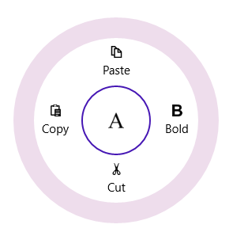
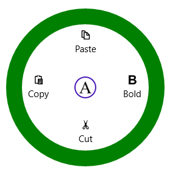
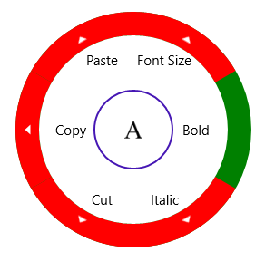
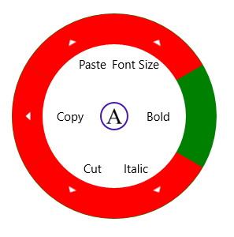
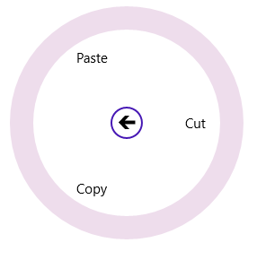

# Appearance and Styling 

## Radius 

RadiusX and RadiusY properties in the SfRadialMenu can be used to define the X and Y axis radius to render the control. 



<navigation:SfRadialMenu RadiusX="150" RadiusY="150" />



## CenterRimRadiusFactor

CenterRimRadiusFactor property can be used to define the radius of the center rim (inner circle). 



<navigation:SfRadialMenu   CenterRimRadiusFactor="0.3" IsOpen="True" />



## RimBackground

RimBackground property used to fill the outer rim (outer circle).



<navigation:SfRadialMenu IsOpen="True" RimBackground="Green" />



## RimActiveBrush

RimActiveBrush property used to fill the expander rim and this expander rim only visible when the items have sub items.   



<navigation:SfRadialMenu RimActiveBrush="Red" RimBackground="Green" IsOpen="True" />



## RimRadiusFactor

RimRadiusFactor property of SfRadialMenu can be used to set the radius of the items panel. Lowest values to this factor increases the thickness of the outer rim. Highest values to this factor decreases the thickness of the outer rim. 



<navigation:SfRadialMenu RimActiveBrush="Red" RimRadiusFactor="0.7" RimBackground="Green"   IsOpen="True" />



## Navigation Button Style

The navigation button displayed in the center of SfRadialMenu can be styled using NaviationButtonStyle property. 



<syncfusion:SfRadialMenu NavigationButtonStyle="{StaticResource NavigationButtonStyle}"

IsOpen="True" />



## Editing SubMenu Items Programmatically

With the DrillDownItem property, you can access and edit submenu items of SfRadialMenu at various hierarchy levels programmatically. The following code example and screen shot illustrate this.



<Page xmlns:navigation="using:Syncfusion.UI.Xaml.Controls.Navigation">

     <Grid Background="{StaticResource ApplicationPageBackgroundThemeBrush}">

<navigation:SfRadialMenu  x:Name="radialmenu">

<navigation:SfRadialMenuItem Header="Edit" x:Name="edit">

<navigation:SfRadialMenuItem Header="Cut"/>

<navigation:SfRadialMenuItem Header="Copy"/>

<navigation:SfRadialMenuItem Header="Paste"/>

</navigation:SfRadialMenuItem>

<navigation:SfRadialMenuItem Header="Bold"/>

<navigation:SfRadialMenuItem Header="Italics"/>

<navigation:SfRadialMenuItem Header="Underline"/>

</navigation:SfRadialMenu>

     </Grid>

</Page>




radialmenu.DrillDownItem = edit;




