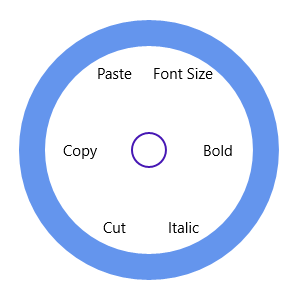

# Checkable Items 

SfRadialMenu items can be checked.  

## Check Mode

The CheckMode property for a radial menu item includes the following options: 

* None: If the CheckMode is set to None, then that item can’t be checked. 
* CheckBox: If the CheckMode is set to CheckBox, then more than one item in the same level can be in checkable state. 
* RadioButton: If the CheckMode is set to RadioButton, then only one item can be checked in the same level. 

## Group Name

The GroupName property of the SfRadialMenu item can be used to group the items in the same level. This property is useful when the CheckMode property of those items is set to RadioButton. 

### IsChecked

IsChecked property of SfRadialMenu item can be used to get or set the checked state of an item. 



<navigation:SfRadialMenu IsOpen="True" RimBackground="CornflowerBlue">

 	<navigation:SfRadialMenuItem  CheckMode="CheckBox" Header="Bold" />

       <navigation:SfRadialMenuItem  CheckMode="CheckBox" Header="Italic" />

       <navigation:SfRadialMenuItem  CheckMode="RadioButton" GroupName="Clipboard" 						   Header="Cut" />

       <navigation:SfRadialMenuItem  CheckMode="RadioButton" GroupName="Clipboard" 						   Header="Copy" />

       <navigation:SfRadialMenuItem  CheckMode="RadioButton" GroupName="Clipboard" 						   Header="Paste" />

       <navigation:SfRadialMenuItem  CheckMode="None" Header="Font Size" />

</navigation:SfRadialMenu>



