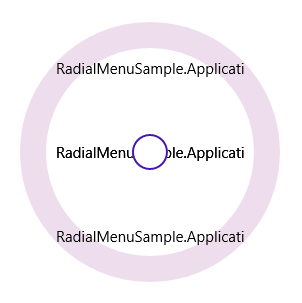
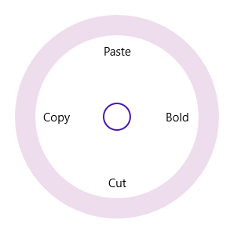
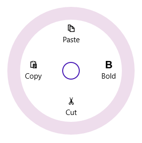

# Populating Items 

## Items Source  

Radial menu items can be populated with the business object collection. Let us create a SfRadialMenu which will show the list of Application commands.   

The Application command model look likes below.  

  

  public class ApplicationCommand

    {

        public string Name { get; set; }

        public string ImagePath { get; set; }

        public ICommand Command { get; set; }

    }



Create the Application command collection as follows. 



private List<ApplicationCommand> options;

public List<ApplicationCommand> Options

   {

            get { return options; }

            set { options = value; }

   }



Populate the Application command collection as follows. 



 Options = new List<ApplicationCommand>(); 

 Options.Add(new ApplicationCommand() { Name="Bold" , ImagePath="bold.png" });    			  Options.Add(new ApplicationCommand() { Name = "Cut" , ImagePath="cut.png"}); 

 Options.Add(new ApplicationCommand() { Name = "Copy" ,ImagePath="copy.png"}); 

 Options.Add(new ApplicationCommand() { Name = "Paste" ,ImagePath="paste.png"});



Bind the Application command collection to the ItemsSource property of the SfRadialMenu control. 



<navigation:SfRadialMenu IsOpen="True" ItemsSource="{Binding Options}"/>



This will populate the SfRadialMenu as shown in the image below. 

### Display Member Path 

DisplayMemberPath property of the SfRadialMenu used to define which business model property needs to be displayed inside the header of the SfRadialMenu items.  



<navigation:SfRadialMenu IsOpen="True" ItemsSource="{Binding Options}"

DisplayMemberPath="Name"

                         />



### Command Path

CommandPath property of the SfRadialMenu can be used to bind the command in the business object to the SfRadialMenu item when items are populated using data binding. 



<navigation:SfRadialMenu IsOpen="True" DisplayMemberPath="Name" CommandPath="Command"

                                 ItemsSource="{Binding Options}" />



### Item Template 

ItemTemplate property of the SfRadialMenu can be used to customize the header part of the SfRadialMenu items.  

   

<navigation:SfRadialMenu IsOpen="True" ItemsSource="{Binding Options}">

            <navigation:SfRadialMenu.ItemTemplate>

                <DataTemplate>

                    <StackPanel >

                        <Image Height="15" Width="15" Source="{Binding ImagePath}"/>

                        <TextBlock Margin="0,5,0,0" Text="{Binding Name}"/>

                    </StackPanel>

                </DataTemplate>

            </navigation:SfRadialMenu.ItemTemplate>

   </navigation:SfRadialMenu>



