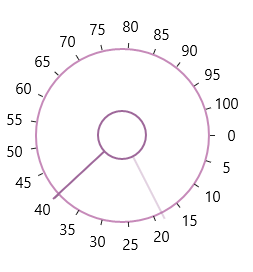

# Ticks 

Ticks are placed along the round track in a uniform manner. The position of tick marks can be customized.

## Tick Frequency

The Tick Frequency property is used to define the number of ticks along the track, based on Minimum and Maximumn values.



<syncfusion:SfRadialSlider Minimum="0" Maximum="100"  

TickFrequency="5" />



