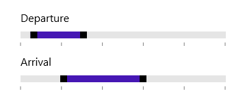

# Overview 

SfRangeSlider control allows the user to select the range of value within the specified minimum and maximum limit. The range can be selected by moving the Thumb control along a track.  

