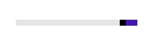

# Reversed Direction

The direction of increasing value can be changed using IsDirectionReversed property. If this property is set to True, the direction of increasing value is towards left in the horizontal orientation and down in the vertical orientation. The default is false. 



<editors:SfRangeSlider Width="200" Minimum="0" Maximum="100" Value="10" IsDirectionReversed="True"  />



