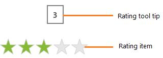

# Overview

`SfRating` control allows user to rate something by clicking on the icon that represents a rate.

## Features

* Rate items count can be easily specified
* Supports three different rating precisions

## Visual Structure

1.WinRT

2.Windows phone

