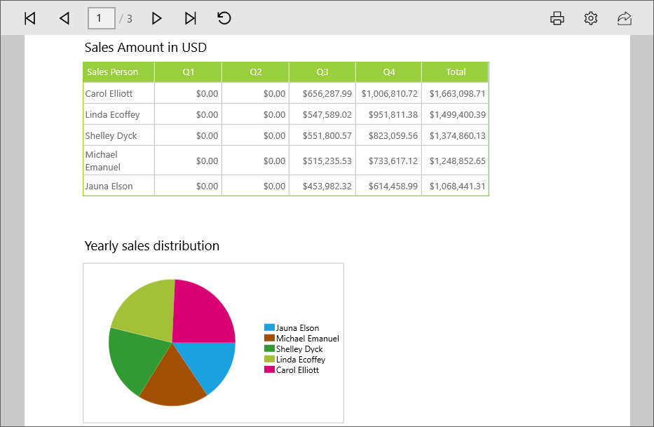

# Getting Started with Universal Windows Platform Application

This section helps you to get start with SfReportViewer control.

## Create your first SfReportViewer application in UWP

Create a new Universal Windows Platform project through Visual Studio Designer.
   
### Add SfReportViewer control from XAML

This section demonstrates how to create an application using SfReportViewer control from XAML. For that, you must add the SfReportViewer reference to your application.

### Add Assembly reference

1. Right-click on the reference folder in solution explorer and select Add Reference.  
2. Choose Universal Windows Platform -> Extensions -> Syncfusion Controls for UWP XAML.
3. Add the following namespace in your XAML page.

   ~~~~ xml
   xmlns:Reports="using:Syncfusion.UI.Xaml.Reports"
   ~~~~
   
   N> Adding the extension Syncfusion Controls for UWP XAML, adds all the Syncfusion UWP controls, you can also add the SfReportViewer reference and its dependent assemblies from the following location. C:\Program Files (x86)\Syncfusion\Essential Studio\Universal Windows\{{ site.releaseversion }}\Assemblies for Universal Windows Platform\
 
4. You can initialize the SfReportViewer control in XAML as follows.

   ~~~~ xml
   <Reports:SfReportViewer x:Name="ReportViewer">
   ~~~~

5. You can also create SfReportViewer control through code with the help of following namespace.  

   ~~~~ csharp
   using Syncfusion.UI.Xaml.Reports;
   ~~~~

### Add SfReportViewer control from Toolbox

1. Drag and drop SfReportViewer control from toolbox to design page of your application, Syncfusion.SfReportViewer.UWP assembly will be added automatically to an application.

2. Right-click on the reference folder in solution explorer and select Add Reference. 

3. Add the following dependent assemblies,

   * Syncfusion.DocIO.UWP
   * Syncfusion.Pdf.UWP
   * Syncfusion.SfGridCommon.UWP
   * Syncfusion.SfChart.UWP
   * Syncfusion.SfGauge.UWP
   * Syncfusion.SfCellGrid.UWP
   * Syncfusion.SfInput.UWP
   * Syncfusion.SfMaps.UWP
   * Syncfusion.SfShared.UWP
   * Syncfusion.SfTreeNavigator.UWP
   * Syncfusion.XlsIO.UWP

   N> You can also add the SfReportViewer reference and its dependent assemblies from the nuget packages. Please refer the [link](https://help.syncfusion.com/uwp/control-dependencies) for control dependencies and nuget packages.

## Load RDLC reports

This section demonstrates how to run RDLC report using SfReportViewer control.

1. You can load report to SfReportViewer control as stream by specifying your RDLC Report build action as EmbeddedResource.

2. Set `ProcessingMode`, `ExportMode` properties of SfReportViewer control.

   ~~~~ csharp
   Assembly assembly = typeof(MainPage).GetTypeInfo().Assembly;
   Stream reportStream = assembly.GetManifestResourceStream("ReportViewerApplicationDemo.ReportTemplate.Sales Dashboard.rdlc"); 
   ReportViewer.ProcessingMode = ProcessingMode.Local;
   ReportViewer.ExportMode = ExportMode.Local;
   ReportViewer.LoadReport(reportStream);
   ~~~~

3. Create a Class named as SalesPersons, Stores, Products and declare the fields required for report as properties as shown below.

   ~~~~ csharp
   #region SalesPersons

   public class SalesPersons
   {
       public string Name { get; set; }
       public double QS1 { get; set; }
       public double QS2 { get; set; }
       public double QS3 { get; set; }
       public double QS4 { get; set; }
       public double Total { get; set; }
       public int Year { get; set; }

       public static IList GetTopSalesPerson()
       {
          List<SalesPersons> SalesPersonCollection = new List<SalesPersons>();
          SalesPersons salesPerson = null;
          salesPerson = new SalesPersons()
          {
             Name = "Carol Elliott",
             QS3 = 656287.9884,
             QS4 = 1006810.7219,
             Total = 1663098.7103,
             Year = 2001
          };
          SalesPersonCollection.Add(salesPerson);
          salesPerson = new SalesPersons()
          {
             Name = "Linda Ecoffey",
             QS3 = 547589.0181,
             QS4 = 951811.3768,
             Total = 1499400.3949,
             Year = 2002
          };
          SalesPersonCollection.Add(salesPerson);
          salesPerson = new SalesPersons()
          {
             Name = "Shelley Dyck",
             QS3 = 551800.5660,
             QS4 = 823059.5628,
             Total = 1374860.1288,
             Year = 2001
          };
          SalesPersonCollection.Add(salesPerson);

          return SalesPersonCollection;
       }
   }

   #endregion 

   #region Stores

   public class Stores
   {
       public string Name { get; set; }
       public double QS1 { get; set; }
       public double QS2 { get; set; }
       public double QS3 { get; set; }
       public double QS4 { get; set; }
       public double Total { get; set; }
       public int year { get; set; }

       public static IList GetTopStores()
       {
           List<Stores> StoreCollection = new List<Stores>();
           Stores store = null;
           store = new Stores()
           {
               Name = "Bicycle Company",
               QS3 = 656287.9884,
               QS4 = 1006810.7219,
               Total = 1663098.7103,
               year = 2001
           };
           StoreCollection.Add(store);
           store = new Stores()
           {
               Name = "Activity Center",
               QS3 = 656287.9884,
               QS4 = 1006810.7219,
               Total = 1663098.7103,
               year = 2002
            };
            StoreCollection.Add(store);
            store = new Stores()
            {
                Name = "Bike Shop",
                QS3 = 656287.9884,
                QS4 = 1006810.7219,
                Total = 1663098.7103,
                year = 2001
            };
            StoreCollection.Add(store);
            
            return StoreCollection;
       }
   }

   #endregion

   #region Products:

   public class Products
   {
       public string Name { get; set; }
       public double QS1 { get; set; }
       public double QS2 { get; set; }
       public double QS3 { get; set; }
       public double QS4 { get; set; }
       public double Total { get; set; }
       public int Year { get; set; }

       public static IList GetTopProducts()
       {
           List<Products> ProductCollection = new List<Products>();
           Products product = null;
           product = new Products()
           {
               Name = "AWC Logo Cap",
               QS3 = 2104165.3554,
               QS4 = 3308323.5938,
               Total = 5412488.9492,
               Year = 2001
           };
           ProductCollection.Add(product);
           product = new Products()
           {
               Name = "S-100 Helmet, B",
               QS3 = 1988382.4844,
               QS4 = 3279281.6611,
               Total = 5267664.1455,
               Year = 2001
           };
           ProductCollection.Add(product);
           product = new Products()
           {
               Name = "L-Sleeve Jrsey",
               QS3 = 1974839.7878,
               QS4 = 3282139.2608,
               Total = 5256979.0486,
               Year = 2001
           };
           ProductCollection.Add(product);

           return ProductCollection;
       }
   }
   
   #endregion
   ~~~~

4. Set datasource for RDLC reports in code behind with the help of created class objects and invoke `RefreshReport` to render the report.  

   ~~~~ csharp
   ReportViewer.DataSources.Clear();
   ReportViewer.DataSources.Add(new ReportDataSource { Name = "TopSalesPerson", Value = SalesPersons.GetTopSalesPerson() });
   ReportViewer.DataSources.Add(new ReportDataSource { Name = "TopStores", Value = Stores.GetTopStores() });
   ReportViewer.DataSources.Add(new ReportDataSource { Name = "TopProduct", Value = Products.GetTopProducts() });
   ReportViewer.RefreshReport();
   ~~~~
   
   N> Name - “TopSalesPerson” – Specifies the dataset name in the report.
   N> 
   N> Value – SalesPerson.GetTopSalesPerson() – Returns the collection of values for dataset.

5. Run the application the following output will be displayed.

    

## Create WebAPI service for SfReportViewer

SfReportViewer control requires WebAPI service to process and render RDL/SSRS reports. This section helps you to create WebAPI service for rendering RDL/SSRS reports.

1. Open Visual Studio and create a new project by clicking New Project. Select the Web category, select the ASP.NET Web Application template, and then click OK. The following screenshot displays the Project Creation Wizard.
    
   
   
2. Add following references to your application.

   * System.Web.Routing
   * System.Net.Http
   * System.Net.Http.WebRequest
   * System.Net.Http.Formatting
   * System.Web.Http
   * System.Web.Http.WebHost
   * Syncfusion.Linq.Base
   * Syncfusion.EJ
   * Syncfusion.EJ.MVC
   * Syncfusion.EJ.ReportViewer
   * Syncfusion.Pdf.Base
   * Syncfusion.XlsIO.Base
   * Syncfusion.DocIO.Base
   * Syncfusion.Shared.Wpf
   * Syncfusion.Chart.Wpf
   * Syncfusion.Gauge.Wpf
   * Syncfusion.SfMaps.Wpf

   N> Refer the above assemblies from the installed location, C:\Program Files (x86)\Syncfusion\Essential Studio\{{ site.releaseversion }}\Assemblies
   N> 
   N> Refer System.Web.Http, System.Web.Http.WebHost, System.Net.Http.WebRequest and System.net.Http.Formatting assemblies from ASP.NET WebApi NuGet package.

3. Add WebAPI controller to your application as shown in below screen shot.

   

### Inherit IReportController

The ApiController inherits the IReportController and you can add the following code example to its methods definition in order to process the report file. The interface IReportController contains the required actions and helper methods declaration to process the report. The ReportHelper class contains helper methods that helps to process Post/Get request from control and return the response to control.



using System;
using Syncfusion.EJ.ReportViewer;
using System.Collections.Generic;
using System.Linq;
using System.Net;
using System.Net.Http;
using System.Web.Http;
using Syncfusion.Reports.EJ;
using System.Collections;

namespace WebAPIService
{
    public class ReportAPIController: ApiController, IReportController
    {
        //Post action for processing the rdl/rdlc report 
        public object PostReportAction(Dictionary<string, object> jsonResult)
        {
            return ReportHelper.ProcessReport(jsonResult, this);
        }

        //Get action for getting resources from the report
        [System.Web.Http.ActionName("GetResource")]
        [AcceptVerbs("GET")]
        public object GetResource(string key, string resourcetype, bool isPrint) 
        {
            return ReportHelper.GetResource(key, resourcetype, isPrint);
        }
        
        //Method will be called when initialize the report options before start processing the report        
        public void OnInitReportOptions(ReportViewerOptions reportOption)
        {
            //You can update report options here
        }
        
        //Method will be called when reported is loaded
        public void OnReportLoaded(ReportViewerOptions reportOption) 
        {
            //You can update report options here
        }
    }
}

 

### WebAPI Routing

1. Right click the project, select Add and select Global.asax file from the listed templates.

   

2. You can route the WebAPI in Application_Start event into Global.asax file as follows.

   ~~~~ csharp
   using System.Collections.Generic;
   using System.Linq;
   using System.Web;
   using System.Web.Security;
   using System.Web.SessionState;
   using System.Web.Http;

   namespace WebAPIService
   {
       public class Global : System.Web.HttpApplication
       {
          protected void Application_Start(object sender, EventArgs e)
          {
              System.Web.Http.GlobalConfiguration.Configuration.Routes.MapHttpRoute(
              name: "DefaultApi",
              routeTemplate: "api/{controller}/{action}/{id}",
              defaults: new { id = RouteParameter.Optional });
              AppDomain.CurrentDomain.SetData("SQLServerCompactEditionUnderWebHosting", true);
          }        
       }
   }
   ~~~~

3. Run the application, copy the URL and assign it to `ReportServiceURL` property of SfReportViewer.   

## Load RDL reports

This section demonstrates how to run RDL report using SfReportViewer control.

1. To Load RDL reports set `ReportPath`, `ReportServiceURL`, `ProcessingMode` properties of SfReportViewer in page loaded event.

   ~~~~ csharp   
   ReportViewer.ReportServiceURL = @"http://localhost:51475/api/RDLReport";
   ReportViewer.ReportPath = @"~/App_Data/Templated List.rdl";
   ReportViewer.ProcessingMode = ProcessingMode.Remote;
   ReportViewer.RefreshReport();
   ~~~~

   N> Add your report files to your Web service application’s App_Data folder. You can obtain sample rdl/rdlc files from Syncfusion installed location (%userprofile%\AppData\Local\Syncfusion\EssentialStudio\{{ site.releaseversion }}\Common\Data\ReportTemplate).

2. Run the sample application the following output will be displayed as result.

   
   
## Load SSRS reports

This section demonstrates how to run SSRS report using SfReportViewer control.

1. To load SSRS reports set `ReportPath`, `ReportServiceURL`, `ReportServerUrl` and `ReportServerCredential` properties of SfReportViewer in the page loaded event.

   ~~~~ csharp
   ReportViewer.ReportServerUrl = @"http://100.74.8.11/ReportServer";
   ReportViewer.ReportServiceURL = @"http://ssrs.syncfusion.com/Reporting/api/SSRSReport/"; 
   ReportViewer.ReportServerCredential = new System.Net.NetworkCredential("ssrs", "RDLReport1");
   ReportViewer.ProcessingMode = ProcessingMode.Remote;
   ReportViewer.ReportPath = @"/SSRSSamples/Territory Sales";
   ReportViewer.RefreshReport();
   ~~~~

2. Set DataSource credentials for the ReportDataSources used within your report in ReportLoaded event of SfReportViewer.

   ~~~~ csharp
   ReportViewer.ReportLoaded += (sen, arg) =>
   {
      List<DataSourceCredentials> crdentials = new List<DataSourceCredentials>(); 
      foreach (var dataSource in ReportViewer.GetDataSources())
      {
         DataSourceCredentials credn = new DataSourceCredentials();
         credn.Name = dataSource.Name;
         credn.UserId = "ssrs1";
         credn.Password = "RDLReport1";
         crdentials.Add(credn);
      }	
      reportViewer.SetDataSourceCredentials(crdentials);
   };
   ~~~~

   N> DataSource credentials must be added to the ReportViewer for Shared DataSources that do not have credentials in the connection string and used in the SSRS Reports.

3. Run the sample application the following output will be displayed as result.

      