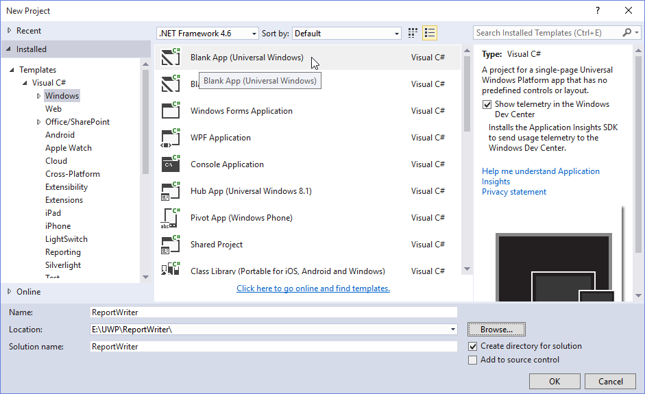
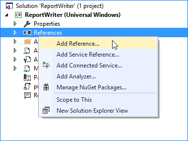
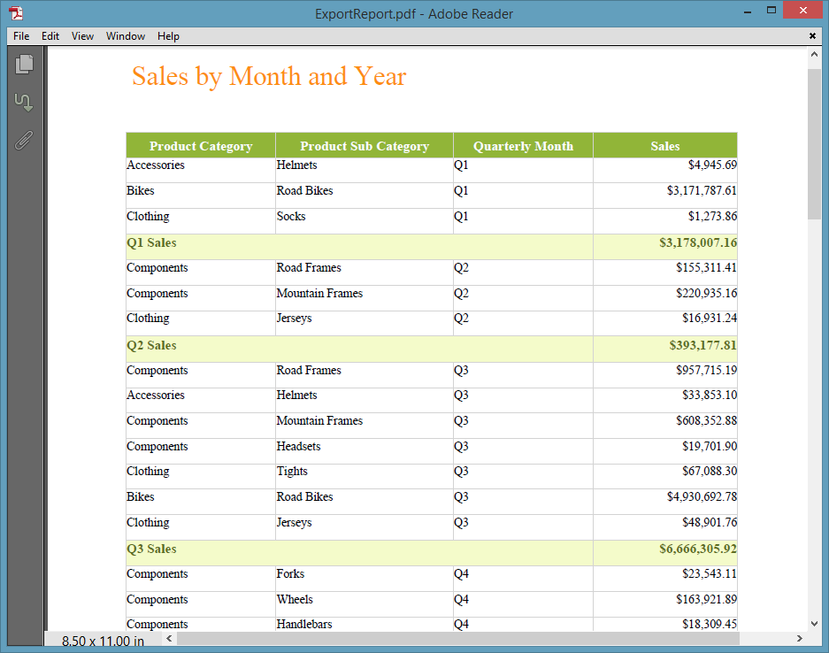

# Getting Started with Universal Windows Platform Application

This section describes how to export the report as PDF, Word, Excel, PPT and HTML formats in Universal Windows Platform application using ReportWriter.

## Project Creation

This section illustrates how to add ReportWriter to the Universal Windows Platform application. It includes the following steps.

Create a new Universal Windows Platform Blank application project by selecting the Universal in Windows category from the listed project template in Microsoft Visual Studio IDE.

 

### Add References

1. In the Solution Explorer, Right-click on the References folder and then click Add Reference.

    

2. Add the following references
   
   * Syncfusion.DocIO.UWP
   * Syncfusion.Pdf.UWP
   * Syncfusion.SfCellGrid.UWP
   * Syncfusion.SfChart.UWP
   * Syncfusion.SfGauge.UWP
   * Syncfusion.SfGridCommon.UWP
   * Syncfusion.SfInput.UWP
   * Syncfusion.SfMaps.UWP
   * Syncfusion.SfReportViewer.UWP
   * Syncfusion.SfTreeNavigator.UWP
   * Syncfusion.XlsIO.UWP  
       
3. Set the following properties to ReportWriter.

   * reportPath - sets the local file system path of the report.

   * ExportMode - Set ExportMode as Remote for RDL report and Local for RDLC report.

   * Export format - Set Export format as PDF, Excel, Word, PPT or HTML.
   
4. Initialize ReportWriter by using the following code example in the MainPage.xaml.cs page to export button click event.

   ~~~ xml
   async void Button_Click(object sender, RoutedEventArgs e)
   {
       FileSavePicker fileSavePicker = new FileSavePicker();
       WriterFormat format = WriterFormat.PDF;

       if (pdf.IsChecked == true)
       {
           fileSavePicker.FileTypeChoices.Add("PDF", new List<string> { ".pdf" });
           fileSavePicker.DefaultFileExtension = ".pdf";
           format = WriterFormat.PDF;
       }
       else if (excel.IsChecked == true)
       {
           fileSavePicker.FileTypeChoices.Add("Excel", new List<string> { ".xls" });
           fileSavePicker.DefaultFileExtension = ".xls";
           format = WriterFormat.Excel;
       }
       else if (word.IsChecked == true)
       {
           fileSavePicker.FileTypeChoices.Add("Word", new List<string> { ".doc" });
           fileSavePicker.DefaultFileExtension = ".doc";
           format = WriterFormat.Word;
       }
       else if (html.IsChecked == true)
       {
           fileSavePicker.FileTypeChoices.Add("Html", new List<string> { ".html" });
           fileSavePicker.DefaultFileExtension = ".html";
           format = WriterFormat.HTML;
       }
       else if (ppt.IsChecked == true)
       {
           fileSavePicker.FileTypeChoices.Add("PPT", new List<string> { ".ppt" });
           fileSavePicker.DefaultFileExtension = ".ppt";
           format = WriterFormat.PPT;
       }
       fileSavePicker.SuggestedFileName = "ExportReport";
       var savedItem = await fileSavePicker.PickSaveFileAsync();
   }
   ~~~

5. Add the following code example in MainPage.xaml page to view ReportWriter export options.

   ~~~ xml
   <StackPanel Name="pagePanel" Grid.Row="1" Margin="20,20,0,0" Background="White">
       <TextBlock  FontSize="15" FontFamily="Segoe UI Regular" TextWrapping="Wrap" Padding="5,5,5,5" >
           <TextBlock.Text>Essential Report Writer is a powerful control for exporting RDL files into specified format files.The following are some of the key features of this component: Provides support for various chart types that include Area, Bar, Column, Pie, Funnel, Radar, Line and so on. Provides support for both Matrix and Table and also provides support for both single, and multi-level row groupings and column groupings. Provides support for other common controls such as Textbox, Image, Rectangle, Line and both Circular,Linear Gauges. Provides support for report parameter.</TextBlock.Text>
       </TextBlock>
       <StackPanel Margin="0,20,0,0" Orientation="Vertical">
           <RadioButton FontSize="15" FontFamily="Segoe UI Regular" Content="PDF" HorizontalAlignment="Left"  Margin="20,10,0,0" x:Name="pdf" IsChecked="true"  VerticalAlignment="Top"/>
           <RadioButton FontSize="15" FontFamily="Segoe UI Regular" Content="Word" HorizontalAlignment="Left" Margin="20,10,0,0"  x:Name="word" VerticalAlignment="Top"/>
           <RadioButton FontSize="15" FontFamily="Segoe UI Regular" Content="Excel" HorizontalAlignment="Left" Margin="20,10,0,0" x:Name="excel" VerticalAlignment="Top"/>
           <RadioButton FontSize="15" FontFamily="Segoe UI Regular" Content="HTML" VerticalAlignment="Top" Margin="20,10,0,0"  x:Name="html" Width="90"/>
           <RadioButton FontSize="15" FontFamily="Segoe UI Regular" Content="PPT" VerticalAlignment="Top" Margin="20,10,0,0" x:Name="ppt" Width="90"/>
           <Button Click="Button_Click" HorizontalAlignment="Left" Margin="20,40,0,0" VerticalAlignment="Bottom" BorderBrush="LightBlue" Background="#8bb54a">
               <StackPanel Orientation= "Horizontal" Background="#8bb54a" Width="144">
                   <TextBlock Foreground="#ffffff" FontSize="16" FontFamily="Segoe UI Bold" Text="Generate"  HorizontalAlignment="Right" Margin="30,5,0,0" Width="110" VerticalAlignment="Center" Height="27"/>
               </StackPanel>
           </Button>
       </StackPanel>
   </StackPanel>
   ~~~

6. Run the application. The following output displays ReportWriter export options, Select the export option and click on Generate button.

    

7. The following output displays exported report in PDF format.

    

## Generating Reports

### Generate RDL Reports

The ReportWriter has options to save the RDL reports. The following code example helps you to generate the RDL report using ReportWriter.

Specify the `ReportPath`, `ExportMode` and `WriterFormat` properties for ReportWriter to generate report.

   ~~~ csharp
   Stream reportStream = assembly.GetManifestResourceStream("UWPwriterSample.Assets.GroupingAgg.rdl");
   ReportWriter writer = new ReportWriter(reportStream, datas);
   writer.ExportMode = Syncfusion.ReportWriter.ExportMode.Remote;
   writer.Save("ExportReport.doc", WriterFormat.Word);
   ~~~

### Generate RDLC Reports

The ReportWriter has support to view and save the RDLC reports. The following code helps you to bind data to ReportWriter.

1. Assign `ReportPath`, `ExportMode` and `ExportFormat` to ReportWriter.

   ~~~ csharp
   Stream reportStream = assembly.GetManifestResourceStream("UWPwriterSample.Assets.GroupingAgg.rdlc");
   ReportWriter writer = new ReportWriter(reportStream, datas);
   writer.ExportMode = Syncfusion.ReportWriter.ExportMode.Local;
   writer.Save("ExportReport.pdf", WriterFormat.PDF);
   ~~~

2. Add Datasource to the RDLC report.

   ~~~ csharp
   ReportDataSourceCollection datas = new ReportDataSourceCollection();
   datas.Add(new ReportDataSource { Name = "Sales", Value = SalesDetails.GetData() });
   ~~~

3. Assign values for the datasource which is given in the RDLC.

   ~~~ csharp
   public class SalesDetails
   {
       public string ProdCat { get; set; }
       public string SubCat { get; set; }
       public double? OrderYear { get; set; }
       public string OrderQtr { get; set; }
       public double? Sales { get; set; }
       public static IList GetData()
       {
           List<SalesDetails> datas = new List<SalesDetails>();
           SalesDetails data = null;
           data = new SalesDetails()
           {
               ProdCat = "Accessories",
               SubCat = "Helmets",
               OrderYear = 2002,
               OrderQtr = "Q1",
               Sales = 4945.6925
           };
           datas.Add(data);
           data = new SalesDetails()
           {
               ProdCat = "Components",
               SubCat = "Road Frames",
               OrderYear = 2002,
               OrderQtr = "Q3",
               Sales = 957715.1942
           };
           datas.Add(data);
           data = new SalesDetails()
           {
               ProdCat = "Components",
               SubCat = "Forks",
               OrderYear = 2002,
               OrderQtr = "Q4",
               Sales = 23543.1060
           };
           return datas;
       }
   }
   ~~~

### Generate SSRS Reports

The ReportWriter has options to save the SSRS reports. The following code example helps you to generate the SSRS report using ReportWriter.

Specify the `ReportPath`, `ReportServerUrl`, `ReportServerCredential`, `ReportProcessingMode` and `WriterFormat` properties for ReportWriter to generate report.

~~~ csharp
HttpContext httpContext = System.Web.HttpContext.Current;
ReportWriter writer = new ReportWriter();
writer.ReportPath = "45db67a0-3fd6-4684-b03c-aa640a521c97";
writer.ReportServerUrl = "http://reportserver.syncfusion.com:80/";
writer.ReportingServer = new ReportingServerExt();
writer.ReportServerCredential = new System.Net.NetworkCredential("guest", "demo");
writer.ReportProcessingMode = ProcessingMode.Remote;
writer.Save("GroupingAgg.doc", WriterFormat.Word, httpContext.Response);
~~~

