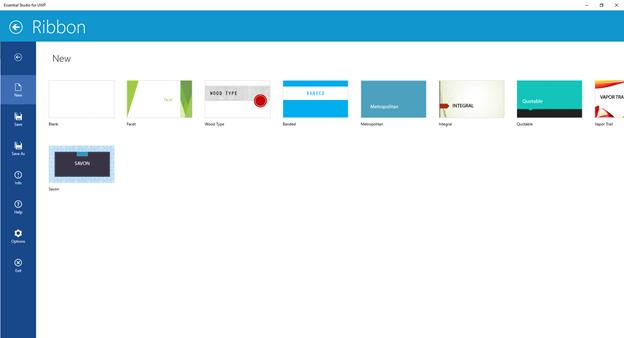

# BackStage

Commands can be added to BackStage similar to office UI. Backstage is completely customizable. For navigating to backstage click on backstage button in left end on Ribbon Tab Items panel. BackStageTabItems can be easily navigated using the scrollbuttons. To navigate back from BackStage click on the back button in top left corner. BackStage can be opened and closed programmatically using the methods “OpenBackStage()” and “CloseBackStage()”.

BackStageButton and BackStage TabItems can be added as follows,


<ribbon:SfRibbon.BackStage>

<ribbon:SfBackstage>

<ribbon:SfBackStageTabItem Header="Save" Icon="Assets/Save.png"/>

<ribbon:SfBackStageButton Label="Exit" Icon="Assets/Exit.png"/>

</ribbon:SfBackstage>

</ribbon:SfRibbon.BackStage>



