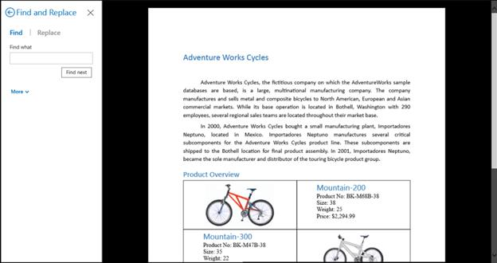

# Find and Replace

The SfRichTextBoxAdv control supports searching text contents in the document. This when used in combination with selection becomes a powerful tool enabling scenarios like highlighting specific parts of the document, applying formatting such as bold or replacing text. You can extend your search by using regular expression to find particular pattern of text in the document. 
The following code example explains how to find the first occurrence of a particular text in the document and apply bold formatting.


// Finds the first occurrence of specified text that matches case in RichTextBoxAdv document from current selection.
TextSearchResult textSearchResult = richTextBoxAdv.Find("Panda", FindOptions.CaseSensitive);
// Selects the text search result.
richTextBoxAdv.Selection.Select(textSearchResult.Start, textSearchResult.End);
// Applies Bold formatting for the current selection.
richTextBoxAdv.Selection.CharacterFormat.Bold = true;





The following code example demonstrates how to find all occurrences of a particular pattern of text in the document and highlighting the result.


// Finds all the words that starts with ‘S’ in RichTextBoxAdv document.
TextSearchResults textSearchResults = richTextBoxAdv.FindAll(new Regex(@"\bS\S*"), FindOptions.None);

// If any text search results found.
if (textSearchResults != null)
{
    for (int j = 0; j < textSearchResults.Count; j++)
    {
    
        TextSearchResult textSearchResult = textSearchResults[j];

        // Adds the search result text positions to the selection.
        richTextBoxAdv.Selection.SelectionRanges.Add(textSearchResult.Start, textSearchResult.End);
    }
    
// Apply highlight color for the selection.
    richTextBoxAdv.Selection.CharacterFormat.HighlightColor = HighlightColor.Yellow;
}





## Replacing existing text

You can replace a single occurrence or all occurrences of a particular text or pattern of text in a document with another text by performing search operation. This helps you to modify the contents easily.
The following code example demonstrates how to replace a single occurrence of a text with another text in SfRichTextBoxAdv.


// Finds the text "colour" that matches whole word in the document.
TextSearchResult textSearchResult = richTextBoxAdv.Find("colour", FindOptions.WholeWord);

// If any text search result found, replace it with the text "color".
if (textSearchResult != null)
    textSearchResult.Replace("color");





The following code example demonstrates how to replace all occurrences of a particular text with another text in SfRichTextBoxAdv.


// Finds the text "analyse" that matches whole word in the document.
TextSearchResults textSearchResults = richTextBoxAdv.FindAll("analyse", FindOptions.WholeWord);

// If any text search results found, replace all occurrences with the text "analyze".
if(textSearchResults != null)
    textSearchResults.ReplaceAll("analyze");





## Options Pane

The SfRichTextBoxAdv provides the built-in options pane support to find the text and navigate to text results similar to Microsoft Word application. It also provides separate pane for advanced find and replace options.
The following code example demonstrates how to show the default search pane in SfRichTextBoxAdv through command binding.


<!-- Binding Button to UI Command that shows the default search pane  -->
<Button Content="Show Search Pane" Command="{Binding ElementName=richTextBoxAdv, Path=ShowOptionsPaneCommand}" />





The following code example demonstrates how to show the advance find pane in SfRichTextBoxAdv through command binding.


<!-- Binding Button to UI Command that shows the advanced find pane  -->
<Button Content="Show Advanced Find Pane" Command="{Binding ElementName=richTextBoxAdv, Path=ShowOptionsPaneCommand}" CommandParameter="Find"/>




The following code example demonstrates how to show the advance replace pane in SfRichTextBoxAdv through command binding.


<!-- Binding Button to UI Command that shows the advanced replace pane  -->
<Button Content="Show Advanced Replace Pane" Command="{Binding ElementName=richTextBoxAdv, Path=ShowOptionsPaneCommand}" CommandParameter="Replace"/>





N> Currently, the SfRichTextBoxAdv does not support options pane in Phone device.
