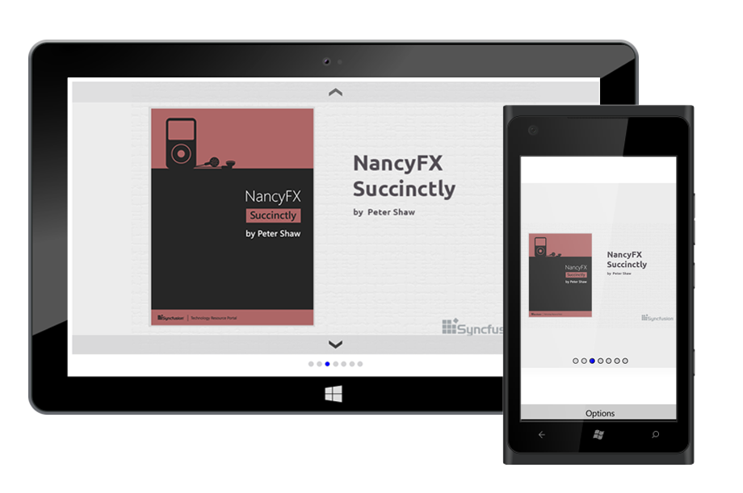

# Getting Started

This section explains you the steps to configure a Rotator control in a real-time scenario and also provides a walk-through on some of the customization features available in Rotator control.

## Referencing Essential Studio Components in Your Solution	

After installing Essential Studio for Universal Windows, all the required assemblies can be found in the installation folders, typically

{Syncfusion Installed location}\Essential Studio\syncfusionessentialstudio-version\lib

Eg: C:\Program Files (x86)\Syncfusion\Essential Studio\{{ site.releaseversion }}\lib

## Create your first Rotator in WPF

This section explains how to create a SfRotator that lets you to display image datas and navigate through them.

`SfRotator` is available in the following assembly and namespace:

`Assembly`: Syncfusion.SfRotator.UWP

`Namespace`: Syncfusion.UI.Xaml.Rotator

## Customizing a simple Rotator sample

To develop an application with Rotator is simple. The following steps explain how to create and configure its properties.

## Add and Configure the Rotator

* Adding reference to Rotator.



	using Syncfusion.UI.Xaml.Rotator; 



* Create an instance of SfRotator.

		

	SfRotator sfRotator = new SfRotator();
	SetContentView(sfRotator);



		

    <syncfusion:SfRotator>


 

## Setting DataSource

SfRotator items can be populated with a collection of image datas using `DataSource` property.



	ArrayList rotatorItems=new ArrayList();
	For(int i=1;i<18;i++)
	{
	SfRotatorItem rotatorItems =new SfRotatorItem ();
	item.ImageName="image"+i;
	rotatorItems.add(item);
	}
	rotator.DataSource=rotatorItems;



## Setting Navigation Mode

The navigation mode for navigating items can be decided using `NavigationMode` property. The items can be navigated using Thumbnail or Dots.

	

	sfRotator.NavigationStripMode = NavigationStripMode.Dots;



## Customizing Position

The placement position of navigation strip items such as Thumbnail or Dots can be specified using `TabStripPosition` property. 

	

	sfRotator.NavigationStripMode = NavigationStripMode.Dots;
	sfRotator.NavigationStripPosition = NavigationStripPosition.Bottom;
	
