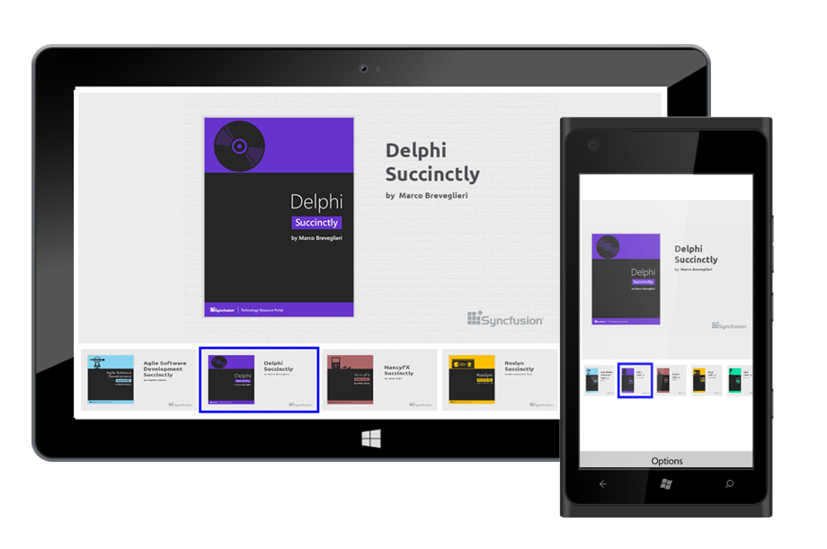
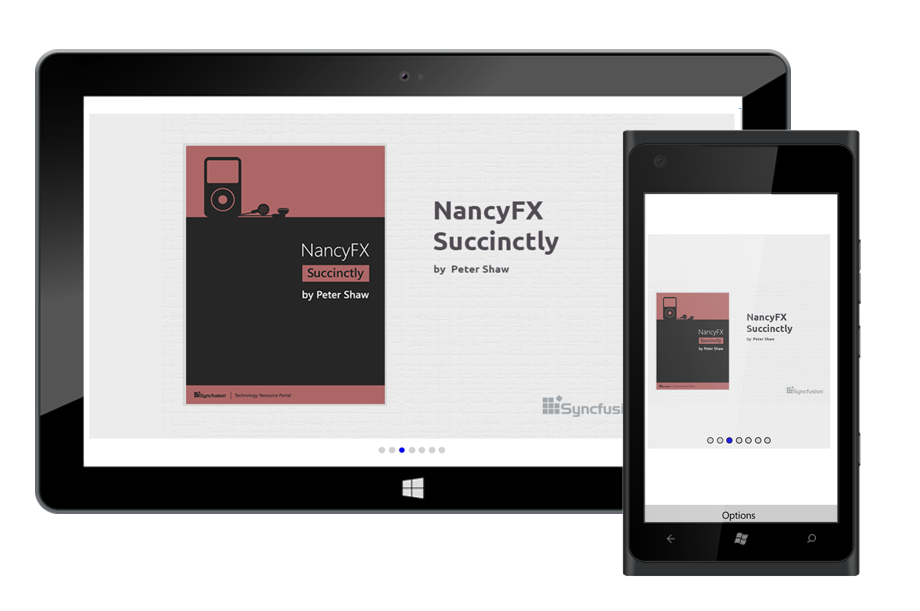

# Navigation Modes

The `NavigationStripMode` property specifies the appearance of navigation bar items. The image datas can be selected either by Thumbnail or by Dots navigation modes.

* `Thumbnail` - The slider items will be loaded in thumbnail view additionally. When a thumbnail item is clicked, the slider will switch to the corresponding image data.



	sfRotator.NavigationStripMode = NavigationStripMode.Thumbnail;	





    <syncfusion:SfRotator NavigationMode="Thumbnail"/>



* `Dots` - The slider items will be loaded in dots view additionally. When a dots item is clicked, the slider will switch to the corresponding image data.



	sfRotator.NavigationStripMode = NavigationStripMode.Dots;	





    <syncfusion:SfRotator NavigationMode="Dots"/>



