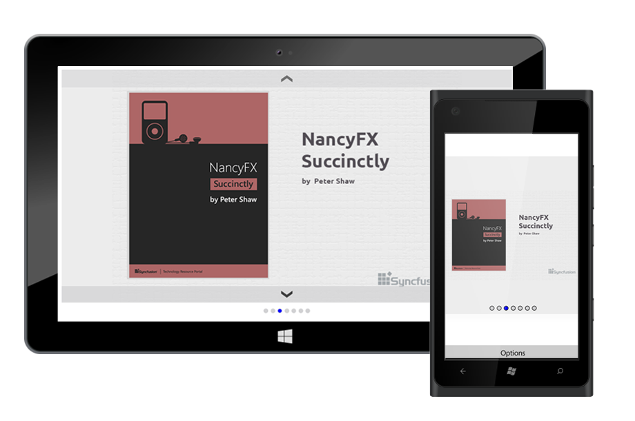

# Overview

The SfRotator is a data control used to display image datas and navigate through them. The images can be selected either by Thumbnail or by Dots support.

 
## Key Features

* `Modes` - Options to navigate datas using dots or thumbnail navigation modes.
* `Position` - Support to decide the placement position of dots or thumbnail items in any of the four sides.
* `Autoplay and Items Looping` - Options for autoplaying items and navigate items in loop.