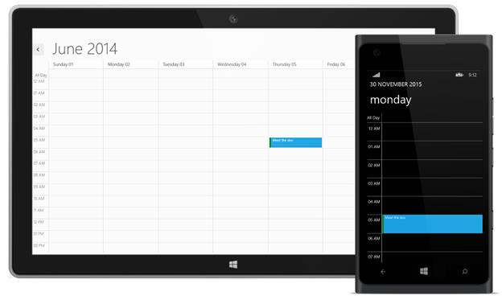

# Appointments

## Creating Appointments

SfSchedule appointments can be added to the SfSchedule control by using the following ways.

They are:

* Using Appointments Property 
* Using Data Binding Technique
* Using Appointment Editor
* Using Context Menu
* Using Schedule Command

### Using Appointments Property

You can add appointments directly to the Schedule control, by creating ScheduleAppointment collection and assigning it to Appointments property. 



           SfSchedule schedule = new SfSchedule();
           schedule.Appointments.Add(new ScheduleAppointment()
            {
                StartTime = new DateTime(2013, 6, 5, 5, 0, 0),
                EndTime = new DateTime(2013, 6, 5, 5, 30, 0),
                Subject = "Meet the doc",
                Location = "Hutchison road",
                AllDay = false
            });



### Using Data Binding Technique

Schedule supports full data binding to any type of IEnumerable source. Specify the **AppointmentMapping** attributes to map the properties in the underlying data source to the Schedule appointments. The basic attributes of the AppointmentMapping property are as follows.  

* Subject
* Location 
* StartTime 
* EndTime  

Add IEnumerable collection to schedule by using the **ItemsSource** property.  




        <Schedule:SfSchedule Name="schedule" ScheduleType="Day" ItemsSource="{Binding MappedAppointments}">
            <Schedule:SfSchedule.AppointmentMapping>
                <Schedule:ScheduleAppointmentMapping
                    SubjectMapping="MappedSubject"
                    StartTimeMapping="MappedStartTime"
                    EndTimeMapping="MappedEndTime"/>
            </Schedule:SfSchedule.AppointmentMapping>
        </Schedule:SfSchedule>





    public partial class MainWindow : Window
    {
        public ObservableCollection<MappedAppointment> MappedAppointments { get; set;}
        public MainWindow()
        {
            InitializeComponent();
            MappedAppointments = new ObservableCollection<MappedAppointment>
                     {
                         new MappedAppointment{MappedSubject = "Meeting", MappedStartTime = DateTime.Now.Date.AddHours(10), 
                                                 MappedEndTime = DateTime.Now.Date.AddHours(11)},
                         new MappedAppointment{MappedSubject = "Conference", MappedStartTime = DateTime.Now.Date.AddHours(15), 
                                                 MappedEndTime = DateTime.Now.Date.AddHours(16)},
                     };
            this.DataContext = this;
        }
    }

    public class MappedAppointment
    {
        public string MappedSubject { get; set; }
        public DateTime MappedStartTime { get; set; }
        public DateTime MappedEndTime { get; set; }
    }




### Using Appointment Editor

Appointments can be added to schedule using default Appointment editor available in schedule control, the editor can be opened by double click on the schedule cells.

### Using Context Menu

You can also use the Context menu to edit the selected appointment by selecting the Edit option in menu item.

>**Note:-ContextMenu is opened on tapping the schedule control in windows,but in Windows Phone it will be opened on holding.**

## Editing Appointments

The existing appointment can be edited by using the following ways.

* Using Editor
* Using Context menu

### Using Editor

In order to edit the existing appointment we need to double click on corresponding appointment and modify the existing data’s of selected appointment by using the editor displayed.

### Using Context menu

The user can also use the Context menu to edit the selected appointment by selecting the Edit option in menu item, which opens the default editor of the schedule control.

## Deleting Appointments

The existing appointment can be deleted by using the following ways.

* Using Editor
* Using Context menu

### Using Editor

In order to delete the existing appointment we need to double click on selected appointment and Click the delete option in Editor.

### Using Context menu

You can also use the Context menu to delete the selected appointment by selecting the Delete option in Context menu item.

## Copy and Paste the Appointment 

The added appointment can be copied and paste by using the context menu.

### Copying Appointment

You can use the Context menu to Copy the selected appointment by selecting the Copy option available in Context menu item.

### Pasting Appointment

You can use the Context menu to Paste the selected appointment to anywhere in schedule by selecting the Paste option in Context menu item.

## Drag-Drop and Resizing the appointment

You can easily drag and drop the appointments from one timeslot to another timeslot. Appointment resizing operation can also be performed as per required start and end time of schedule in an interactive manner.

The added appointment can be drag or Resize by using the context menu.

### Using Context menu

You can use the Context menu to drag or resize the selected appointment by selecting the Resize option available in Context menu item.

>**Note:-Drag-drop and resize is only applicable for windows.**

## Appointment Time Zone

In Schedule, appointments can be created at various time zones using the properties StartTimeZone and EndTimeZone of the ScheduleAppointment. The default Start and End TimeZone value of schedule appointments is local time zone. Appointments will be arranged based on its Time Zone value.



             SfSchedule schedule = new SfSchedule();
            schedule.Appointments.Add(
            new ScheduleAppointment
             {
                 Subject = "Recurrence Appointment",
                 StartTimeZone = new TimeZone { TimeZoneValue = "(UTC+05:30) Chennai, Kolkata, Mumbai, New Delhi" },
                 EndTimeZone = new TimeZone { TimeZoneValue = "(UTC+05:30) Chennai, Kolkata, Mumbai, New Delhi" },
                 StartTime = new DateTime(2015, 11, 5, 5, 0, 0),
                 EndTime = new DateTime(2015, 11, 5, 5, 30, 0),

             });
            this.grid.Children.Add(schedule);



### TimeZoneCollection

The TimeZoneCollection property contains all the basic Time Zones in it and so it can be used to specify the start and end TimeZone value of the appointment in Schedule.



      SfSchedule schedule = new SfSchedule();
            schedule.Appointments.Add(new ScheduleAppointment()
            {
                StartTimeZone = schedule.TimeZoneCollection[2],
                EndTimeZone = schedule.TimeZoneCollection[2],
                StartTime = new DateTime(2013, 6, 5, 5, 0, 0),
                EndTime = new DateTime(2013, 6, 5, 5, 30, 0),
                Subject = "Meet the doc",
                Location = "Hutchison road",
                AllDay = false
            });



## All Day Appointments

You can create all day event by setting **AllDay** property of ScheduleAppointment as true. By default **AllDay** property value is false.



           SfSchedule schedule = new SfSchedule();
            this.schedule.Appointments.Add(new ScheduleAppointment
            {
                Subject = "Birthday",
                StartTime = DateTime.Now.Date.AddHours(1),
                EndTime = DateTime.Now.Date.AddHours(2),
                AllDay = true,
            });
            this.grid.Children.Add(schedule);
            


### Displaying /Hiding All-Day Panel 

All-Day event will be arranged in all day panel of SfSchedule. The schedule All Day panel visibility can be enabled or disabled by using **ShowAllDay** property and its default value is true.




    <Schedule:SfSchedule x:Name="schedule" ShowAllDay="False"/>





            SfSchedule schedule = new SfSchedule();
            schedule.ShowAllDay = false;
            this.grid.Children.Add(schedule);




## Read Only Appointments

By enabling the **ReadOnly** property of ScheduleAppointment you can restrict the user from editing the details of a specific appointment, you could not edit/delete the appointment defined as **ReadOnly** using UI in schedule control.



            SfSchedule schedule = new SfSchedule();
            schedule.ScheduleType = ScheduleType.Week;
            schedule.Appointments.Add(new ScheduleAppointment
            {
                Subject = "Read-Only",
                StartTime = date,
                EndTime = date.AddHours(2),
                ReadOnly = true
            });    
            this.grid.Children.Add(schedule);



##  Appointment Status

You can declare the Appointment status based on its priority. Schedule Appointment status can be set by using the Status Property of the **ScheduleAppointment** and appointment status color can be differed by using **Brush** property.



            SfSchedule schedule = new SfSchedule();
            schedule.ScheduleType = ScheduleType.Week;
            schedule.Appointments.Add(new ScheduleAppointment()
            {
                Status = new ScheduleAppointmentStatus() { Brush = new SolidColorBrush(Colors.Green), Status = "Free" },
                StartTime = new DateTime(2013, 6, 5, 5, 0, 0),
                EndTime = new DateTime(2013, 6, 5, 5, 30, 0),
                Subject = "Meet the doc",
                Location = "Hutchison road",
                AllDay = false
            });



### AppointmentStatusCollection:

The AppointmentStatusCollection property contains some of the basic status such as free, tentative, Out of Office or busy, based on its priority. You can specify the status of the ScheduleAppointment using this collection property. And also you can add new status to this existing collection, so that it will be displayed in editor.



        SfSchedule schedule = new SfSchedule();
            schedule.ScheduleType = ScheduleType.Week;
            schedule.AppointmentStatusCollection.Add(new ScheduleAppointmentStatus()
            {
                Status = "Idle",
                Brush = new SolidColorBrush(Colors.Pink)
            });
            schedule.AppointmentStatusCollection.Add(new ScheduleAppointmentStatus()
            {
                Status = "Do not disturb",
                Brush = new SolidColorBrush(Colors.Red)
            });
            this.grid.Children.Add(schedule);
            


