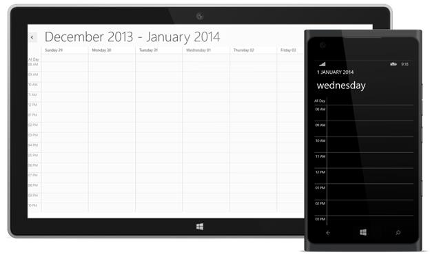

# DateTime Navigation and Gesture

## Move to date

Visible dates can be moved to specific date using **MoveToDate** method available in SfSchedule. It will move to any specific date if the schedule view is Day View, similarly it will move to the specific week if it is week view and to specific month if it is month view

>**Note:-The specified date should lies between MinDisplayDate and MaxDisplayDate, if the specified date is greater than *MaxDisplayDate* then the view moved to MaxDisplayDate similarly if the specified date is lesser than the *MinDisplayDate* then the view moved to MinDisplayDate.**



    SfSchedule schedule = new SfSchedule();
    schedule.MoveToDate(new DateTime(2014, 1, 1));



## Move to time

You can move the SfSchedule to particular time by passing the Timespan value to MoveToTime method. This method is applicable for Day, week and TimeLine view of SfSchedule control.

>**Note:-Since this method handles the position of scroll, it calls only after SfSchedule view gets loaded and MoveToTime is only applicable in day view of Windows Phone.**



    SfSchedule schedule = new SfSchedule();
    schedule.ScheduleType = ScheduleType.Day;
    schedule.MoveToTime(new TimeSpan(8, 0, 0));
    this.grid.Children.Add(schedule);



## Forward and Backward

### Forward

By default the date can be navigated to next view using touch gesture, by swiping the control in right to left direction. The view can be also changed programmatically using **Forward** method available in SfSchedule. So that next immediate visible dates will be viewed. It will move to next month if the schedule views is month, similarly it will move to next week for week view and next day for day view.

>**Note:- Date can be navigated until it reaches the Min Max date.**



    schedule.Forward();



### Backward

By default the date can be navigated to previous view using touch gesture, by swiping the control in left to right direction.The view can be also changed programmatically using **Backward** method available in SfSchedule. So that previous immediate visible dates will be displayed. It will move to previous month if the schedule views is month, similarly it will move to previous week for week view and previous day for day view

>**Note: - Date can be navigated until it reaches the Min Max date.**



    schedule.Backward();



## Minimum and Maximum Date

Visible dates can be restricted between certain range of dates using **MinimumDisplayDate** and **MaximumDisplayDate** properties available in Schedule control. It is applicable in all the schedule views.

So that beyond the min max date range, it will restrict date navigations features of forward(), backward(), moveToDate() and also can’t swipe the control using touch gesture beyond the min max date range. 



    schedule.MinimumDisplayDate = (new DateTime(2015, 11, 16));
    schedule.MaximumDisplayDate = (new DateTime(2015, 11, 27));



## Enable/Disable Navigation

By default Schedule views can be moved backwards and forwards using touch swipe gesture. This navigation, using touch gesture can be enabled and disabled using **EnableNavigation** property available in Schedule control. By default this is enabled.




    <schedule:SfSchedule ScheduleType="Month" x:Name="schedule" 
    EnableNavigation ="true"/>





    SfSchedule schedule = new SfSchedule();
    schedule.ScheduleType = ScheduleType.Month;
    schedule.EnableNavigation = true;
    this.grid.Children.Add(schedule);




