# Getting Started

This section explains you the steps required to configure the **SfSchedule** and also explains the steps to add events (appointments) that are to be bound to the **SfSchedule** control through various API’s available within it.

In addition, there are other additional options available within the Schedule control to customize the appearance and behavior of it. Now, we will look onto the steps in the following sections, to add a schedule control to an application where a person can manage some of his important activities in his schedule.

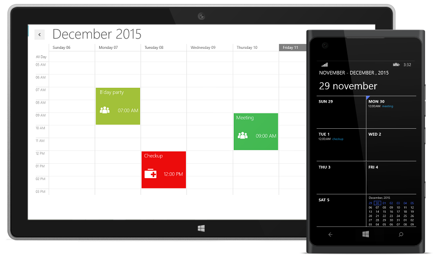

## Configuring SfSchedule

SfSchedule is available in the following assembly and namespace.

**Assembly**: Syncfusion.SfSchedule.UWP

**Namespace**: Syncfusion.UI.Xaml.Schedule




    <Schedule:SfSchedule />
    




    SfSchedule schedule = new SfSchedule();
    this.grid.Children.Add(schedule);




Run the above code and now the schedule can be seen as follows without appointments. In order to display the appointments on the schedule, either in local or remote data needs to be passed to it.

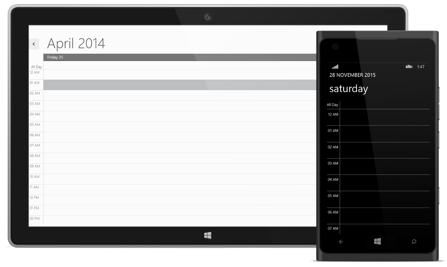

## Populating Events

The data can be either local or remote, which needs to be populated to the schedule control in order to add the appointments on the scheduler.



            SfSchedule schedule = new SfSchedule();
            ScheduleAppointment app = new ScheduleAppointment()
            {
                StartTime = new DateTime(2014, 6, 6, 5, 0, 0),
                EndTime = new DateTime(2014, 6, 6, 6, 30, 0),
                Subject = "Checkup",
                Location = "Hutchison road",
                AllDay = false
            };
            ScheduleAppointment app1 = new ScheduleAppointment()
            {
                StartTime = new DateTime(2014, 6, 7, 7, 0, 0),
                EndTime = new DateTime(2014, 6, 7, 9, 30, 0),
                Subject = "My B'day",
                Location = "Hutchison road",
                AllDay = false
            };
            ScheduleAppointment app2 = new ScheduleAppointment()
            {
                StartTime = new DateTime(2014, 6, 4, 7, 0, 0),
                EndTime = new DateTime(2014, 6, 4, 9, 30, 0),
                Subject = "Meeting",
                Location = "Hutchison road",
                AllDay = false
            };
            schedule.ScheduleType = ScheduleType.Week;
            schedule.Appointments.Add(app);
            schedule.Appointments.Add(app1);
            schedule.Appointments.Add(app2);
            this.grid.Children.Add(schedule);
            


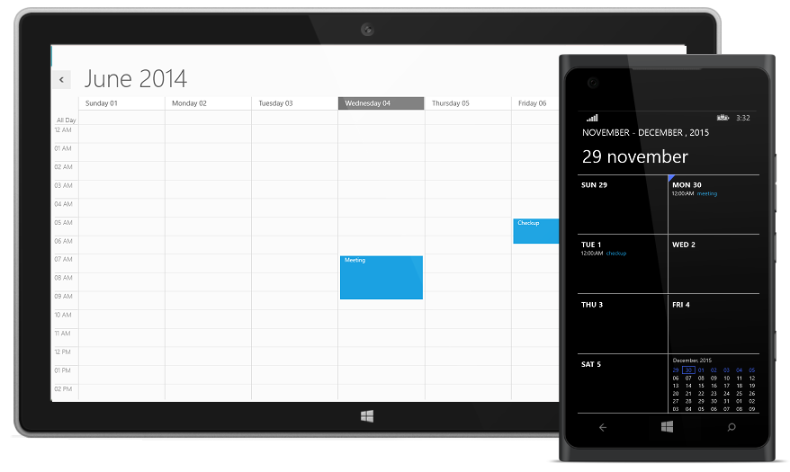

As you can see now in the above image, the schedule control displays the appointments in a default style. It’s also possible to customize the appointments within the scheduler by making use of the template support, which will be seen in the next section.

## Adding Templates to the appointments

We can change the appearance of the appointments and add images to represent the purpose of the appointments more clearly on visual by customizing the appointment template of schedule.



     <syncfusion:SfSchedule Grid.Row="1" Grid.ColumnSpan="2" x:Name="Schedule" ScheduleType="Week" Background="White" Margin="20,40,20,20" IntervalHeight="50">
                <syncfusion:SfSchedule.AppointmentTemplate>
                    <DataTemplate>
                        <Grid>
                            <Rectangle VerticalAlignment="Stretch" HorizontalAlignment="Stretch" Fill="{Binding AppointmentBackground}"/>
                            <Grid >
                                <Grid.RowDefinitions>
                                    <RowDefinition Height="Auto" />
                                    <RowDefinition Height="0.75*" />
                                </Grid.RowDefinitions>
                                <Grid.ColumnDefinitions>
                                    <ColumnDefinition />
                                    <ColumnDefinition />
                                </Grid.ColumnDefinitions>
                                <TextBlock Margin="10,2,0,0" Text="{Binding Subject}" Grid.Row="0" Grid.Column="0" Grid.ColumnSpan="2" HorizontalAlignment="Left" VerticalAlignment="Center" FontSize="20" Foreground="White" FontWeight="Light" FontFamily="Segoe UI"/>
      <Image Height="70" Width="70"  Grid.Row="1" HorizontalAlignment="Left" VerticalAlignment="Center">       
                                        <Image.Source>
                                            <BitmapImage   UriSource="ms-appx:/Schedule/Assets/"/>
                                        </Image.Source>             
                                </Image>
                                <TextBlock Text="{Binding AppointmentTime}" Grid.Row="1" Grid.Column="1" HorizontalAlignment="Left" VerticalAlignment="Center" FontSize="20" Foreground="White" FontWeight="Light" FontFamily="Segoe UI" TextWrapping="NoWrap"/>
                            </Grid>
                        </Grid>
                    </DataTemplate>
                </syncfusion:SfSchedule.AppointmentTemplate>
            </syncfusion:SfSchedule>
            


Once the template is set for the appointments, now the schedule will be displayed with customized appointments as shown below.

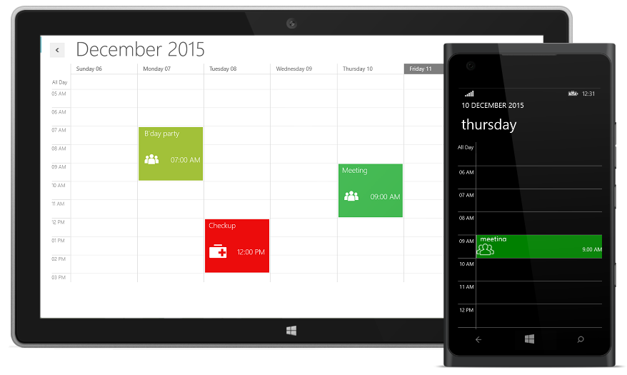

## Changing the Schedule View

As you can see in the image above that the appointments are rendered successfully with the images by using templates, but in order to display the appointments in different view, you need to change the view of the schedule from one type of view to another type (for an example :- “week” to “month”) by using the **ScheduleType** property. By default, the schedule control is displayed with the *Day* view.

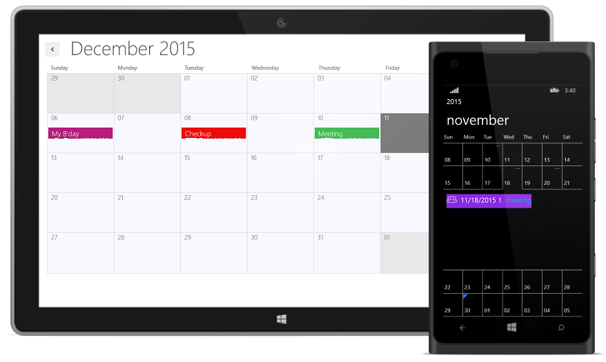

## Manipulating the Appointments

### Appointments Creation

Initially, we have seen how the appointments are rendered by binding the remote data. In order to add the appointments through UI to the schedule control, we need to double click on the appropriate schedule cells, in prior to the required time and then need to provide the required details on the appointment Editor that pops up. There is also an another option available in Context Menu to quickly add the appointments to the schedule control, by clicking the Add Option in Context Menu on required schedule cells. While adding new appointments to the schedule control either by making use of local or remote data, the new appointment data is saved automatically to the appointment collection.

The below image shows the appointment Editor that pops up while Clicking the Add option available in Context Menu.

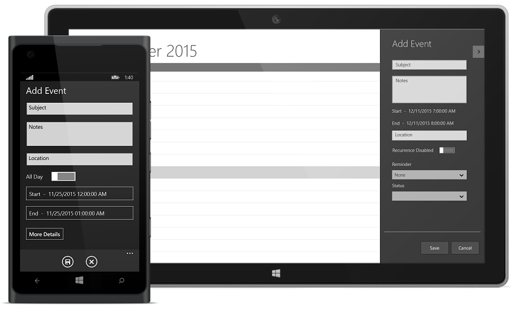

### Edit/Deleting Appointments

You can also edit or delete the appointments within the schedule control by clicking the Edit/Delete option available in Context Menu.

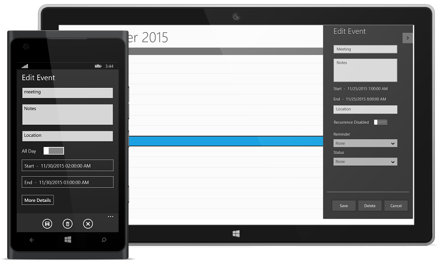

## Manipulating Recurrence Appointments

### Adding Recurrence Appointment

In order to add recurrence appointments, the “**Recurrence Enabled**” option needs to be enabled in schedule appointment editor as shown below. 

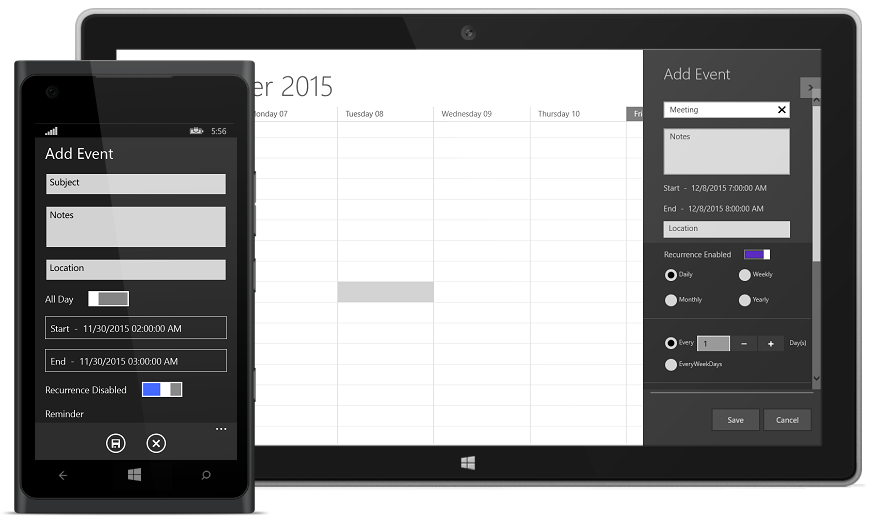

Once the **Recurrence Enabled** option is enabled, the sub-options available within the recurrence are shown in schedule Appointment Editor as shown below,

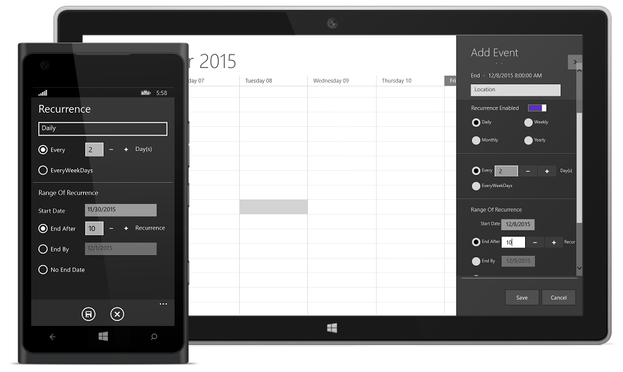

Now click “Save”, the recurrence appointment has been created with given recurrence pattern are shown below.

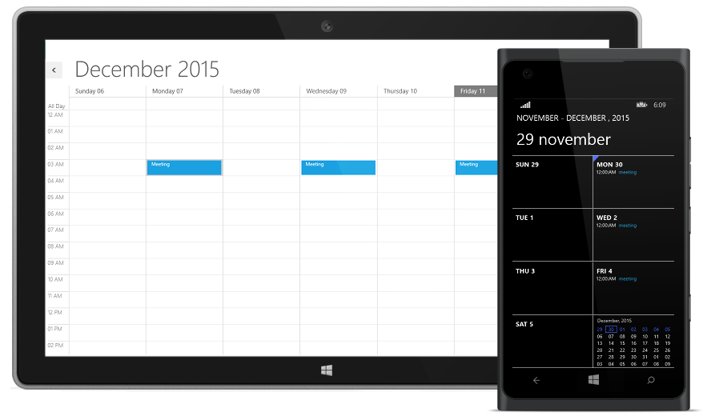

The Recurrence option that are chosen in the above cases, are usually stored in a **RecurrenceRule** field in a string format. Also, the **Recurrence** field indicates whether the appointments created are of normal or recurrence type. 

### Editing/Deleting Recurrence Appointment

The same procedure followed for normal appointments while editing/deleting appointments is applicable to recurrence appointments too, but we can make a choice to either edit/delete the single occurrence of that appointment or the entire series in an intermediate confirmation pop-up that shows off and we can Edit/Delete recurrence appointment by clicking the Edit Option in Context Menu. Double clicking the recurrence appointment opens the below confirmation pop-up,

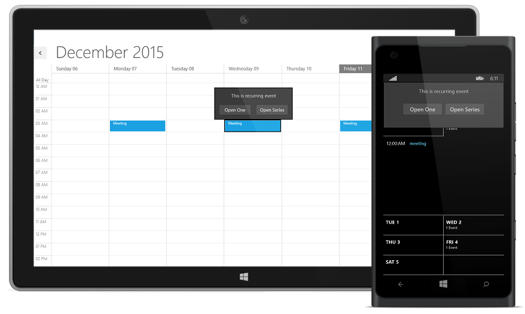

By clicking the option “Open One” or “Open Series” button the single/series of recurrence appointment data will be handled in AppointmentEditor as shown below.

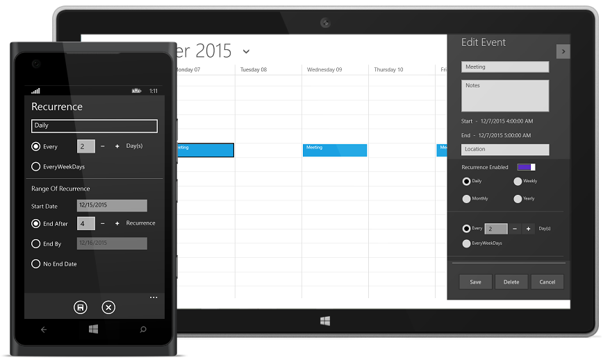

##  Behavior Customization using the events

### Preventing the display of appointment window

Now we have seen how to create the appointments and manipulating the appointments in schedule. If we have to restrict the appointments creation using editor, this can be achieved easily in Schedule using the events and validating its arguments such as StartTime & EndTime.

For example, if the appointment pop-up needs to be blocked, then the following code snippet needs to be used by defining the **AppointmentEditorOpening** event.




    <syncfusion:SfSchedule  Name="schedule
    AppointmentEditorOpening="schedule_AppointmentEditorOpening" >
    </syncfusion:SfSchedule>




    
     public MainWindow()
        {
            InitializeComponent();
            SfSchedule schedule = new SfSchedule();
            schedule.AppointmentEditorOpening += schedule_AppointmentEditorOpening;        
            this.grid.Children.Add(schedule);
        }

        void schedule_AppointmentEditorOpening(object sender, AppointmentEditorOpeningEventArgs e)
        {
            e.Cancel = true;
        }      




Thus, we have learned so far, how to create an application with our SfSchedule UWP control to manage a person’s daily important activities and also learned the behavior customization of SfSchedule by using the API’s available within it.

