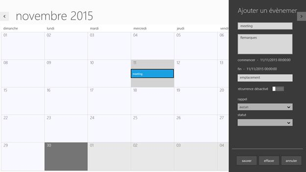
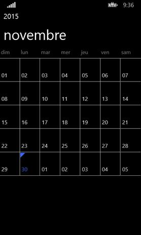
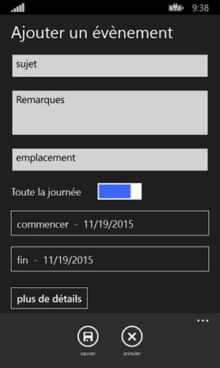

# Localization

The SfSchedule control allows you to set custom resources through .resx files. You can simply provide the string values in a resource file for a specific culture and set it in your application. The given string values will be set accordingly in the SfSchedule control. The appointment windows, message boxes, and other alert windows will be displayed with text in the local language (culture). If the application is deployed in French culture, then the SfSchedule control will display its contents in French language.



	ApplicationLanguages.PrimaryLanguageOverride ="fr-fr";



**Windows**

**Windows Phone**

<table>
<tr>
<td>
{{''| markdownify }}
</td><td>
{{''| markdownify }}
</td></tr>
</table>

## Advantages of Localization

The SfSchedule control can be embedded in applications deployed in any culture (e.g., en-US is the culture for English spoken in United States; en-GB is the culture for English spoken in United Kingdom or Great Britain) to provide details and information in the native language of the users.

