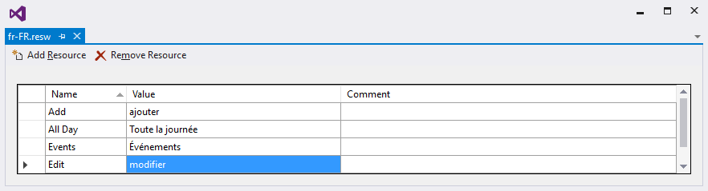

# Localization
Schedule control is available with complete localization support. Localization can be specified by setting the local language to the `PrimaryLanguageOverride`. In the format of `Language code`.
## Change default control language
Based on the locale specified the strings in the control such as Date, time, days are localized accordingly.
By default, schedule control is available with en locale, which is English.

   
 

        ApplicationLanguages.PrimaryLanguageOverride = "fr";

   


>**Note:** AM/PM in the timeline will not be localized in the Schedule views.

**Windows**

**Windows Phone**

<table>
<tr>
<td>
{{''| markdownify }}
</td><td>
{{''| markdownify }}
</td></tr>
</table>

## Localizing custom text in UWP renderer.
You can localize custom text available in the control by adding equivalent localized string in the fr.resw file. Here we have used French language.
>**Note:** Here resw file name should be match with the given locale language code.

