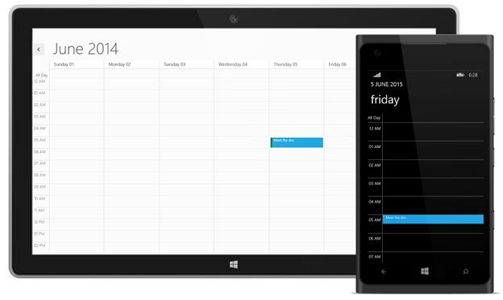
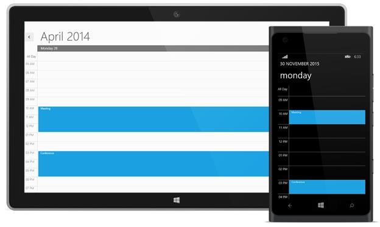

# Populating Data 

## Using Appointments Property

You can add appointments directly to the Schedule control, by creating ScheduleAppointment collection and assigning it to Appointments property. 



            SfSchedule schedule = new SfSchedule();
            schedule.Appointments.Add(new ScheduleAppointment()
            {
                StartTime = new DateTime(2013, 6, 5, 5, 0, 0),
                EndTime = new DateTime(2013, 6, 5, 5, 30, 0),
                Subject = "Meet the doc",
                Location = "Hutchison road",
                AllDay = false
            });



## Using Data Binding Technique

Schedule supports full data binding to any type of IEnumerable source. Specify the **AppointmentMapping** attributes to map the properties in the underlying data source to the Schedule appointments. The basic attributes of the AppointmentMapping property are as follows.  

* Subject
* Location 
* StartTime 
* EndTime  

Add IEnumerable collection to schedule by using the **ItemsSource** property.  




         <Schedule:SfSchedule Name="schedule" ScheduleType="Day" ItemsSource="{Binding MappedAppointments}">
            <Schedule:SfSchedule.AppointmentMapping>
                <Schedule:ScheduleAppointmentMapping
                    SubjectMapping="MappedSubject"
                    StartTimeMapping="MappedStartTime"
                    EndTimeMapping="MappedEndTime"/>
            </Schedule:SfSchedule.AppointmentMapping>
        </Schedule:SfSchedule>





    public partial class MainWindow : Window
    {
        public ObservableCollection<MappedAppointment> MappedAppointments { get; set; }
        public MainWindow()
        {
            InitializeComponent();
            MappedAppointments = new ObservableCollection<MappedAppointment>
                     {
                         new MappedAppointment{MappedSubject = "Meeting", MappedStartTime = DateTime.Now.Date.AddHours(10), 
                                                 MappedEndTime = DateTime.Now.Date.AddHours(11)},
                         new MappedAppointment{MappedSubject = "Conference", MappedStartTime = DateTime.Now.Date.AddHours(15), 
                                                 MappedEndTime = DateTime.Now.Date.AddHours(16)},
                     };
            this.DataContext = this;
        }
    }
    
    public class MappedAppointment
    {
        public string MappedSubject { get; set; }
        public DateTime MappedStartTime { get; set; }
        public DateTime MappedEndTime { get; set; }
    }
    



## Using MVVM 

This section explains binding **ItemsSource** property of SfSchedule in MVVM pattern.

>**Note:-Before enter this section you should have a clear idea about databinding support which is the one of the major concept used to bind the custom collection in Schedule.**

In order to bind the data source to **ItemsSource**, First you have to create a class (Model) for mapping Schedule appointments.



    public class ScheduleAppointmentModel : INotifyPropertyChanged
    {
        #region Properties

        #region StartTime
        private DateTime startTime;
        public DateTime StartTime
        {
            get
            {
                return startTime;
            }
            set
            {
                this.startTime = value;
                OnPropertyChanged("StarTime");

            }
        }
        #endregion

        #region EndTime
        private DateTime endTime;
        public DateTime EndTime
        {
            get
            {
                return endTime;
            }
            set
            {
                this.endTime = value;
                OnPropertyChanged("EndTime");

            }

        }
        #endregion

        #region Subject
        private string subject;
        public string Subject
        {
            get
            {
                return subject;
            }
            set
            {
                this.subject = value;
                OnPropertyChanged("StarTime");

            }
        }
        #endregion

        #endregion

        #region PropertyChanged Event

        public event PropertyChangedEventHandler PropertyChanged;

        public void OnPropertyChanged(string name)
        {
            if (this.PropertyChanged != null)
                this.PropertyChanged(this, new PropertyChangedEventArgs(name));

        }

        #endregion
    }



In Next step define property to pass the data source to **ItemsSource** of SfSchedule control in view model.

**ItemsSource–** Used to pass the data source of custom SfSchedule appointments.



    public class ScheduleViewModel : INotifyPropertyChanged
    {
        #region Properties

        #region ScheduleAppointmentCollection
        private ObservableCollection<ScheduleAppointmentModel> scheduleAppointmentCollection = new ObservableCollection<ScheduleAppointmentModel>();

        public ObservableCollection<ScheduleAppointmentModel> ScheduleAppointmentCollection
        {
            get
            {
                return scheduleAppointmentCollection;
            }
            set
            {
                this.scheduleAppointmentCollection = value;
                OnPropertyChanged("ScheduleAppointmentCollection");
            }
        }
        #endregion

        #endregion

        #region Constructor

        public ScheduleViewModel()
        {
            var startDate = DateTime.Now.Date.StartOfWeek(DayOfWeek.Monday);
            ScheduleAppointmentModel appointment1 = new ScheduleAppointmentModel()
            {
                StartTime = startDate.AddHours(5),
                EndTime = startDate.AddHours(6),
                Subject = "Johny's Appointment",
            };

            ScheduleAppointmentModel appointment2 = new ScheduleAppointmentModel()
            {
                StartTime = startDate.AddDays(1).AddHours(6),
                EndTime = startDate.AddDays(1).AddHours(7),
                Subject = "Neal's Appointment"
            };

            ScheduleAppointmentModel appointment3 = new ScheduleAppointmentModel()
            {
                StartTime = startDate.AddDays(2).AddHours(7),
                EndTime = startDate.AddDays(2).AddHours(8),
                Subject = "Peter's Appointment"
            };

            ScheduleAppointmentModel appointment4 = new ScheduleAppointmentModel()
            {
                StartTime = startDate.AddDays(3).AddHours(8),
                EndTime = startDate.AddDays(3).AddHours(9),
                Subject = "Morgan's Appointment"
            };

            ScheduleAppointmentModel appointment5 = new ScheduleAppointmentModel()
            {
                StartTime = startDate.AddDays(4).AddHours(9),
                EndTime = startDate.AddDays(4).AddHours(10),
                Subject = "Smith's Appointment"
            };

            scheduleAppointmentCollection.Add(appointment1);
            scheduleAppointmentCollection.Add(appointment2);
            scheduleAppointmentCollection.Add(appointment3);
            scheduleAppointmentCollection.Add(appointment4);
            scheduleAppointmentCollection.Add(appointment5);
        }

        #endregion

        #region PropertyChanged Event

        public event PropertyChangedEventHandler PropertyChanged;

        public void OnPropertyChanged(string name)
        {
            if (this.PropertyChanged != null)
                this.PropertyChanged(this, new PropertyChangedEventArgs(name));

        }
        #endregion
    }



Finally set the **DataContext** to view model Class.



    this.DataContext = new ScheduleViewModel();





    <syncfusion:SfSchedule x:Name="Schedule" 
    ScheduleType="Week" TimeInterval="OneHour"
    ItemsSource="{Binding ScheduleAppointmentCollection}">
    <syncfusion:SfSchedule.AppointmentMapping>
    <syncfusion:ScheduleAppointmentMapping
    SubjectMapping="Subject"
    StartTimeMapping="StartTime"
    EndTimeMapping="EndTime"/>
    </syncfusion:SfSchedule.AppointmentMapping>
    </syncfusion:SfSchedule>



