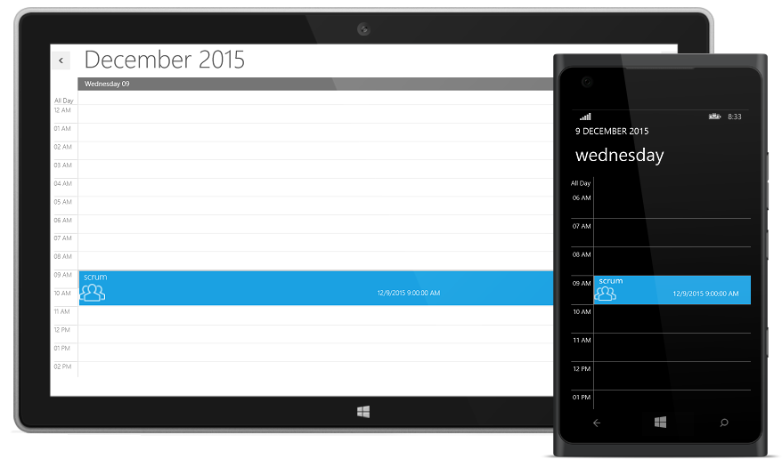
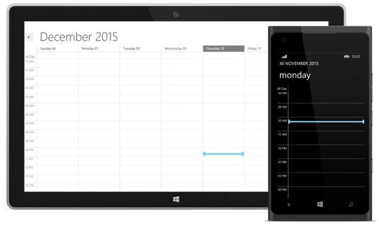
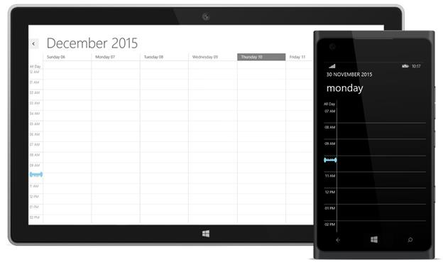
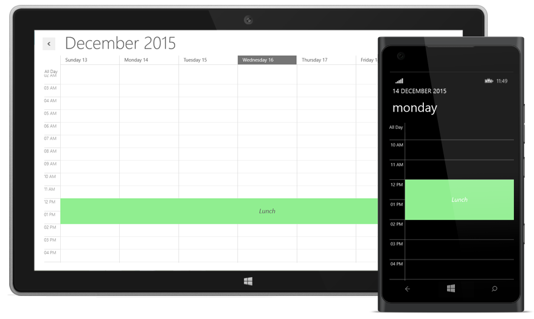

# UI Customization

## Appointment Template Customization

The default appearance of the Appointment can be customized by using the **AppointmentTemplate** property. The **AppointmentTemplate** is a DataTemplate type, used to customize or override the default template of the Appointments.




<Schedule:SfSchedule>
    <Schedule:SfSchedule.AppointmentTemplate>
        <DataTemplate>
            <Grid>
                <Rectangle Fill="{Binding AppointmentBackground}"/>
                <Grid>
                    <Grid.RowDefinitions>
                        <RowDefinition Height="0.25*"/>
                        <RowDefinition Height="0.75*"/>
                    </Grid.RowDefinitions>
                    <Grid.ColumnDefinitions>
                        <ColumnDefinition/><ColumnDefinition/>
                    </Grid.ColumnDefinitions>
                    <TextBlock Margin="10,2,0,0" Text="{Binding Subject}" Grid.Row="0" Grid.Column="0" Grid.ColumnSpan="2" HorizontalAlignment="Left" VerticalAlignment="Center" FontSize="20" Foreground="White" FontWeight="Light" FontFamily="Segoe UI"/>
                    <Image Source="../Assets/Team.png" Grid.Row="1" HorizontalAlignment="Left" VerticalAlignment="Center" />
                    <TextBlock Text="{Binding StartTime}" Grid.Row="1" Grid.Column="1" HorizontalAlignment="Left" VerticalAlignment="Center" FontSize="20" Foreground="White" FontWeight="Light" FontFamily="Segoe UI" TextWrapping="NoWrap"/>
                </Grid></Grid>
        </DataTemplate>
    </Schedule:SfSchedule.AppointmentTemplate>
    </Schedule:SfSchedule>  





        schedule.Appointments.Add(new ScheduleAppointment()
            {
                StartTime = DateTime.Now.Date.AddHours(9),
                EndTime = DateTime.Now.Date.AddHours(11),
                Subject = "scrum",
                Location = "chennai",
            });




## CurrentTimeIndicator Template Customization

The default appearance of CurrentTimeIndicator can be customized by using the CurrentTimeIndicatorTemplate property.The CurrentTimeIndicatorTemplate is DataTemplate type used to customize or override the default template of the CurrentTimeIndicator.

>**Note:-CurrentTimeIndicator customization is only applicable in day,week,workweek and timeline views in windows,and for windowsphone it is applicable for day and timeline views.**




     <Schedule:SfSchedule x:Name="schedule" ScheduleType="Week" CurrentTimeIndicatorVisibility="Visible" Background="White">
            <Schedule:SfSchedule.CurrentTimeIndicatorTemplate>
                <DataTemplate>
                    <Border Background="Transparent" Height="20" HorizontalAlignment="Stretch" VerticalAlignment="Stretch">
                        <Grid VerticalAlignment="Stretch" >
                            <Ellipse Width="10" VerticalAlignment="Center" Height="20" Fill="SkyBlue" HorizontalAlignment="Left"/>
                            <Rectangle Fill="SkyBlue" Height="8" VerticalAlignment="Center" HorizontalAlignment="Stretch"/>
                            <Ellipse Width="10" VerticalAlignment="Center" Height="20" Fill="SkyBlue" HorizontalAlignment="Right"/>
                        </Grid>
                    </Border>
                </DataTemplate>
            </Schedule:SfSchedule.CurrentTimeIndicatorTemplate>
        </Schedule:SfSchedule>





            SfSchedule schedule = new SfSchedule();
            schedule.ScheduleType = ScheduleType.Week;
            schedule.CurrentTimeIndicatorVisibility = Visibility.Visible;
            schedule.CurrentTimeIndicatorTemplate = (DataTemplate)this.Resources["CurrentTimeIndicatorTemplate"];
            this.grid.Children.Add(schedule);




## Customizing NonAccessibleBlock

The default appearance of **NonAccessibleBlock** can be customized by using the **NonAccessibleBlockTemplate** property.The **NonAccessibleBlockTemplate** is DataTemplate type used to customize or override the default template of the **NonAccessibleBlock**.

>**Note:-NonAccessibleBlock customization is only applicable in day,week,workweek and timeline views in windows,and for windowsphone it is applicable for day and timeline views.**




        <Schedule:SfSchedule ScheduleType="Week">
            <Schedule:SfSchedule.NonAccessibleBlocks>
                <Schedule:NonAccessibleBlock Background="LightPink" StartHour="12.00" EndHour="14.00" Label="Non Accessible Block">
                </Schedule:NonAccessibleBlock>
            </Schedule:SfSchedule.NonAccessibleBlocks>
            <Schedule:SfSchedule.NonAccessibleBlockTemplate>
                <DataTemplate>
                    <Border Background="LightGreen">
                        <TextBlock Text="Lunch" VerticalAlignment="Center" FontSize="20"  FontStyle="Italic" HorizontalAlignment="Center"></TextBlock>
                    </Border>
                </DataTemplate>
            </Schedule:SfSchedule.NonAccessibleBlockTemplate>
        </Schedule:SfSchedule>





            SfSchedule schedule = new SfSchedule();
            schedule.NonAccessibleBlocks.Add(new NonAccessibleBlock()
            {
                StartHour = 12,
                EndHour = 14,
                Label = "Lunch"
            });
            schedule.NonAccessibleBlockTemplate = (DataTemplate)this.Resources["NonAccessibleBlockTemplate"];
            this.grid.Children.Add(schedule);




