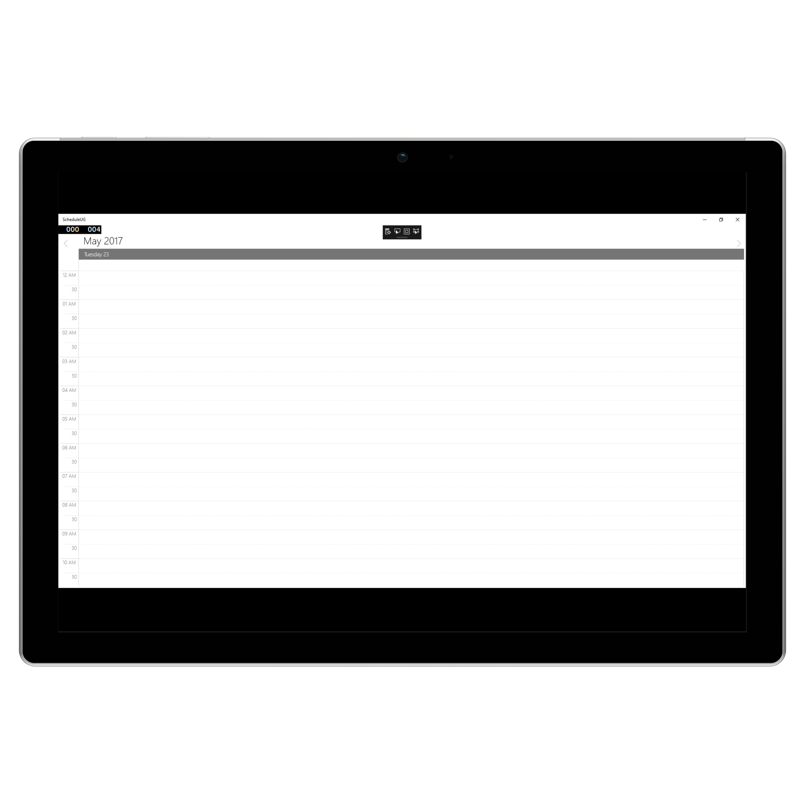
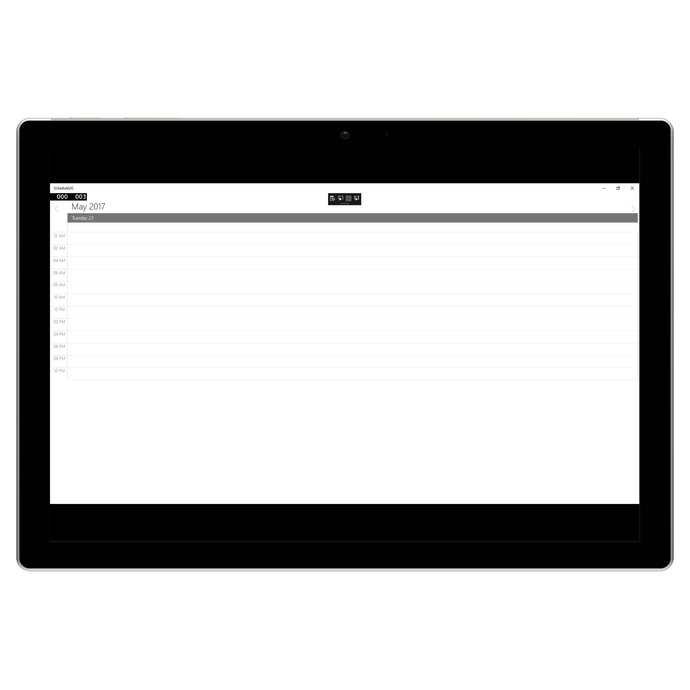
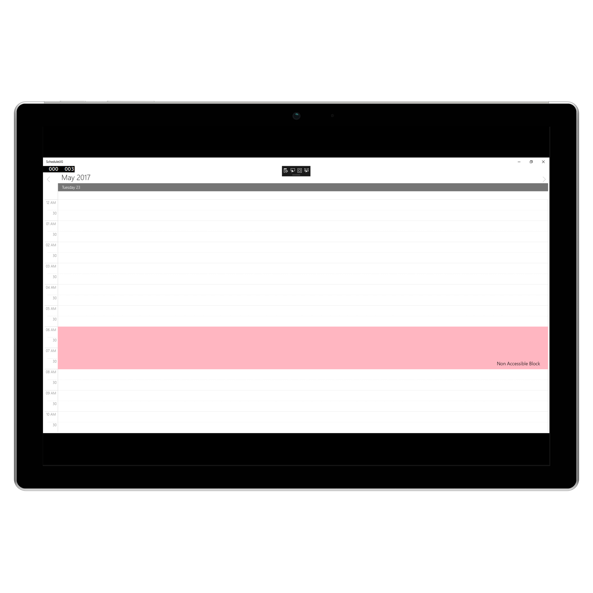
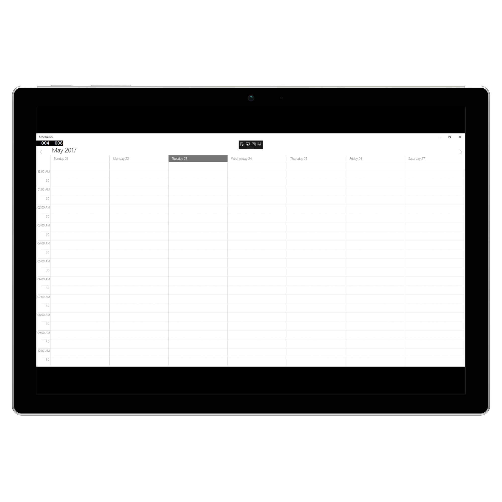
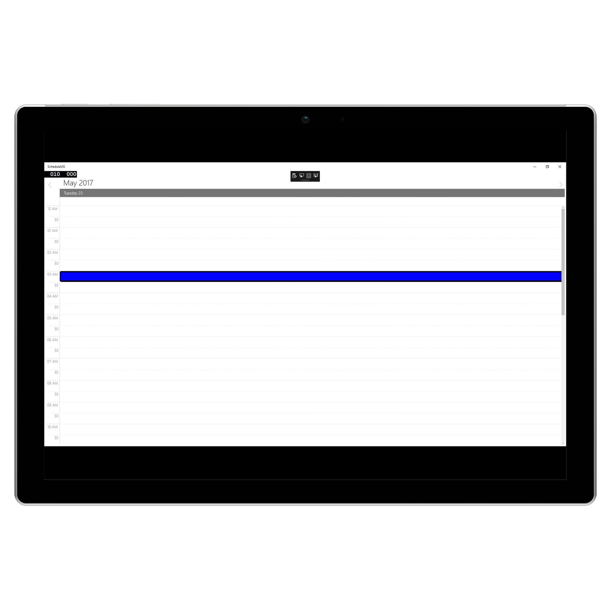
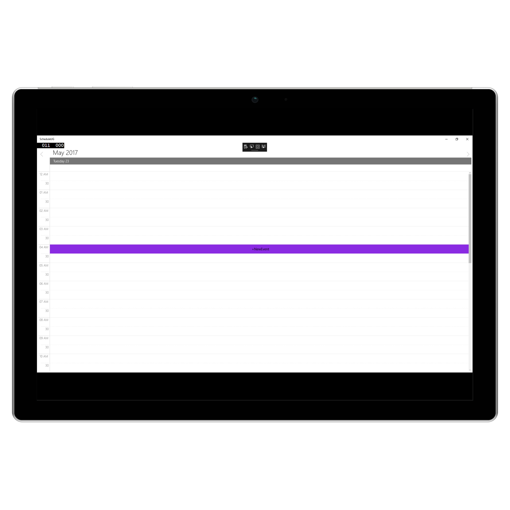
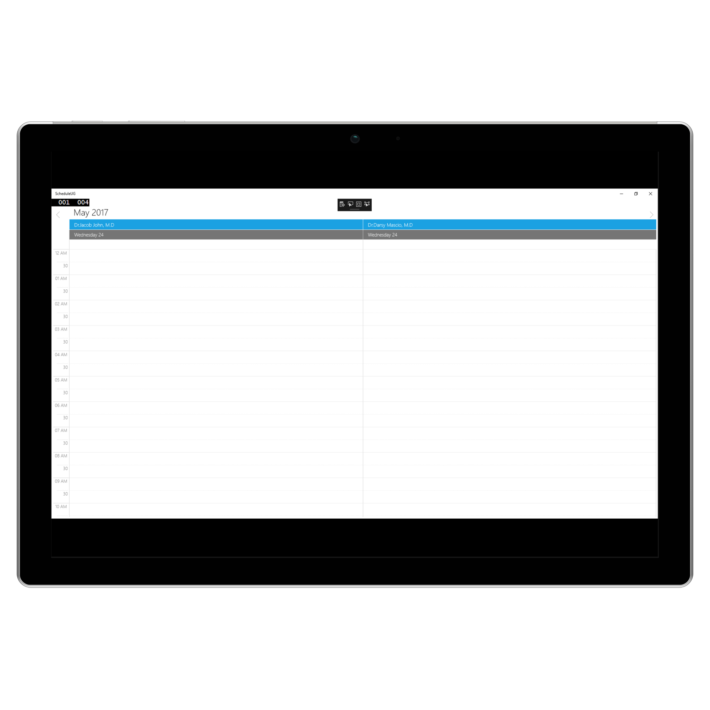
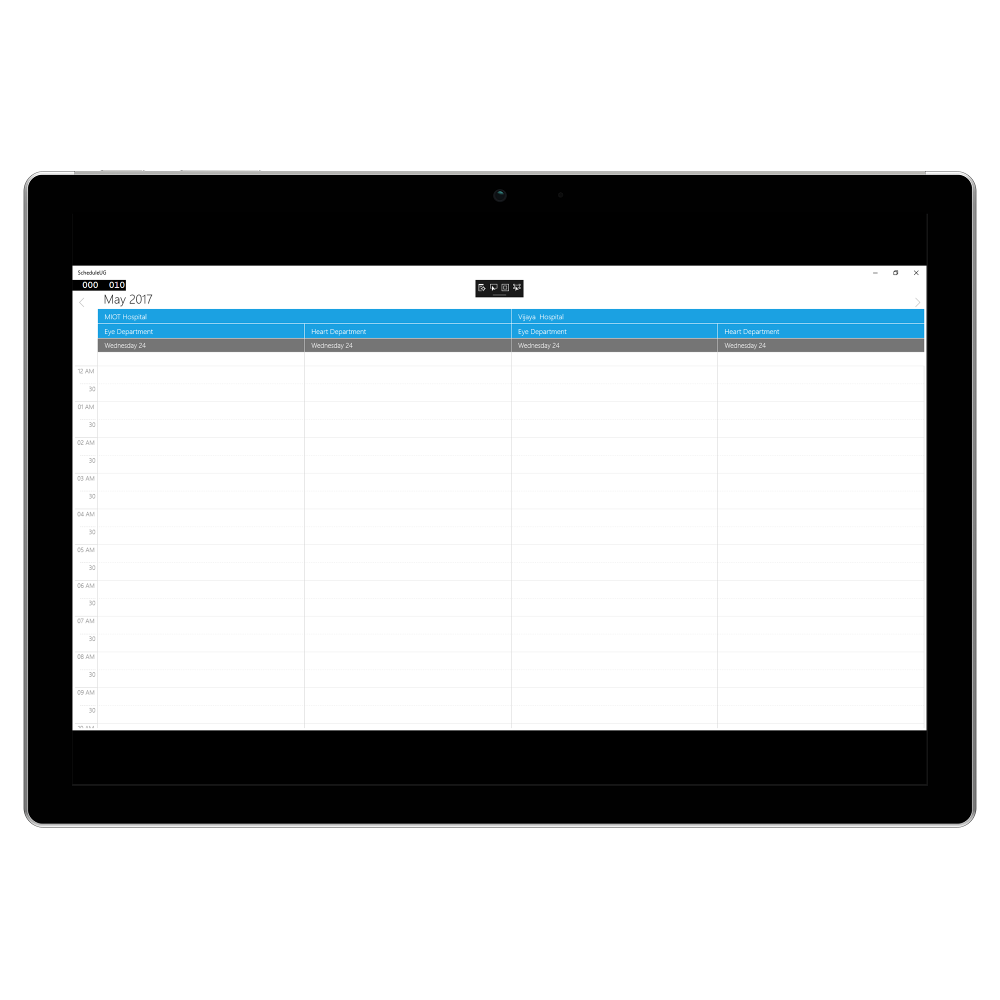

---

layout: post
title: Customize the Schedule DayView at SfSchedule control for UWP
description: Learn how to Customize the schedule DayView in SfSchedule control
platform: UWP
control: SfSchedule
documentation: ug

---

# DayView:

DayView is used to display a single day, current day will be visible by default. Appointments on a specific day will be arranged in respective timeslots based on its duration.

## ViewHeader Appearance:
You can customize the default appearance of view header in [DayView](https://help.syncfusion.com/cr/cref_files/uwp/sfschedule/index.html#frlrfSyncfusionUIXamlScheduleScheduleTypeClassTopic.html) by using [DayViewHeaderStyle](https://help.syncfusion.com/cr/cref_files/uwp/sfschedule/frlrfSyncfusionUIXamlScheduleSfScheduleClassDayViewHeaderStyleTopic.html) and [DayViewHeaderHeight](https://help.syncfusion.com/cr/cref_files/uwp/sfschedule/frlrfSyncfusionUIXamlScheduleScheduleDayViewHeaderStyleClassDayViewHeaderHeightTopic.html) properties of [SfSchedule](https://help.syncfusion.com/cr/cref_files/uwp/sfschedule/index.html#frlrfSyncfusionUIXamlScheduleSfScheduleClassTopic.html).




    <Schedule:SfSchedule x:Name="schedule" ScheduleType="Day">
            <Schedule:SfSchedule.DayViewHeaderStyle>
                <Schedule:ScheduleDayViewHeaderStyle
                    DayViewHeaderBackground="Red"
                    DayViewHeaderFontFamily="Arial"
                    DayViewHeaderHeight="50"
                    DayViewHeaderTextColor="White"
                    DayViewHeaderTextSize="15" />
            </Schedule:SfSchedule.DayViewHeaderStyle>
        </Schedule:SfSchedule>




    SfSchedule schedule = new SfSchedule();
            schedule.ScheduleType = ScheduleType.Day;
            ScheduleDayViewHeaderStyle dayViewHeaderStyle = new ScheduleDayViewHeaderStyle();
            dayViewHeaderStyle.DayViewHeaderTextColor = new SolidColorBrush(Colors.White);
            dayViewHeaderStyle.DayViewHeaderFontFamily = new FontFamily("Arial");
            dayViewHeaderStyle.DayViewHeaderHeight = 50;
            dayViewHeaderStyle.DayViewHeaderTextSize = 15;
            dayViewHeaderStyle.DayViewHeaderBackground = new SolidColorBrush(Colors.Red);
            schedule.DayViewHeaderStyle = dayViewHeaderStyle;



## Change Time Interval:
You can customize the interval of timeslots in `DayView`.

* [TimeInterval customization](#timeInterval-customization)
* [CustomTimeInterval](#customTimeInterval)

### TimeInterval customization:
You can customize the interval of timeslots in `DayView` by setting [TimeInterval](https://help.syncfusion.com/cr/cref_files/uwp/sfschedule/frlrfSyncfusionUIXamlScheduleSfScheduleClassTimeIntervalTopic.html) property of `SfSchedule`.



            schedule.ScheduleType = ScheduleType.Day;
            schedule.TimeInterval = TimeInterval.ThirtyMin;




     <Schedule:SfSchedule x:Name="schedule" TimeInterval="ThirtyMin" />



### CustomTimeInterval:
You can customize the interval of timeslots in `DayView` by setting [CustomTimeInterval](https://help.syncfusion.com/cr/cref_files/uwp/sfschedule/frlrfSyncfusionUIXamlScheduleSfScheduleClassCustomTimeIntervalTopic.html) property of `SfSchedule`.



            schedule.ScheduleType = ScheduleType.Day;
            schedule.TimeInterval = TimeInterval.Custom;
            schedule.CustomTimeInterval = 120;




     <Schedule:SfSchedule
            x:Name="schedule"
            CustomTimeInterval="120"
            TimeInterval="Custom" />



## Change Working hours:
Working hours in `DayView` of Schedule control will be differentiated with non-working hours by separate color. By default, working hours will be between 09 to 18. You can customize the working hours by setting [WorkStartHour](https://help.syncfusion.com/cr/cref_files/uwp/sfschedule/frlrfSyncfusionUIXamlScheduleSfScheduleClassWorkStartHourTopic.html) and [WorkEndHour](https://help.syncfusion.com/cr/cref_files/uwp/sfschedule/frlrfSyncfusionUIXamlScheduleSfScheduleClassWorkEndHourTopic.html) properties of `SfSchedule`.



           schedule.IsHighLightWorkingHours = true;
            schedule.ScheduleType = ScheduleType.Day;
            schedule.WorkStartHour = 10;
            schedule.WorkEndHour = 18;
            schedule.NonWorkingHourBrush = new SolidColorBrush(Colors.LightGray);




    <Schedule:SfSchedule
            x:Name="schedule"
            IsHighLightWorkingHours="True"
            NonWorkingHourBrush="LightGray"
            ScheduleType="Day"
            WorkEndHour="18"
            WorkStartHour="10" />



>**Note**:
`WorkStartHour` and `WorkEndHour` should be in integer value to represent hours.

## Timeslot Appearance:
You can customize the appearance of the Timeslot by its color using [MajorTickStroke](https://help.syncfusion.com/cr/cref_files/uwp/sfschedule/frlrfSyncfusionUIXamlScheduleSfScheduleClassMajorTickStrokeTopic.html), [MinorTickStroke](https://help.syncfusion.com/cr/cref_files/uwp/sfschedule/frlrfSyncfusionUIXamlScheduleSfScheduleClassMinorTickStrokeTopic.html), [DayViewVerticalLineStroke](https://help.syncfusion.com/cr/cref_files/uwp/sfschedule/index.html#frlrfSyncfusionUIXamlScheduleSfScheduleClassDayViewVerticalLineStrokeTopic.html),  [MajorTickStrokeDashArray](https://help.syncfusion.com/cr/cref_files/uwp/sfschedule/frlrfSyncfusionUIXamlScheduleSfScheduleClassMajorTickStrokeDashArrayTopic.html),  [MinorTickStrokeDashArray](https://help.syncfusion.com/cr/cref_files/uwp/sfschedule/frlrfSyncfusionUIXamlScheduleSfScheduleClassMinorTickStrokeDashArrayTopic.html),  [IsHighLightWorkingHours](https://help.syncfusion.com/cr/cref_files/uwp/sfschedule/frlrfSyncfusionUIXamlScheduleSfScheduleClassIsHighLightWorkingHoursPropertyTopic.html),  `WorkStartHour` , `WorkEndHour` and [NonWorkingHourBrush](https://help.syncfusion.com/cr/cref_files/uwp/sfschedule/frlrfSyncfusionUIXamlScheduleSfScheduleClassNonWorkingHourBrushTopic.html) properties of `SfSchedule`.



            schedule.ScheduleType = ScheduleType.Day;
            schedule.MajorTickStroke = new SolidColorBrush(Colors.Red);
            schedule.MinorTickStroke = new SolidColorBrush(Colors.Green);
            schedule.DayViewVerticalLineStroke = new SolidColorBrush(Colors.Blue);
            schedule.MajorTickStrokeDashArray = new DoubleCollection() { 5, 10 };
            schedule.MinorTickStrokeDashArray = new DoubleCollection() { 10, 10 };
            schedule.IsHighLightWorkingHours = true;
            schedule.WorkStartHour = 9;
            schedule.WorkEndHour = 18;
            schedule.NonWorkingHourBrush = new SolidColorBrush(Colors.LightBlue);




    <Schedule:SfSchedule
            x:Name="schedule"
            DayViewVerticalLineStroke="Blue"
            IsHighLightWorkingHours="True"
            MajorTickStroke="Red"
            MajorTickStrokeDashArray="5,10"
            MinorTickStroke="Green"
            MinorTickStrokeDashArray="5,5"
            NonWorkingHourBrush="LightBlue"
            WorkEndHour="18"
            WorkStartHour="9" />



## Non-Accessible timeslots:

You can restrict or allocate certain timeslot as non-accessible blocks by using [NonAccessibleBlocks](https://help.syncfusion.com/cr/cref_files/uwp/sfschedule/frlrfSyncfusionUIXamlScheduleSfScheduleClassNonAccessibleBlocksTopic.html) of `SfSchedule`, so that you can allocate those timeslots for predefined events/activities like Lunch hour.



            schedule.ScheduleType = ScheduleType.Day;
            schedule.NonAccessibleBlocks.Add(new NonAccessibleBlock()
            {
                Background = new SolidColorBrush(Colors.LightPink),
                StartHour = 6.00,
                EndHour = 8.00,
                Label = "Non Accessible Block"
            });




    <Schedule:SfSchedule x:Name="schedule" ScheduleType="Day">
            <Schedule:SfSchedule.NonAccessibleBlocks>
                <Schedule:NonAccessibleBlock
                    Background="LightPink"
                    EndHour="8.00"
                    Label="Non Accessible Block"
                    StartHour="6.00" />
            </Schedule:SfSchedule.NonAccessibleBlocks>
    </Schedule:SfSchedule>



>**Note**:
Selection and related events will not be working in this blocks.

## Change first day of week:

Change first day of week:
[FirstDayOfWeek](https://help.syncfusion.com/cr/cref_files/uwp/sfschedule/frlrfSyncfusionUIXamlScheduleSfScheduleClassFirstDayOfWeekTopic.html) of `SfSchedule` is not applicable for `DayView` as it displays only one day.

## Time Label Formatting:
You can customize the format for the labels which are mentioning the time, by setting [MajorTickTimeFormat](https://help.syncfusion.com/cr/cref_files/uwp/sfschedule/frlrfSyncfusionUIXamlScheduleSfScheduleClassMajorTickTimeFormatTopic.html) and [MinorTickTimeFormat](https://help.syncfusion.com/cr/cref_files/uwp/sfschedule/frlrfSyncfusionUIXamlScheduleSfScheduleClassMinorTickTimeFormatTopic.html) properties of ` SfSchedule`.



            schedule.ScheduleType = ScheduleType.Day;
            schedule.MajorTickTimeFormat = "hh:mm tt";
            schedule.MinorTickTimeFormat = "mm";




    <Schedule:SfSchedule
            x:Name="schedule"
            MajorTickTimeFormat="hh:mm tt"
            MinorTickTimeFormat="mm"
            ScheduleType="Day" />



## Time Label Appearance:

You can customize the color for the labels which are mentioning the time, by setting [MajorTickLabelStroke](https://help.syncfusion.com/cr/cref_files/uwp/sfschedule/frlrfSyncfusionUIXamlScheduleSfScheduleClassMajorTickLabelStrokeTopic.html) and  [MinorTickLabelStroke](https://help.syncfusion.com/cr/cref_files/uwp/sfschedule/frlrfSyncfusionUIXamlScheduleSfScheduleClassMinorTickLabelStrokeTopic.html) properties of ` SfSchedule`.


            schedule.ScheduleType = ScheduleType.Day;
            schedule.MajorTickLabelStroke = new SolidColorBrush(Colors.Blue);
            schedule.MinorTickLabelStroke = new SolidColorBrush(Colors.Blue);




    <Schedule:SfSchedule
            x:Name="schedule"
            MajorTickLabelStroke="Blue"
            MinorTickLabelStroke="Blue"
            ScheduleType="Day" />



## Selection:
You can customize the default appearance of selection UI in the timeslots.

* [Selection customization using style](#selection-customization-using-style)
* [Selection customization using custom View](#selection-customization-using-custom-view)

### Selection customization using style:
You can customize the timeslot selection by using [ScheduleSelectionStyle](https://help.syncfusion.com/cr/cref_files/uwp/sfschedule/frlrfSyncfusionUIXamlScheduleSfScheduleClassScheduleSelectionStyleTopic.html) property of `SfSchedule`.



            schedule.ScheduleType = ScheduleType.Day;
            ScheduleSelectionStyle selectionStyle = new ScheduleSelectionStyle();
            selectionStyle.Background = new SolidColorBrush(Colors.Blue);
            selectionStyle.BorderBrush = new SolidColorBrush(Colors.Black);
            selectionStyle.BorderThickness = new Thickness(5);
            selectionStyle.BorderCornerRadius = new CornerRadius(5);
            schedule.ScheduleSelectionStyle = selectionStyle;



    <Schedule:SfSchedule x:Name="schedule" ScheduleType="Day">
            <Schedule:SfSchedule.ScheduleSelectionStyle>
                <Schedule:ScheduleSelectionStyle
                    Background="Blue"
                    BorderBrush="Black"
                    BorderCornerRadius="5"
                    BorderThickness="5" />
            </Schedule:SfSchedule.ScheduleSelectionStyle>
        </Schedule:SfSchedule>



### Selection customization using custom View:
You can replace the default selection UI with your custom view by setting [SelectionView](https://help.syncfusion.com/cr/cref_files/uwp/sfschedule/frlrfSyncfusionUIXamlScheduleSfScheduleClassSelectionViewTopic.html) property of `SfSchedule`.



            schedule.ScheduleType = ScheduleType.Day;
            Button selectionView = new Button();
            selectionView.Content = "+NewEvent";
            selectionView.Background = new SolidColorBrush(Colors.BlueViolet);
            schedule.SelectionView = selectionView;




    <Schedule:SfSchedule x:Name="schedule" ScheduleType="Day">
            <Schedule:SfSchedule.SelectionView>
                <Button Background="BlueViolet" Content="+NewEvent" />
            </Schedule:SfSchedule.SelectionView>
    </Schedule:SfSchedule>



>**Note:**
Selection customization is applicable for time slots alone.

## Configuration Resources
The Schedule control allows you to define resources that can be assigned to appointments. Resources let you associate additional information with your appointments. The schedule can group appointments based on the resources associated with them.

* [Adding resource](#adding-resource)
* [Sub Resource](#sub-resource)
* [Changing resource order](#changing-resource-order)
* [Customizing resource visibility](#customizing-resource-visibility)

### Adding resource
Resource can be added to the schedule control by setting [Resource](https://help.syncfusion.com/cr/cref_files/uwp/sfschedule/frlrfSyncfusionUIXamlScheduleSfScheduleClassResourceTopic.html) and [ScheduleResourceTypeCollection](https://help.syncfusion.com/cr/cref_files/uwp/sfschedule/frlrfSyncfusionUIXamlScheduleSfScheduleClassScheduleResourceTypeCollectionTopic.html) of `SfSchedule`. After that add the [ResourceType](https://help.syncfusion.com/cr/cref_files/uwp/sfschedule/index.html#frlrfSyncfusionUIXamlScheduleResourceTypeClassctorTopic.html) for `ScheduleResourceTypeCollection` and assign `Resource` to `ResourceType`.



     //setting resource for schedule
            schedule.Resource = "Doctor";
            //Creating Appointment style 
            ResourceType resourceType = new ResourceType { TypeName = "Doctor" };
            resourceType.ResourceCollection.Add(new Resource { DisplayName = "Dr.Jacob", ResourceName = "Dr.Jacob", });
            resourceType.ResourceCollection.Add(new Resource { DisplayName = "Dr.Darsy", ResourceName = "Dr.Darsy" });
            schedule.DayHeaderOrder = DayHeaderOrder.OrderByDate;
            //setting resource type
            schedule.ScheduleResourceTypeCollection = new ObservableCollection<ResourceType> { resourceType };



    <syncfusion:SfSchedule Name="schedule" Resource="Doctors">
            <syncfusion:SfSchedule.ScheduleResourceTypeCollection>
                <syncfusion:ResourceType TypeName="Doctors">
                    <syncfusion:Resource
                        DisplayName="Dr.Jacob John, M.D "
                        ResourceName="Dr.Jacob" />
                    <syncfusion:Resource
                        DisplayName="Dr.Darsy Mascio, M.D"
                        ResourceName="Dr.Darsy" />
                </syncfusion:ResourceType>
            </syncfusion:SfSchedule.ScheduleResourceTypeCollection>
        </syncfusion:SfSchedule>




### Sub Resource

SubResourceType enables users to view appointments based on their subcategory only in `day`, `week` views and can group appointments under various subcategories.



            SfSchedule schedule = new SfSchedule();
            schedule.ScheduleType = ScheduleType.Day;
            ResourceType resourceType = new ResourceType
            {
                TypeName = "Hospital"
            };
            ResourceType subResourceType = new ResourceType
            {
                TypeName = "Department"
            };
            resourceType.ResourceCollection.Add(new Resource
            {
                DisplayName = "MIOT Hospital",
                ResourceName = "MIOTHospital",
            });
            resourceType.ResourceCollection.Add(new Resource
            {
                DisplayName = "Vijaya  Hospital",
                ResourceName = "VijayaHospital"
            });
            subResourceType.ResourceCollection.Add(new Resource
            {
                DisplayName = "Eye Department",
                ResourceName = "Eye"
            });
            subResourceType.ResourceCollection.Add(new Resource
            {
                DisplayName = "Heart Department",
                ResourceName = "Heart"
            });
            schedule.ScheduleResourceTypeCollection = new ObservableCollection<ResourceType> { resourceType };
            schedule.ScheduleResourceTypeCollection = new ObservableCollection<ResourceType> { subResourceType };
            schedule.Resource = "Hospital";
            schedule.Resource = "Department";





    <syncfusion:SfSchedule
            x:Name="schedule"
            Resource="Hospital"
            ScheduleType="Day">
            <syncfusion:SfSchedule.ScheduleResourceTypeCollection>
                <syncfusion:ResourceType TypeName="Hospital">
                    <syncfusion:ResourceType.ResourceCollection>
                        <syncfusion:Resource DisplayName="MIOT Hospital" ResourceName="MIOTHospital" />
                        <syncfusion:Resource DisplayName="Vijaya  Hospital" ResourceName="VijayaHospital" />
                    </syncfusion:ResourceType.ResourceCollection>
                    <syncfusion:ResourceType.SubResourceType>
                        <syncfusion:ResourceType TypeName="Department">
                            <syncfusion:ResourceType.ResourceCollection>
                                <syncfusion:Resource DisplayName="Eye Department" ResourceName="Eye" />
                                <syncfusion:Resource DisplayName="Heart Department" ResourceName="Heart" />
                            </syncfusion:ResourceType.ResourceCollection>
                        </syncfusion:ResourceType>
                    </syncfusion:ResourceType.SubResourceType>
                </syncfusion:ResourceType>
            </syncfusion:SfSchedule.ScheduleResourceTypeCollection>
        </syncfusion:SfSchedule>



### Changing resource order:
#### Order by Date
DayHeaderOrder property is used to set the order by which resources must be displayed. OrderByDate will be displaying the resource based on date. 



            schedule.ScheduleType = ScheduleType.Day;
            schedule.DayHeaderOrder = DayHeaderOrder.OrderByDate;




    <syncfusion:SfSchedule x:Name="schedule" ScheduleType="Day"
                       Resource="Hospital" DayHeaderOrder="OrderByDate"/>



#### Order by resource
DayHeaderOrder property is used to set the order by which resources must be displayed. OrderByResource will be displaying the resource based on resource collection. 



            schedule.ScheduleType = ScheduleType.Day;
            schedule.DayHeaderOrder = DayHeaderOrder.OrderByResource;




    <syncfusion:SfSchedule x:Name="schedule" ScheduleType="Day"
                       Resource="Hospital" DayHeaderOrder="OrderByResource"/>



### Customizing resource visibility:

#### Column count
This feature supports to specifying the count of resources that needs to be displayed per view. This support can be enabled by using property [DayViewColumnCount](https://help.syncfusion.com/cr/cref_files/uwp/sfschedule/frlrfSyncfusionUIXamlScheduleSfScheduleClassDayViewColumnCountTopic.html) in `SfSchedule`. By default, its value is “zero”.

>**Note**
This support is available for Day view alone.



            schedule.ScheduleType = ScheduleType.Day;
            schedule.DayViewColumnCount = 5;



    <syncfusion:SfSchedule x:Name="schedule" ScheduleType="Day"
        Resource="Hospital" DayHeaderOrder="OrderByDate" DayViewColumnCount="5"/>



