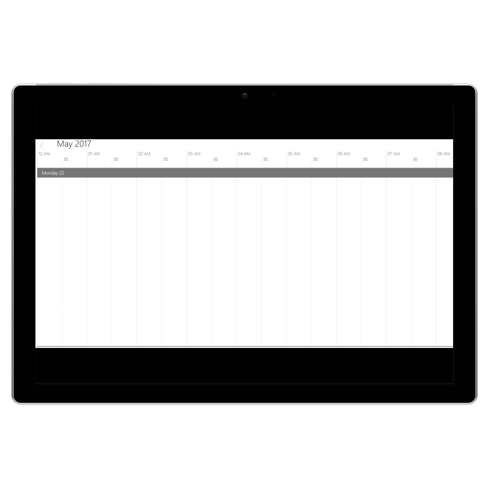
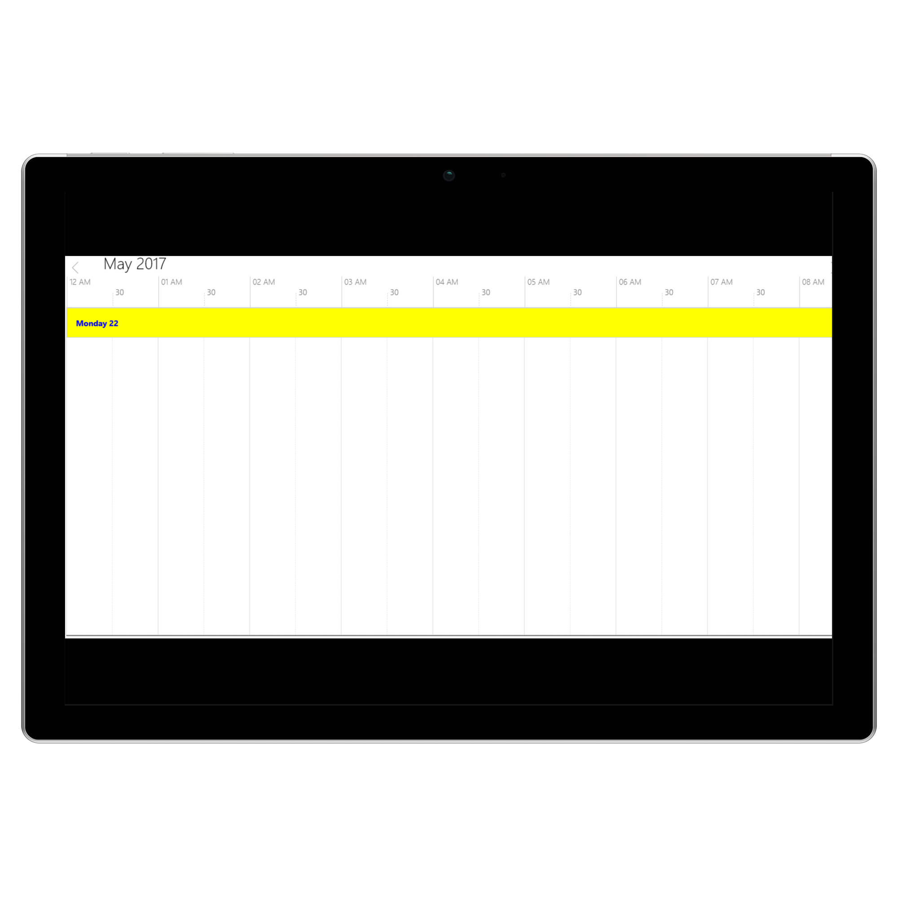
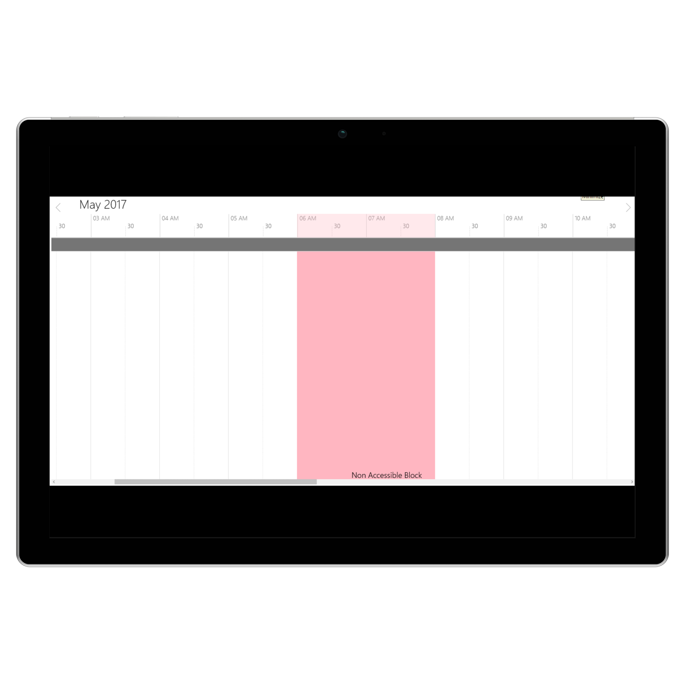
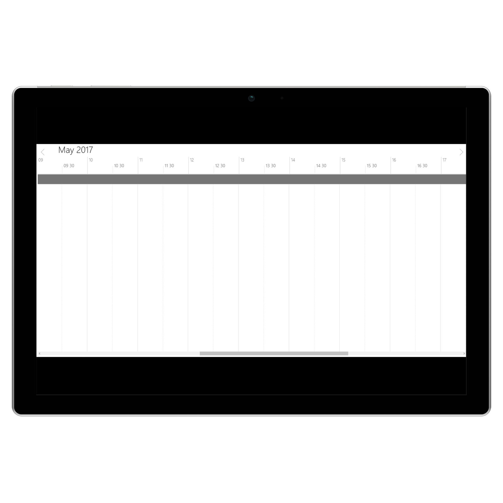
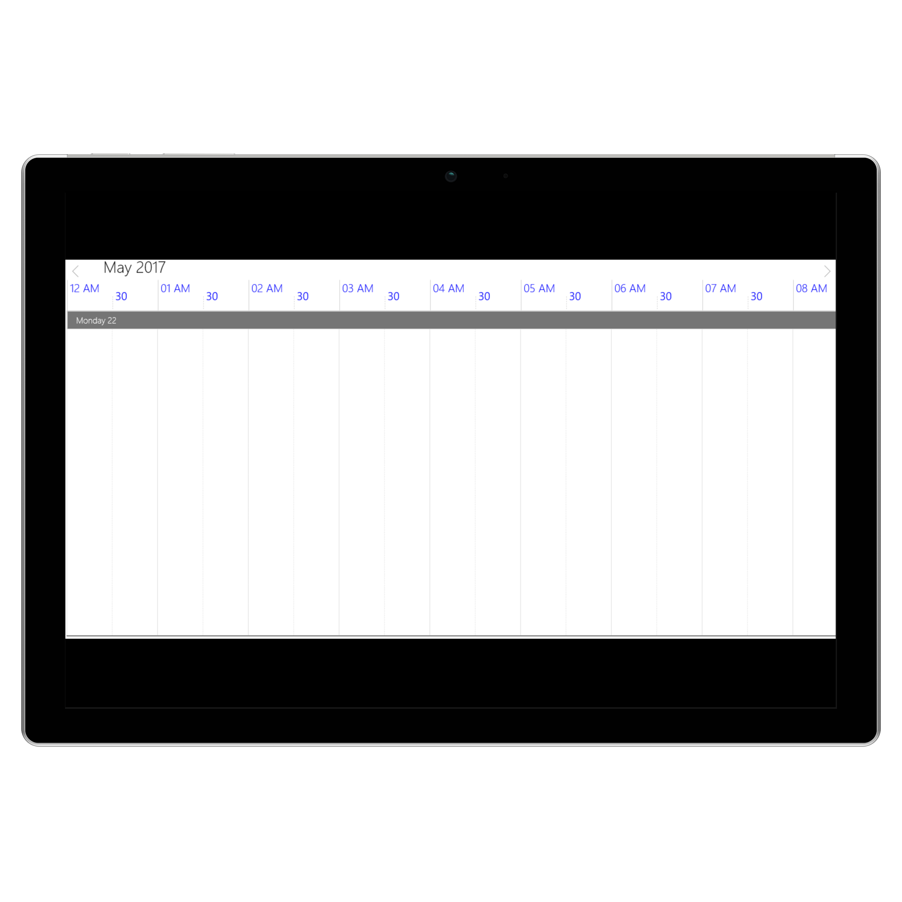
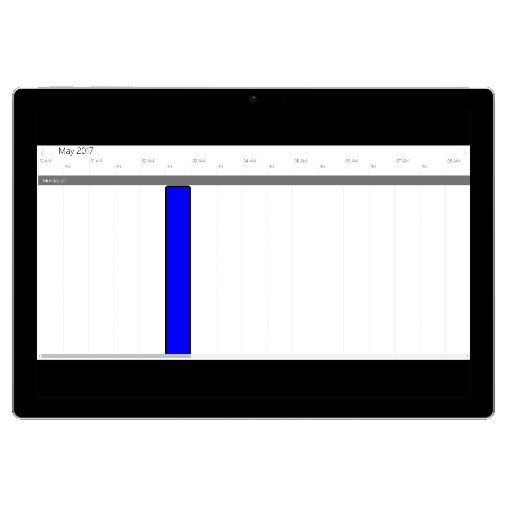
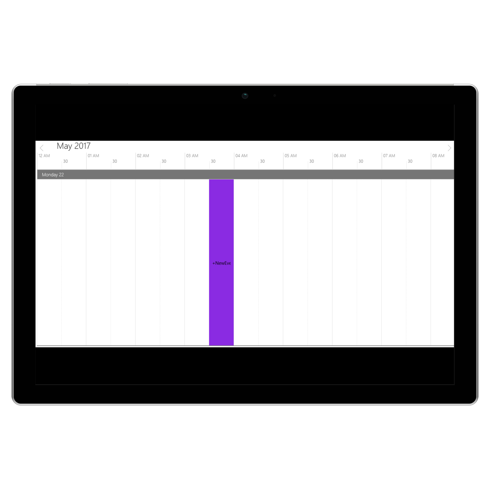
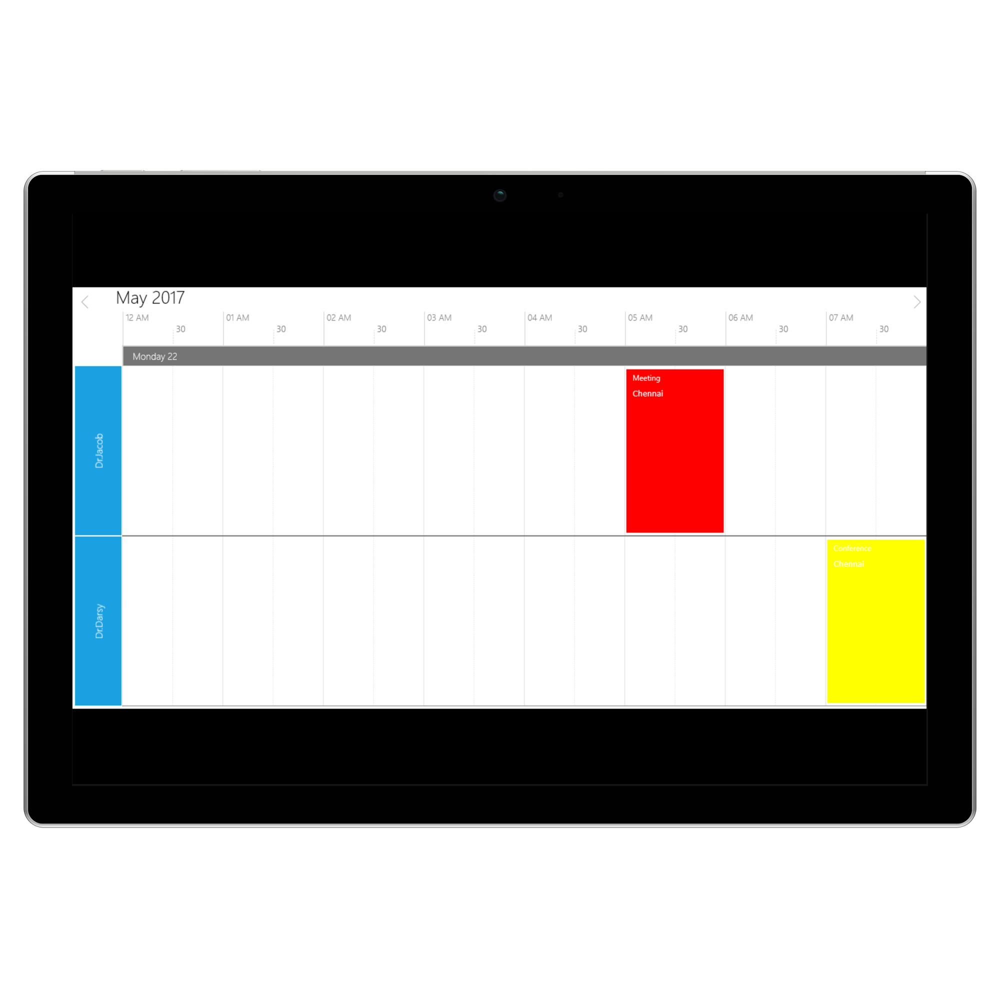

# TimeLine View
TimeLine view is used to displays complete TimeLine in selected day, the default visible day of Schedule will be current day. Appointments are added in particular timeslot based on its timeline.

## View Header Appearance
You can customize the default appearance of schedule timeline view header using [TimeLineViewHeaderStyle](https://help.syncfusion.com/cr/cref_files/uwp/sfschedule/index.html#frlrfSyncfusionUIXamlScheduleSfScheduleClassTimeLineViewHeaderStyleTopic.html) property of `SfSchedule`.

  
 

        <schedule:SfSchedule x:Name="schedule" ScheduleType="TimeLine">
            <schedule:SfSchedule.TimeLineViewHeaderStyle>
                <schedule:ScheduleTimeLineViewHeaderStyle
                    TimeLineViewCurrentDateBackground="Yellow"
                    TimeLineViewCurrentDateForeground="Blue"
                    TimeLineViewHeaderBackground="LightGray"
                    TimeLineViewHeaderFontFamily="Calibri "
                    TimeLineViewHeaderFontWeight="Bold"
                    TimeLineViewHeaderHeight="50"
                    TimeLineViewHeaderTextColor="Black"
                    TimeLineViewHeaderTextFontStyle="Normal"
                    TimeLineViewHeaderTextHorizontalAlignment="Stretch"
                    TimeLineViewHeaderTextSize="14"
                    TimeLineViewHeaderTextVerticalAlignment="Center" />
            </schedule:SfSchedule.TimeLineViewHeaderStyle>
        </schedule:SfSchedule>

 
 

              schedule.ScheduleType = ScheduleType.TimeLine;
            schedule.TimeLineViewHeaderStyle = new ScheduleTimeLineViewHeaderStyle()
            {
                TimeLineViewCurrentDateBackground = new SolidColorBrush(Colors.Yellow),
                TimeLineViewCurrentDateForeground = new SolidColorBrush(Colors.Blue),
                TimeLineViewHeaderBackground = new SolidColorBrush(Colors.LightGray),
                TimeLineViewHeaderFontFamily = new FontFamily("Calibri"),
                TimeLineViewHeaderFontWeight = FontWeights.Bold,
                TimeLineViewHeaderHeight = 50,
                TimeLineViewHeaderTextColor = new SolidColorBrush(Colors.Black),
                TimeLineViewHeaderTextFontStyle = FontStyle.Normal,
                TimeLineViewHeaderTextHorizontalAlignment = HorizontalAlignment.Center,
                TimeLineViewHeaderTextSize = 14,
                TimeLineViewHeaderTextVerticalAlignment = VerticalAlignment.Center
            };

   


## Change Time Interval
You can customize the time intervals of timeslots in timeline by using [TimeInterval](https://help.syncfusion.com/cr/cref_files/uwp/sfschedule/index.html#frlrfSyncfusionUIXamlScheduleSfScheduleClassTimeIntervalTopic.html) property of `SfSchedule`.

   
 

         <schedule:SfSchedule
            x:Name="schedule"
            TimeInterval="FifteenMin"
            ScheduleType="TimeLine" />

 
 

            schedule.ScheduleType = ScheduleType.TimeLine;
            schedule.TimeInterval= TimeInterval.FifteenMin;

   


You can also set the custom time interval for timeslots  by using [CustomTimeInterval](https://help.syncfusion.com/cr/cref_files/uwp/sfschedule/frlrfSyncfusionUIXamlScheduleSfScheduleClassCustomTimeIntervalTopic.html) property of `SfSchedule` by making `TimeInterval` as Custom.
   
 

        <schedule:SfSchedule
            x:Name="schedule"
            TimeInterval="Custom"
            CustomTimeInterval="120"
            ScheduleType="TimeLine" />

 
 

            schedule.TimeInterval= TimeInterval.Custom;
            schedule.CustomTimeInterval = 120;

   


## Change Working Hours
Working hours in `TimeLine` of Schedule control will be differentiated with non-working hours by separate color. By default working hours will be between 09 to 18. You can customize the working hours by setting [WorkStartHour](https://help.syncfusion.com/cr/cref_files/uwp/sfschedule/index.html#frlrfSyncfusionUIXamlScheduleSfScheduleClassWorkStartHourTopic.html) and [WorkEndHour](https://help.syncfusion.com/cr/cref_files/uwp/sfschedule/index.html#frlrfSyncfusionUIXamlScheduleSfScheduleClassWorkEndHourTopic.html) properties of `SfSchedule`.
Non-working hours can be disabled by setting [ShowNonWorkingHours](https://help.syncfusion.com/cr/cref_files/uwp/sfschedule/index.html#frlrfSyncfusionUIXamlScheduleSfScheduleClassShowNonWorkingHoursTopic.html) to false and non-working hours color can be changed by using [NonWorkingHourBrush](https://help.syncfusion.com/cr/cref_files/uwp/sfschedule/frlrfSyncfusionUIXamlScheduleSfScheduleClassNonWorkingHourBrushTopic.html) property of `SfSchedule`.

   
 

        <schedule:SfSchedule
            x:Name="schedule"
            IsHighLightWorkingHours="True"
            NonWorkingHourBrush="Blue"
            ScheduleType="TimeLine"
            ShowNonWorkingHours="True"
            WorkEndHour="20"
            WorkStartHour="8" />

 
 

            schedule.WorkStartHour = 8;
            schedule.WorkEndHour = 20;
            schedule.IsHighLightWorkingHours = true;
            schedule.NonWorkingHourBrush = new SolidColorBrush(Colors.Blue);
            schedule.ShowNonWorkingHours = true;

   


## Timeslot Appearance
You can customize the default timeslot appearance in timeline view by changing its stoke dash array by using [MajorTickStrokeDashArray](https://help.syncfusion.com/cr/cref_files/uwp/sfschedule/index.html#frlrfSyncfusionUIXamlScheduleSfScheduleClassMajorTickStrokeDashArrayTopic.html) and [MinorTickStrokeDashArray](https://help.syncfusion.com/cr/cref_files/uwp/sfschedule/index.html#frlrfSyncfusionUIXamlScheduleSfScheduleClassMinorTickStrokeDashArrayTopic.html) properties of `SfSchedule`. And, you can change the color by using [MajorTickStroke](https://help.syncfusion.com/cr/cref_files/uwp/sfschedule/index.html#frlrfSyncfusionUIXamlScheduleSfScheduleClassMajorTickStrokeTopic.html) and [MinorTickStroke](https://help.syncfusion.com/cr/cref_files/uwp/sfschedule/index.html#frlrfSyncfusionUIXamlScheduleSfScheduleClassMinorTickStrokeTopic.html) properties of `SfSchedule` control.

   
 

         <schedule:SfSchedule
            x:Name="schedule"
            MajorTickStroke="Blue"
            MinorTickStroke="Blue"
            MajorTickStrokeDashArray="10"
            MinorTickStrokeDashArray="10"
            ScheduleType="TimeLine" />

 
 

            schedule.MajorTickStroke = new SolidColorBrush(Colors.Blue);
            schedule.MinorTickStroke = new SolidColorBrush(Colors.Blue);
            schedule.MajorTickStrokeDashArray = new DoubleCollection() {10};
            schedule.MinorTickStrokeDashArray = new DoubleCollection() {10};

   


## Non-Accessible timeslots.
You can restrict/allocate certain timeslot as Non-accessible block using  [NonAccessibleBlocks](https://help.syncfusion.com/cr/cref_files/uwp/sfschedule/index.html#frlrfSyncfusionUIXamlScheduleSfScheduleClassNonAccessibleBlocksTopic.html)  property of  `SfSchedule`, so that can allocate those timeslots for predefined events/activities like Lunch hour.
   
 

        <schedule:SfSchedule ScheduleType="TimeLine">
            <schedule:SfSchedule.NonAccessibleBlocks>
                <schedule:NonAccessibleBlock
                    Background="LightPink"
                    EndHour="8.00"
                    Label="Non Accessible Block"
                    StartHour="6.00" />
            </schedule:SfSchedule.NonAccessibleBlocks>
        </schedule:SfSchedule>

 
 

            schedule.ScheduleType = ScheduleType.TimeLine;
            schedule.NonAccessibleBlocks.Add(new NonAccessibleBlock()
            {
                Background = new SolidColorBrush(Colors.LightPink),
                StartHour = 6.00,
                EndHour = 8.00,
                Label = "Non Accessible Block"
            });

   


## Time Label Formatting
You can customize the default label format of time in timeline view by using [MajorTickTimeFormat](https://help.syncfusion.com/cr/cref_files/uwp/sfschedule/index.html#frlrfSyncfusionUIXamlScheduleSfScheduleClassMajorTickTimeFormatTopic.html) and [MinorTickTimeFormat](https://help.syncfusion.com/cr/cref_files/uwp/sfschedule/index.html#frlrfSyncfusionUIXamlScheduleSfScheduleClassMinorTickTimeFormatTopic.html) properties of `SfSchedule`.
   
 

       <schedule:SfSchedule
            x:Name="schedule"
            MajorTickTimeFormat="HH"
            MinorTickTimeFormat="HH mm"
            ScheduleType="TimeLine" />

 
 

            schedule.ScheduleType = ScheduleType.TimeLine;
            schedule.MajorTickTimeFormat = "HH";
            schedule.MinorTickTimeFormat = "HH mm";

   


## Time Label appearance
You can the customize the default color of time label in timeline view by using the [MajorTickLabelStroke](https://help.syncfusion.com/cr/cref_files/uwp/sfschedule/index.html#frlrfSyncfusionUIXamlScheduleSfScheduleClassMajorTickLabelStrokeTopic.html) and [MinorTickLabelStroke](https://help.syncfusion.com/cr/cref_files/uwp/sfschedule/index.html#frlrfSyncfusionUIXamlScheduleSfScheduleClassMinorTickLabelStrokeTopic.html) properties of `SfSchedule`.

   
 

        <schedule:SfSchedule
            x:Name="schedule"
            MajorTickLabelStroke="Blue"
            MinorTickLabelStroke="Blue"
            ScheduleType="TimeLine" />

 
 

            schedule.MajorTickLabelStroke=new SolidColorBrush(Colors.Blue);
            schedule.MinorTickLabelStroke = new SolidColorBrush(Colors.Blue);

   

You can the customize the default font size of time label in timeline view by using the [MajorTickLabelSize](https://help.syncfusion.com/cr/cref_files/uwp/sfschedule/index.html#frlrfSyncfusionUIXamlScheduleSfScheduleClassMajorTickLabelSizeTopic.html) and [MinorTickLabelSize](https://help.syncfusion.com/cr/cref_files/uwp/sfschedule/index.html#frlrfSyncfusionUIXamlScheduleSfScheduleClassMinorTickLabelSizeTopic.html) properties of `SfSchedule`.

   
 

        <schedule:SfSchedule
            x:Name="schedule"
            MajorTickLabelSize="20"
            MinorTickLabelSize="20"
            ScheduleType="TimeLine" />

 
 

            schedule.MajorTickLabelSize=20;
            schedule.MinorTickLabelSize =20;

   


## Selection
You can customize the default appearance of selection UI in the timeslots.
*	Selection customization using style
*	Selection customization using custom View.
### Selection customization using style
You can customize the timeslot selection by using [ScheduleSelectionStyle](https://help.syncfusion.com/cr/cref_files/uwp/sfschedule/frlrfSyncfusionUIXamlScheduleSfScheduleClassScheduleSelectionStyleTopic.html) property of `SfSchedule`.
   
 

        <schedule:SfSchedule ScheduleType="TimeLine">
            <schedule:SfSchedule.ScheduleSelectionStyle>
                <schedule:ScheduleSelectionStyle
                    Background="Blue"
                    BorderBrush="Black"
                    BorderCornerRadius="5"
                    BorderThickness="5" />
            </schedule:SfSchedule.ScheduleSelectionStyle>
        </schedule:SfSchedule>

 
 

        schedule.ScheduleSelectionStyle= new ScheduleSelectionStyle()
            {
                 Background = new SolidColorBrush(Colors.Blue),
                 BorderBrush = new SolidColorBrush(Colors.Black),
                 BorderCornerRadius = new CornerRadius(5),
                 BorderThickness = new Thickness(5)
            };

   


### Selection customization using custom View.
You can replace the default selection UI with your custom view by setting [SelectionView](https://help.syncfusion.com/cr/cref_files/uwp/sfschedule/frlrfSyncfusionUIXamlScheduleSfScheduleClassSelectionViewTopic.html) property of `SfSchedule`.

   
 

         <schedule:SfSchedule x:Name="schedule" ScheduleType="TimeLine">
            <schedule:SfSchedule.SelectionView>
                <Button Background="BlueViolet" Content="+NewEvent" />
            </schedule:SfSchedule.SelectionView>
        </schedule:SfSchedule>

 
 

       schedule.SelectionView=new Button()
            {
                Content = "+NewEvent",
                Background = new SolidColorBrush(Colors.BlueViolet)
            };

   


## Configuring Resources
The Schedule control allows you to define resources that can be assigned to appointments. Resources let you associate additional information with your appointments. 
### Multi-Resource
Schedule appointments will be grouped based on the resource associated with them only when both the [Resource](https://help.syncfusion.com/cr/cref_files/uwp/sfschedule/index.html#frlrfSyncfusionUIXamlScheduleSfScheduleClassResourceTopic.html) and [ScheduleResourceTypeCollection](https://help.syncfusion.com/cr/cref_files/uwp/sfschedule/frlrfSyncfusionUIXamlScheduleSfScheduleClassScheduleResourceTypeCollectionTopic.html) properties are set, and also when the Value set for a `Resource` matches with any types specified in the `ScheduleResourceTypeCollection` property.
   
 

        <schedule:SfSchedule
            x:Name="schedule"
            Resource="Doctors"
            ScheduleType="TimeLine">
            <schedule:SfSchedule.ScheduleResourceTypeCollection>
                <schedule:ResourceType TypeName="Doctors">
                    <schedule:Resource
                        DisplayName="Dr.Jacob"
                        ResourceName="Dr.Jacob"
                        TypeName="Doctors" />
                    <schedule:Resource
                        DisplayName="Dr.Darsy"
                        ResourceName="Dr.Darsy"
                        TypeName="Doctors" />
                </schedule:ResourceType>
            </schedule:SfSchedule.ScheduleResourceTypeCollection>
        </schedule:SfSchedule>

 
 

           var currentDate=DateTime.Now;
            ScheduleAppointment app = new ScheduleAppointment()
            {
                StartTime = currentDate.Date.AddHours(5),
                EndTime = currentDate.Date.AddHours(6),
                Subject = "Meeting",
                Location = "Chennai",
                AppointmentBackground =new SolidColorBrush(Colors.Red)
            };
            app.ResourceCollection.Add(new Resource()
            {
                ResourceName = "Dr.Jacob",
                TypeName = "Doctors"
            });

            ScheduleAppointment app1 = new ScheduleAppointment()
            {
                StartTime = currentDate.Date.AddHours(7),
                EndTime = currentDate.Date.AddHours(8),
                Subject = "Conference",
                Location = "Chennai",
                AppointmentBackground = new SolidColorBrush(Colors.Yellow)
            };
            app1.ResourceCollection.Add(new Resource()
            {
                ResourceName = "Dr.Darsy",
                TypeName = "Doctors"
            });

            schedule.Appointments.Add(app);
            schedule.Appointments.Add(app1);

   


### Row Count in Timeline View
This feature supports to display ‘N’ number of rows in `TimeLine` view. You can achieve this by specifying the count of resources that needs to be displayed per view. This support is offered for `TimeLine` view alone.
This support can be enabled by using property [TimeLineViewRowCount](https://help.syncfusion.com/cr/cref_files/uwp/sfschedule/frlrfSyncfusionUIXamlScheduleSfScheduleClassTimeLineViewRowCountTopic.html) in `SfSchedule`. By default, its value is “zero”.

   
 

         <schedule:SfSchedule
            x:Name="schedule" TimeLineViewRowCount="1"
            Resource="Doctors"
            ScheduleType="TimeLine">
            <schedule:SfSchedule.ScheduleResourceTypeCollection>
                <schedule:ResourceType TypeName="Doctors">
                    <schedule:Resource
                        DisplayName="Dr.Jacob"
                        ResourceName="Dr.Jacob"
                        TypeName="Doctors" />
                    <schedule:Resource
                        DisplayName="Dr.Darsy"
                        ResourceName="Dr.Darsy"
                        TypeName="Doctors" />
                </schedule:ResourceType>
            </schedule:SfSchedule.ScheduleResourceTypeCollection>
        </schedule:SfSchedule>

 
 

            schedule.TimeLineViewRowCount = 1;
            var currentDate=DateTime.Now;
            ScheduleAppointment app = new ScheduleAppointment()
            {
                StartTime = currentDate.Date.AddHours(5),
                EndTime = currentDate.Date.AddHours(6),
                Subject = "Meeting",
                Location = "Chennai",
                AppointmentBackground =new SolidColorBrush(Colors.Red)
            };
            app.ResourceCollection.Add(new Resource()
            {
                ResourceName = "Dr.Jacob",
                TypeName = "Doctors"
            });

            ScheduleAppointment app1 = new ScheduleAppointment()
            {
                StartTime = currentDate.Date.AddHours(7),
                EndTime = currentDate.Date.AddHours(8),
                Subject = "Conference",
                Location = "Chennai",
                AppointmentBackground = new SolidColorBrush(Colors.Yellow)
            };
            app1.ResourceCollection.Add(new Resource()
            {
                ResourceName = "Dr.Darsy",
                TypeName = "Doctors"
            });
            schedule.Appointments.Add(app);
            schedule.Appointments.Add(app1);

   


