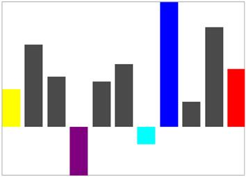

# Customize segment brush

We can able to customize the first, last, negative, high and low point brushes of column sparkline as like markers in area and line sparkline.

* [`FirstPointBrush`](http://help.syncfusion.com/cr/cref_files/uwp/sfchart/index.html#frlrfSyncfusionUIXamlChartsSegmentTemplateSelectorClassFirstPointBrushTopic.html) – Gets or sets the brush to paint the first point of the sparkline.
* [`LastPointBrush`](http://help.syncfusion.com/cr/cref_files/uwp/sfchart/frlrfSyncfusionUIXamlChartsSegmentTemplateSelectorClassLastPointBrushTopic.html) – Gets or sets the brush to paint the last point of the sparkline.
* [`LowPointBrush`](http://help.syncfusion.com/cr/cref_files/uwp/sfchart/frlrfSyncfusionUIXamlChartsSegmentTemplateSelectorClassLowPointBrushTopic.html) – Gets or sets the brush to paint the low point of the sparkline.
* [`HighPointBrush`](http://help.syncfusion.com/cr/cref_files/uwp/sfchart/index.html#frlrfSyncfusionUIXamlChartsSegmentTemplateSelectorClassHighPointBrushTopic.html) – Gets or sets the brush to paint the high point of the sparkline.
* [`NegativePointBrush`](http://help.syncfusion.com/cr/cref_files/uwp/sfchart/frlrfSyncfusionUIXamlChartsSegmentTemplateSelectorClassNegativePointBrushTopic.html) – Gets or sets the brush to paint the negative point of the sparkline.





<Syncfusion:SfColumnSparkline Interior="#4a4a4a" 

BorderBrush="DarkGray" BorderThickness="1"

ItemsSource="{Binding UsersList}" 

YBindingPath="NoOfUsers">

<Syncfusion:SfColumnSparkline.SegmentTemplateSelector>

<Syncfusion:SegmentTemplateSelector FirstPointBrush="Yellow" 

LastPointBrush="Red" NegativePointBrush="Cyan"

LowPointBrush="Purple" HighPointBrush="Blue"/>

</Syncfusion:SfColumnSparkline.SegmentTemplateSelector>

</Syncfusion:SfColumnSparkline >





SfColumnSparkline sparkline = new SfColumnSparkline()
{

    ItemsSource = new SparkViewModel().UsersList,

    YBindingPath = "NoOfUsers"

};

SegmentTemplateSelector selector = new SegmentTemplateSelector()
{

    FirstPointBrush = new SolidColorBrush(Colors.Yellow),

    LastPointBrush = new SolidColorBrush(Colors.Yellow),

    HighPointBrush = new SolidColorBrush(Colors.Red)

};

sparkline.SegmentTemplateSelector = selector;





