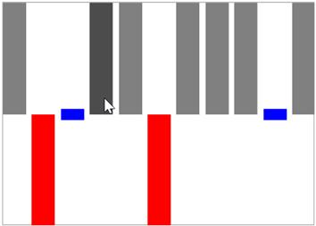

# Highlight Segment

This feature enable to highlight the column segments on mouse move and this is applicable for column and win-loss sparkline.



<Syncfusion:SfWinLossSparkline Interior="Gray" BorderBrush="DarkGray" 

BorderThickness="1" 

HighlightSegment="True" x:Name="sparkline"  

ItemsSource="{Binding Match}" YBindingPath="Result" >

</Syncfusion:SfWinLossSparkline>



Following is the snapshot for highlight segment,

