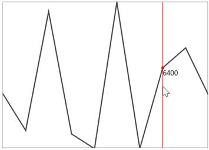

# Add labels for track ball

We can add labels for track ball to show the corresponding values. In order to add labels for the trackball, you need to subscribe the event OnSparklineMouseMove and you can get the following data’s from event argument.



private void SfLineSparkline_OnSparklineMouseMove(object src,Syncfusion.UI.Xaml.Charts.SparklineMouseMoveEventArgs args)

{

if (!args.RootPanel.Children.Contains(info))

{

info = new ContentPresenter();

args.RootPanel.Children.Add(info);

}

info.Content = args.Value.Y;

info.Arrange(new Rect(args.Coordinate.X, args.Coordinate.Y, info.ActualWidth, info.ActualHeight));

}

}





<Syncfusion:SfLineSparkline  Interior="#4a4a4a"   

BorderBrush="DarkGray" BorderThickness="1"                                      

OnSparklineMouseMove="SfLineSparkline_OnSparklineMouseMove"

ItemsSource="{Binding UsersList}"  ShowTrackBall="True" 

YBindingPath="NoOfUsers"/>



