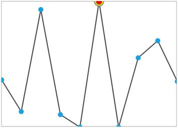

# Customize the marker for specific data point

We can customize the marker for specific data point with custom template for LineSparkline and AreaSparkline, in order to customize the marker we need to inherit the [`MarkerTemplateSelector`](http://help.syncfusion.com/cr/cref_files/wpf/sfchart/Syncfusion.SfChart.WPF~Syncfusion.UI.Xaml.Charts.MarkerTemplateSelector.html#) class and override the SelectTemplate method.



public class CustomMarkersTemplateSelector : MarkerTemplateSelector

{

protected override DataTemplate SelectTemplate(double x, double y)

{

if (y == MaximumY)

{

DataTemplate markerTemplate =  Application.Current.Resources["markerTemplate"] as DataTemplate;

return markerTemplate;

}

else

return base.SelectTemplate(x, y);

}

}





<Syncfusion:SfLineSparkline  BorderBrush="DarkGray"    

BorderThickness="1"  ItemsSource="{Binding UsersList}"                                  

Interior="#4a4a4a"   MarkerVisibility="Visible"                    

YBindingPath="NoOfUsers">

<Syncfusion:SfLineSparkline.MarkerTemplateSelector>

<local:CustomMarkersTemplateSelector MarkerHeight="10" MarkerWidth="10"/>

</Syncfusion:SfLineSparkline.MarkerTemplateSelector>

</Syncfusion:SfLineSparkline >



